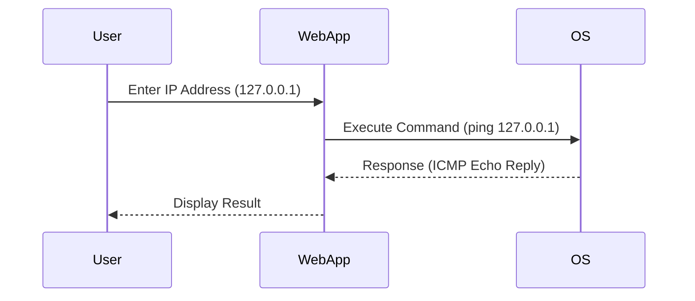

## What is Command Injection?

Command Injection, also known as OS Command Injection, is a type of vulnerability that allows an attacker to execute arbitrary commands on the host operating system through a vulnerable application. This vulnerability arises when an application takes untrusted input from a user and uses it to construct a command that is executed by the operating system. 

### Background Theory

To understand command injection, it's essential to grasp how operating systems handle commands and how applications interact with them. In most operating systems, commands are executed using a shell, such as `bash` on Unix-based systems or `cmd.exe` on Windows. Applications can invoke these shells to execute commands, often using functions like `system()`, `exec()`, or `popen()` in C/C++, or equivalent methods in other programming languages.

When an application constructs a command string using user input without proper sanitization or validation, it becomes susceptible to command injection attacks. An attacker can manipulate the input to inject additional commands or modify the intended command, leading to unauthorized actions on the host system.

### Example Scenario

Let's consider a scenario involving a web application that allows users to ping an IP address to check if it is up and running. The application might have a form where users can enter an IP address, and upon submission, the application constructs a command to execute the `ping` utility.

#### Vulnerable Code Example

Here is a simplified example of how the vulnerable code might look:

```python
import subprocess

def ping_ip(ip_address):
    command = f"ping {ip_address}"
    result = subprocess.run(command, shell=True, capture_output=True)
    return result.stdout.decode()

# Example usage
ip_address = "127.0.0.1"
print(ping_ip(ip_address))
```

In this code, the `subprocess.run` function is used to execute the `ping` command with the provided IP address. The `shell=True` argument tells Python to execute the command through the shell, making it vulnerable to command injection.

### How Command Injection Works

When an attacker manipulates the input, they can inject additional commands or modify the existing command. For instance, if the user input is not properly sanitized, an attacker could provide an IP address like `"127.0.0.1; rm -rf /"` to execute a dangerous command after the `ping` command.

#### Attacker's Input

```plaintext
127.0.0.1; rm -rf /
```

This input would cause the following command to be executed:

```plaintext
ping 127.0.0.1; rm -rf /
```

The semicolon (`;`) separates two commands, allowing both to be executed sequentially. The `rm -rf /` command is particularly dangerous as it attempts to delete all files on the system.

### Real-World Examples

Command injection vulnerabilities have been exploited in various real-world scenarios. Here are a few notable examples:

1. **CVE-2021-3129**: A command injection vulnerability was found in the `docker-compose` tool, which allowed attackers to execute arbitrary commands on the host system. This vulnerability was due to improper handling of user-provided input in the `docker-compose` command-line interface.

2. **CVE-2020-14882**: A command injection vulnerability was discovered in the `nginx` web server, specifically in the `ngx_http_auth_request_module`. This module was vulnerable to command injection if an attacker could control the `auth_request` directive.

### Detection and Prevention

#### Detection

Detecting command injection vulnerabilities requires a combination of static analysis and dynamic testing. Static analysis tools can identify potential issues in the code, while dynamic testing involves simulating attacks to see if the application is vulnerable.

##### Static Analysis Tools

- **SonarQube**: Provides static code analysis to identify potential command injection vulnerabilities.
- **Fortify Static Code Analyzer**: Detects command injection vulnerabilities by analyzing the code for unsafe command execution patterns.

##### Dynamic Testing Tools

- **OWASP ZAP**: Can be used to test web applications for command injection vulnerabilities by injecting malicious inputs and observing the results.
- **Burp Suite**: Another popular tool for dynamic testing, which can help identify and exploit command injection vulnerabilities.

#### Prevention

Preventing command injection requires a multi-faceted approach, including proper input validation, avoiding shell execution, and using safer alternatives.

##### Secure Coding Practices

1. **Input Validation**: Always validate and sanitize user input to ensure it does not contain malicious characters or commands.
   
   ```python
   import re

   def ping_ip(ip_address):
       if not re.match(r'^\d{1,3}\.\d{1,3}\.\d{1,3}\.\d{1,3}$', ip_address):
           raise ValueError("Invalid IP address")
       command = f"ping {ip_address}"
       result = subprocess.run(command, shell=True, capture_output=True)
       return result.stdout.decode()
   ```

2. **Avoid Shell Execution**: Use safer alternatives to executing commands through the shell. For example, use `subprocess.run` without `shell=True`.

   ```python
   import subprocess

   def ping_ip(ip_address):
       result = subprocess.run(["ping", "-c", "1", ip_address], capture_output=True)
       return result.stdout.decode()
   ```

3. **Use Safer Libraries**: Utilize libraries designed to safely execute commands, such as `shlex` for parsing command strings.

   ```python
   import shlex
   import subprocess

   def ping_ip(ip_address):
       command = shlex.split(f"ping -c 1 {ip_address}")
       result = subprocess.run(command, capture_output=True)
       return result.stdout.decode()
   ```

### Mermaid Diagrams

#### Command Execution Flow



#### Attack Chain

```mermaid
sequenceDiagram
    participant Attacker
    participant WebApp
    participant OS

    Attacker->>WebApp: Enter Malicious IP Address (127.0.0.1; rm -rf /)
    WebApp->>OS: Execute Command (ping 127.0.0.1; rm -rf /)
    OS-->>WebApp: Response (ICMP Echo Reply)
    OS-->>Attacker: System Files Deleted
```

### Hands-On Labs

For practical experience with command injection, consider the following labs:

- **PortSwigger Web Security Academy**: Offers interactive labs on command injection, including detailed walkthroughs and challenges.
- **OWASP Juice Shop**: Contains several vulnerabilities, including command injection, which can be exploited and fixed in a controlled environment.
- **DVWA (Damn Vulnerable Web Application)**: Provides a variety of web application vulnerabilities, including command injection, for educational purposes.

By thoroughly understanding the concepts, mechanisms, and preventive measures associated with command injection, developers can significantly reduce the risk of such vulnerabilities in their applications.

---
<!-- nav -->
[[04-Introduction to OS Command Injection|Introduction to OS Command Injection]] | [[Web Security (PortSwigger)/10-OS Command Injection/01-Command Injection Complete Guide/00-Overview|Overview]] | [[06-Advanced Topics in Command Injection|Advanced Topics in Command Injection]]
