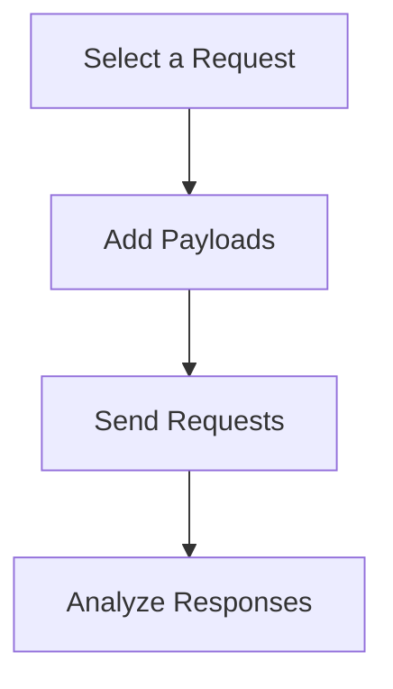

## Exploiting Command Injection

### Fuzzing the Application

Once you have identified potential vulnerable points, the next step is to fuzz the application with command injection payloads. This involves sending various payloads to see if the application executes them.

### Tools for Fuzzing

Several tools can be used for fuzzing:

- **Burp Suite Intruder**: Allows you to send multiple payloads to test for vulnerabilities.
- **OWASP ZAP Fuzzer**: Similar to Burp Suite Intruder but integrated with OWASP ZAP.
- **Custom Scripts**: Writing custom scripts to automate the fuzzing process.

### Example Using Burp Suite Intruder

Here’s a step-by-step example of using Burp Suite Intruder to fuzz the application:

1. **Select a Request**: Choose a request that contains a parameter you suspect is vulnerable.
2. **Add Payloads**: Add command injection payloads to the selected parameter.
3. **Send Requests**: Send the requests and analyze the responses to identify successful injections.



### Analyzing Responses

When analyzing responses, look for signs that the injected command was executed. This could include unexpected output, changes in the application behavior, or error messages indicating command execution.

### Example Response Analysis

Suppose you send the following payload:

```bash
ls ; echo "Command Injection Successful"
```

If the response includes the string "Command Injection Successful," it indicates that the command was successfully executed.

---
<!-- nav -->
[[11-Detailed Mechanics of Command Injection|Detailed Mechanics of Command Injection]] | [[Web Security (PortSwigger)/10-OS Command Injection/01-Command Injection Complete Guide/00-Overview|Overview]] | [[13-Final Thoughts|Final Thoughts]]
