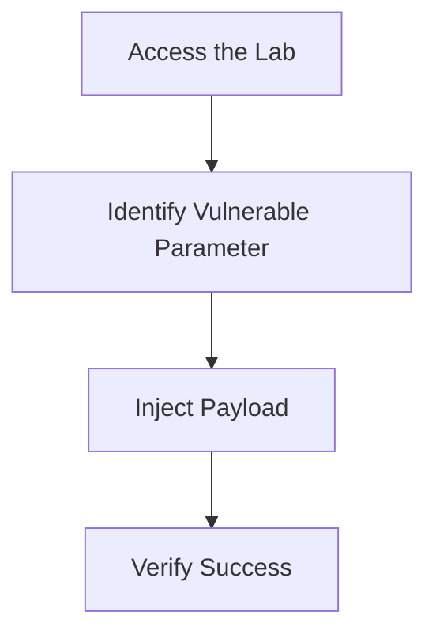

## Hands-On Lab Exercises

### Lab Exercises

To gain hands-on experience with command injection, you can use the following labs:

- **PortSwigger Web Security Academy**: Offers interactive labs to practice command injection.
- **OWASP Juice Shop**: A deliberately insecure web application for practicing various security vulnerabilities.
- **DVWA (Damn Vulnerable Web Application)**: A PHP/MySQL web application that is vulnerable to many types of attacks, including command injection.
- **WebGoat**: An interactive training application designed to teach web application security lessons.

### Example Lab Exercise

Here’s an example of a lab exercise using PortSwigger Web Security Academy:

1. **Access the Lab**: Navigate to the command injection lab in PortSwigger.
2. **Identify Vulnerable Parameter**: Identify the parameter that is vulnerable to command injection.
3. **Inject Payload**: Inject a command injection payload to execute arbitrary commands.
4. **Verify Success**: Verify that the command was successfully executed and gain unauthorized access.

---
<!-- nav -->
[[13-Final Thoughts|Final Thoughts]] | [[Web Security (PortSwigger)/10-OS Command Injection/01-Command Injection Complete Guide/00-Overview|Overview]] | [[15-Mapping Client-Side Input|Mapping Client-Side Input]]
