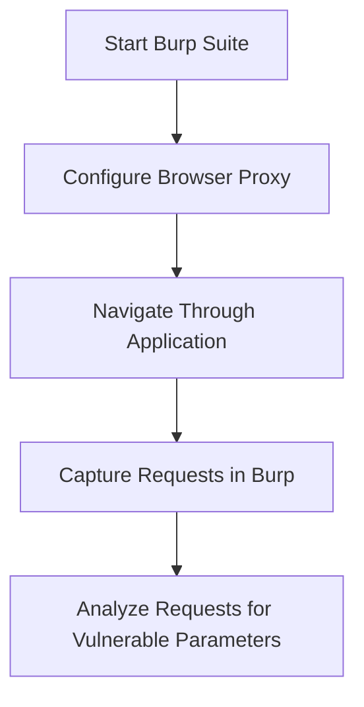

## Mapping Client-Side Input

### Identifying Vulnerable Points

To effectively identify potential command injection vulnerabilities, you must first map all instances in the application where there is client-side input. This includes form fields, URL parameters, and any other input mechanisms that interact with the backend.

### Tools for Mapping Input

Several tools can help in mapping client-side inputs:

- **Burp Suite**: A comprehensive toolkit for web application security testing.
- **OWASP ZAP**: Another popular open-source tool for scanning web applications.
- **Fuzzers**: Automated tools that send various inputs to test for vulnerabilities.

### Example Using Burp Suite

Here’s a step-by-step example of using Burp Suite to map client-side inputs:

1. **Start Burp Suite** and configure your browser to use Burp as a proxy.
2. **Navigate through the application** and capture all requests in Burp.
3. **Analyze the requests** to identify parameters that could be vulnerable to command injection.

---
<!-- nav -->
[[14-Hands-On Lab Exercises|Hands-On Lab Exercises]] | [[Web Security (PortSwigger)/10-OS Command Injection/01-Command Injection Complete Guide/00-Overview|Overview]] | [[16-OS Command Injection Vulnerability|OS Command Injection Vulnerability]]
