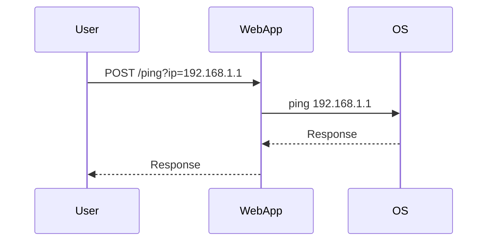

## Understanding the Context of OS Command Injection

### What is OS Command Injection?

OS Command Injection, also known as Shell Injection, is a type of security vulnerability that occurs when an attacker can inject arbitrary commands into a program that is executed by the operating system. This typically happens when user input is used to construct shell commands without proper validation or sanitization. The result can be severe, allowing attackers to execute arbitrary commands on the server, leading to unauthorized access, data theft, or even complete system compromise.

### Why Does OS Command Injection Matter?

Understanding OS Command Injection is crucial because it can lead to significant security breaches. For instance, CVE-2021-3504, a vulnerability in the Jenkins pipeline plugin, allowed attackers to inject malicious commands into the build process, potentially compromising the entire environment. This underscores the importance of identifying and mitigating such vulnerabilities.

### How Does OS Command Injection Work?

To understand how OS Command Injection works, let's break down the process:

1. **User Input**: An attacker provides input to a web application.
2. **Command Construction**: The application uses this input to construct a command string.
3. **Execution**: The constructed command is executed by the operating system.
4. **Injection**: If the input is not properly sanitized, the attacker can inject additional commands.

### Identifying Potential Vulnerabilities

When testing a web application for OS Command Injection, the first step is to identify all instances where the application interacts with the underlying operating system. This can be done by:

1. **Mapping the Application**: Visit the URL of the application, navigate through all accessible pages, and make note of all input vectors.
2. **Intercepting Requests**: Use tools like Burp Suite to intercept and analyze all requests made to the application.
3. **Understanding Logic**: Understand the application’s logic and how it processes inputs.

### Example Scenario

Consider a web application that allows users to ping a host by entering an IP address. The application constructs a command using the user-provided input and executes it.

```python
import subprocess

def ping_host(ip_address):
    command = f"ping {ip_address}"
    result = subprocess.run(command, shell=True, capture_output=True)
    return result.stdout.decode()
```

In this example, the `subprocess.run` function is used to execute the `ping` command with the user-provided IP address. If the input is not sanitized, an attacker could inject additional commands.

### Real-World Example: CVE-2021-3504

CVE-2021-3504 was a critical vulnerability in the Jenkins pipeline plugin. Attackers could inject malicious commands into the build process, leading to remote code execution. This demonstrates the severity of OS Command Injection and the importance of proper input validation and sanitization.

### Detecting OS Command Injection

Detecting OS Command Injection involves several steps:

1. **Static Analysis**: Analyze the code to identify potential vulnerabilities.
2. **Dynamic Analysis**: Use tools like Burp Suite to intercept and modify requests.
3. **Automated Scanning**: Use tools like OWASP ZAP or Nessus to scan for vulnerabilities.

### How to Prevent / Defend Against OS Command Injection

#### Secure Coding Practices

1. **Input Validation**: Validate all user inputs to ensure they meet expected formats.
2. **Sanitization**: Sanitize inputs to remove any characters that could be used for injection.
3. **Use Safe APIs**: Use safe APIs that do not rely on shell execution.

#### Example: Secure Code Implementation

Let's compare the insecure and secure versions of the `ping_host` function:

**Insecure Version:**

```python
import subprocess

def ping_host(ip_address):
    command = f"ping {ip_address}"
    result = subprocess.run(command, shell=True, capture_output=True)
    return result.stdout.decode()
```

**Secure Version:**

```python
import subprocess

def ping_host(ip_address):
    # Validate IP address format
    if not re.match(r'^\d{1,3}\.\d{1,3}\.\d{1,3}\.\d{1,3}$', ip_address):
        raise ValueError("Invalid IP address")
    
    # Use list to avoid shell injection
    command = ["ping", ip_address]
    result = subprocess.run(command, capture_output=True)
    return result.stdout.decode()
```

In the secure version, we validate the IP address format and use a list to construct the command, avoiding the use of `shell=True`.

### Network Topology and Request Flow

To better understand the flow of requests and responses, consider the following network topology and request flow:



This diagram shows the interaction between the user, web application, and operating system during a ping request.

### Common Pitfalls and Mitigations

#### Common Pitfalls

1. **Using `shell=True`**: This is a common mistake that allows shell injection.
2. **Improper Input Validation**: Failing to validate user inputs can lead to injection attacks.
3. **Hardcoding Commands**: Hardcoding commands without proper sanitization can introduce vulnerabilities.

#### Mitigations

1. **Use Safe APIs**: Avoid using `shell=True` and instead use safe APIs.
2. **Implement Input Validation**: Ensure all user inputs are validated and sanitized.
3. **Use Parameterized Queries**: Where possible, use parameterized queries to avoid direct command construction.

### Hands-On Practice Labs

For hands-on practice, consider the following labs:

- **PortSwigger Web Security Academy**: Offers comprehensive labs on various web security topics, including OS Command Injection.
- **OWASP Juice Shop**: A deliberately insecure web application for practicing web security skills.
- **DVWA (Damn Vulnerable Web Application)**: Another popular web application for learning and testing web security vulnerabilities.

These labs provide practical experience in identifying and mitigating OS Command Injection vulnerabilities.

### Conclusion

OS Command Injection is a serious security vulnerability that can lead to significant breaches. By understanding the mechanisms behind it, identifying potential vulnerabilities, and implementing secure coding practices, developers can mitigate these risks effectively. Regular testing and validation of user inputs are crucial steps in preventing such vulnerabilities.

---
<!-- nav -->
[[19-Preventing and Defending Against Command Injection|Preventing and Defending Against Command Injection]] | [[Web Security (PortSwigger)/10-OS Command Injection/01-Command Injection Complete Guide/00-Overview|Overview]] | [[21-Conclusion|Conclusion]]
