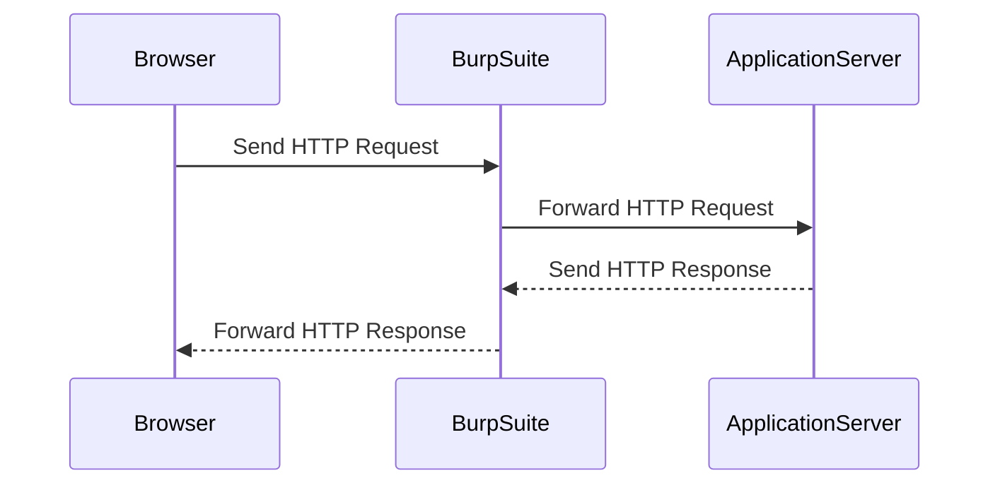

## OS Command Injection

### Introduction

OS Command Injection is a type of security vulnerability that occurs when an attacker can inject arbitrary operating system commands into a vulnerable application. This can lead to unauthorized access, data theft, or even complete control over the server. Understanding how this vulnerability works, how to detect it, and how to prevent it is crucial for securing web applications.

### Background Theory

#### What is OS Command Injection?

OS Command Injection happens when an application constructs a shell command using user input without proper validation or sanitization. This allows an attacker to inject additional commands that will be executed by the operating system. The vulnerability arises from the fact that the application trusts the user input and does not properly handle special characters or escape sequences.

#### Why Does OS Command Injection Matter?

The consequences of OS Command Injection can be severe:

- **Unauthorized Access**: An attacker can execute commands that grant them access to sensitive files or directories.
- **Data Theft**: By executing commands, an attacker can read and exfiltrate sensitive data.
- **Denial of Service**: An attacker can execute commands that cause the server to crash or become unresponsive.
- **Complete Control**: In some cases, an attacker can gain full control over the server, allowing them to install malware or perform other malicious activities.

### Real-World Examples

#### Recent CVEs and Breaches

One notable example of OS Command Injection is the CVE-2019-11510, which affected the Jenkins Continuous Integration server. This vulnerability allowed attackers to inject arbitrary commands into the Jenkins environment, leading to remote code execution.

Another example is the CVE-2020-14882, which affected the Apache Struts framework. This vulnerability allowed attackers to inject commands into the application, leading to remote code execution.

### Detection and Prevention

#### How to Detect OS Command Injection

Detecting OS Command Injection requires a combination of static analysis and dynamic testing:

- **Static Analysis**: Tools like SonarQube, Fortify, and Veracode can scan the source code for patterns that indicate potential command injection vulnerabilities.
- **Dynamic Testing**: Tools like Burp Suite, OWASP ZAP, and Metasploit can be used to test the application for command injection vulnerabilities by injecting payloads and observing the results.

#### How to Prevent OS Command Injection

Preventing OS Command Injection involves several strategies:

- **Input Validation**: Validate all user inputs to ensure they do not contain special characters or commands.
- **Use Parameterized Queries**: Instead of constructing shell commands using user input, use parameterized queries or APIs that do not allow command injection.
- **Least Privilege Principle**: Run the application with the least privileges necessary to minimize the damage an attacker can cause.
- **Security Headers**: Use security headers like `Content-Security-Policy` to mitigate the impact of command injection.

### Example Scenario

Let's walk through an example scenario based on the provided transcript chunk.

#### Setting Up the Environment

First, we need to set up our environment to intercept HTTP requests using Burp Suite.



#### Intercepting Requests

We set the proxy settings in our browser to intercept requests in Burp Suite. When we click on the "Check Stock" button, a POST request is sent to the server.

```http
POST /checkStock HTTP/1.1
Host: example.com
Content-Type: application/x-www-form-urlencoded
Content-Length: 22

productID=1&storeID=1
```

#### Injecting Commands

To test for command injection, we modify the `productID` parameter to include a command injection payload.

```http
POST /checkStock HTTP/1.1
Host: example.com
Content-Type: application/x-www-form-urlencoded
Content-Length: 22

productID=1;whoami&storeID=1
```

If the application is vulnerable, the `whoami` command will be executed, and the output will be included in the response.

### Secure Coding Practices

#### Vulnerable Code Example

Here is an example of vulnerable code that constructs a shell command using user input:

```python
import subprocess

def check_stock(product_id, store_id):
    command = f"stock_check {product_id} {store_id}"
    result = subprocess.run(command, shell=True, capture_output=True)
    return result.stdout.decode()
```

#### Secure Code Example

To prevent command injection, we can use parameterized queries or APIs that do not allow command injection.

```python
import subprocess

def check_stock(product_id, store_id):
    command = ["stock_check", str(product_id), str(store_id)]
    result = subprocess.run(command, capture_output=True)
    return result.stdout.decode()
```

### Detection and Mitigation

#### Detection

To detect OS Command Injection, we can use tools like Burp Suite to inject payloads and observe the results.

#### Mitigation

To mitigate OS Command Injection, we can implement the following measures:

- **Input Validation**: Validate all user inputs to ensure they do not contain special characters or commands.
- **Use Parameterized Queries**: Use parameterized queries or APIs that do not allow command injection.
- **Least Privilege Principle**: Run the application with the least privileges necessary to minimize the damage an attacker can cause.
- **Security Headers**: Use security headers like `Content-Security-Policy` to mitigate the impact of command injection.

### Practice Labs

For hands-on practice with OS Command Injection, consider the following labs:

- **PortSwigger Web Security Academy**: Offers a comprehensive lab on OS Command Injection.
- **OWASP Juice Shop**: Provides a vulnerable application for practicing various web security vulnerabilities, including OS Command Injection.
- **DVWA (Damn Vulnerable Web Application)**: A deliberately insecure web application for practicing web hacking techniques.

By thoroughly understanding the concepts, detecting vulnerabilities, and implementing secure coding practices, you can significantly reduce the risk of OS Command Injection in your web applications.

---
<!-- nav -->
[[Web Security (PortSwigger)/10-OS Command Injection/02-Lab 1 OS command injection simple case/01-Introduction to OS Command Injection|Introduction to OS Command Injection]] | [[Web Security (PortSwigger)/10-OS Command Injection/02-Lab 1 OS command injection simple case/00-Overview|Overview]] | [[Web Security (PortSwigger)/10-OS Command Injection/02-Lab 1 OS command injection simple case/03-Practice Questions & Answers|Practice Questions & Answers]]
