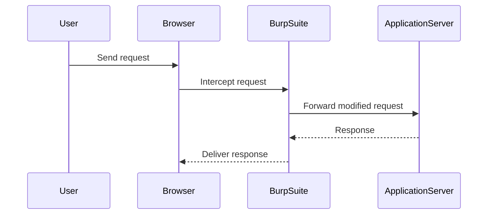

## Lab Setup: Blind OS Command Injection with Output Redirection

### Lab Objective

The objective of this lab is to exploit a blind command injection vulnerability and redirect the output of the `whoami` command to a specific folder. This exercise will help understand the steps involved in identifying and exploiting such vulnerabilities.

### Steps Involved

1. **Confirm Vulnerability**: Identify a parameter that is vulnerable to blind command injection.
2. **Find Output Location**: Determine where the application stores files that can be written to.
3. **Redirect Output**: Redirect the output of the `whoami` command to an image file in the writable directory.
4. **Check File Creation**: Verify if the file was successfully created or overwritten.

### Tools Used

- **Burp Suite Community Edition**: A tool for intercepting and modifying HTTP traffic.
- **FoxyProxy Extension**: An extension for managing proxy settings in browsers.

### Setting Up the Lab Environment

1. **Access the Lab**: Open the lab environment in a new tab.
2. **Configure Burp Suite**: Set up Burp Suite to intercept HTTP traffic.
3. **Intercept Requests**: Use Burp Suite to intercept and modify HTTP requests.

---
<!-- nav -->
[[05-How to Prevent  Defend Against OS Command Injection|How to Prevent  Defend Against OS Command Injection]] | [[Web Security (PortSwigger)/10-OS Command Injection/04-Lab 3 Blind OS command injection with output redirection/00-Overview|Overview]] | [[07-OS Command Injection Blind Injection with Output Redirection|OS Command Injection Blind Injection with Output Redirection]]
