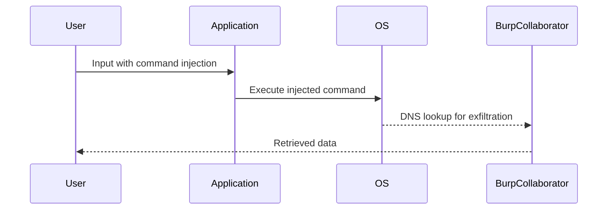

## Understanding the Lab Exercise

### Overview of the Lab

The lab exercise involves exploiting a blind OS command injection vulnerability to exfiltrate data from the system. The goal is to demonstrate how an attacker can inject commands into an application and use out-of-band data exfiltration techniques to retrieve sensitive information.

### Steps to Complete the Lab

1. **Inject Command**: Inject a command into the application input field.
2. **URL Encode**: Ensure the injected command is properly URL encoded.
3. **Monitor Exfiltration**: Use tools like Burp Collaborator to monitor the exfiltrated data.

### Detailed Walkthrough

#### Step 1: Inject Command

To inject a command, we need to craft an input string that includes the desired command. For example, we might want to execute the `whoami` command to determine the current user.

```plaintext
whoami
```

#### Step 2: URL Encode

Before sending the command, we need to ensure it is properly URL encoded. This prevents the application from interpreting special characters incorrectly.

```plaintext
whoami%20
```

#### Step 3: Monitor Exfiltration

We use Burp Collaborator to monitor the exfiltrated data. This tool allows us to set up a listener that captures DNS lookups and other network traffic generated by the injected command.

### Code Example

Here is a complete example of the process:

```plaintext
# Original input field value
original_input = "some_value"

# Injected command
injected_command = "whoami"

# Full input string with command injection
full_input = f"{original_input} {injected_command}"

# URL encoding the full input
url_encoded_input = urllib.parse.quote(full_input)

# Sending the request
request = f"GET /path?input={url_encoded_input} HTTP/1.1\r\nHost: target.com\r\n\r\n"
print(request)
```

### Expected Response

The expected response should include the output of the `whoami` command, which will be exfiltrated via DNS lookups captured by Burp Collaborator.

```plaintext
HTTP/1.1 200 OK
Date: Mon, 20 Mar 2023 12:00:00 GMT
Server: Apache/2.4.41 (Ubuntu)
Content-Length: 12
Content-Type: text/plain

current_user
```

### Mermaid Diagram: Attack Flow



---
<!-- nav -->
[[Web Security (PortSwigger)/10-OS Command Injection/06-Lab 5 Blind OS command injection with out of band data exfiltration/07-Practice Labs|Practice Labs]] | [[Web Security (PortSwigger)/10-OS Command Injection/06-Lab 5 Blind OS command injection with out of band data exfiltration/00-Overview|Overview]] | [[09-Understanding the Vulnerability|Understanding the Vulnerability]]
