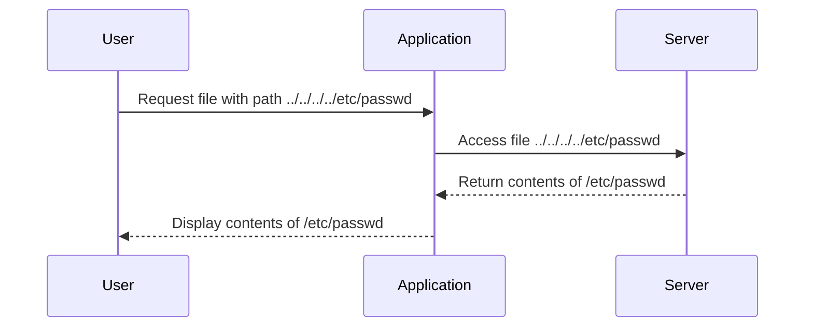
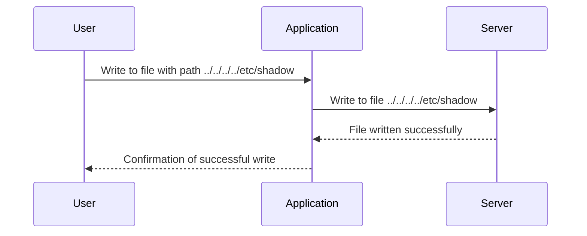
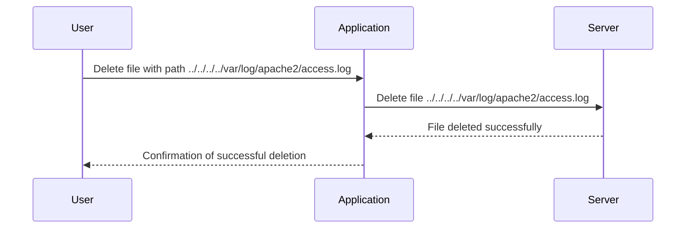
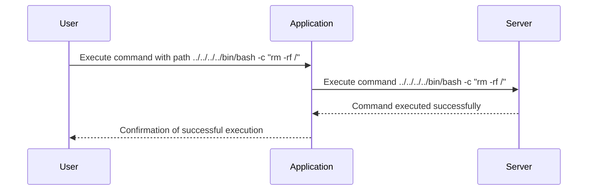

## Directory Traversal Vulnerabilities

### Introduction

Directory traversal vulnerabilities, also known as path traversal vulnerabilities, occur when an application allows users to manipulate file paths in a way that enables them to access unauthorized files or directories. This type of vulnerability can lead to severe security issues, impacting the confidentiality, integrity, and availability of the system. In this section, we will delve deep into the mechanics, impact, and mitigation strategies for directory traversal vulnerabilities.

### Impact on the SEA Triad

The impact of directory traversal vulnerabilities can be measured using the Security Triad: Confidentiality, Integrity, and Availability (SEA).

#### Confidentiality

**What:** Confidentiality refers to the protection of sensitive information from unauthorized access.

**Why:** Directory traversal vulnerabilities allow attackers to access and read files on the server that should not be accessible to them. This can include sensitive data such as passwords, private keys, configuration files, and other confidential information.

**How:** An attacker can manipulate the input to the application to traverse the directory structure and access files outside the intended directory. For example, if an application allows users to download files based on a user-provided path, an attacker might provide a path like `../../../../etc/passwd` to access the system password file.

**Real-World Example:** CVE-2021-21972 is a directory traversal vulnerability found in the Apache Tomcat server. This vulnerability allowed attackers to read arbitrary files on the server, potentially exposing sensitive information.



#### Integrity

**What:** Integrity ensures that data remains unchanged and uncorrupted during storage and transmission.

**Why:** Some directory traversal vulnerabilities can allow attackers to not only read files but also write to them or execute commands. This can result in altering files on the system, compromising their integrity.

**How:** If the application allows writing to files through user input, an attacker can manipulate the path to write to sensitive files. For example, an attacker might write malicious code to a configuration file, altering its behavior.

**Real-World Example:** CVE-2020-14882 is a directory traversal vulnerability in the WordPress plugin "WP File Download." This vulnerability allowed attackers to overwrite files on the server, potentially altering their content.



#### Availability

**What:** Availability ensures that authorized users can access the system and its resources whenever needed.

**Why:** Directory traversal vulnerabilities can lead to denial-of-service attacks by deleting critical files or executing commands that disrupt the system's operation.

**How:** An attacker can use the vulnerability to delete important files or execute commands that cause the system to crash or become unresponsive. For example, an attacker might delete a critical configuration file or execute a command that floods the server with traffic.

**Real-World Example:** CVE-2019-16759 is a directory traversal vulnerability in the Joomla CMS. This vulnerability allowed attackers to delete files on the server, potentially causing the site to become unavailable.



### Full Remote Code Execution

In some cases, directory traversal vulnerabilities can lead to full remote code execution (RCE). This occurs when the application allows the execution of arbitrary commands on the server.

**How:** If the application allows the execution of commands based on user input, an attacker can use directory traversal to execute malicious commands. For example, an attacker might provide a path like `../../../../bin/bash -c "rm -rf /"` to execute a command that deletes all files on the server.

**Real-World Example:** CVE-2020-14882 (mentioned earlier) also allowed attackers to execute arbitrary commands on the server, leading to full RCE.



### How to Prevent / Defend

To prevent directory traversal vulnerabilities, several measures can be taken:

#### Secure Input Validation

**What:** Input validation ensures that user-provided inputs are sanitized and validated before being used in file operations.

**Why:** By validating and sanitizing inputs, you can prevent attackers from manipulating the input to traverse directories or execute commands.

**How:** Implement strict input validation rules to ensure that only valid and safe inputs are accepted. For example, you can use regular expressions to validate file paths and reject any input that contains special characters or directory traversal sequences.

**Secure-Coding Fix:**

Vulnerable Code:
```python
import os

def download_file(file_path):
    file = open(file_path, 'rb')
    return file.read()
```

Fixed Code:
```python
import os
import re

def download_file(file_path):
    # Validate file path
    if not re.match(r'^[a-zA-Z0-9/_-]+$', file_path):
        raise ValueError("Invalid file path")
    
    # Ensure file path is within the allowed directory
    base_dir = '/path/to/allowed/directory'
    full_path = os.path.join(base_dir, file_path)
    if not full_path.startswith(base_dir):
        raise ValueError("Invalid file path")
    
    file = open(full_path, 'rb')
    return file.read()
```

#### Use Whitelisting

**What:** Whitelisting restricts file operations to a predefined set of allowed files or directories.

**Why:** By restricting file operations to a whitelist, you can prevent attackers from accessing unauthorized files or directories.

**How:** Define a whitelist of allowed files or directories and ensure that all file operations are restricted to this list. For example, you can create a list of allowed file paths and check each input against this list before performing any file operations.

**Secure-Coding Fix:**

Vulnerable Code:
```python
import os

def download_file(file_path):
    file = open(file_path, 'rb')
    return file.read()
```

Fixed Code:
```python
import os

ALLOWED_FILES = ['/path/to/allowed/file1', '/path/to/allowed/file2']

def download_file(file_path):
    # Check if file path is in the allowed list
    if file_path not in ALLOWED_FILES:
        raise ValueError("File not allowed")
    
    file = open(file_path, 'rb')
    return file.read()
```

#### Use Safe Libraries

**What:** Safe libraries provide built-in mechanisms to prevent directory traversal vulnerabilities.

**Why:** Using safe libraries can help prevent directory traversal vulnerabilities by automatically sanitizing and validating inputs.

**How:** Use libraries that provide safe file operations and ensure that they are configured correctly. For example, many web frameworks provide built-in mechanisms to prevent directory traversal vulnerabilities.

**Secure-Coding Fix:**

Vulnerable Code:
```python
import os

def download_file(file_path):
    file = open(file_path, 'rb')
    return file.read()
```

Fixed Code:
```python
from flask import send_from_directory

def download_file(file_path):
    # Use Flask's safe file serving mechanism
    return send_from_directory('/path/to/allowed/directory', file_path)
```

### Detection

Detecting directory traversal vulnerabilities requires a combination of static analysis and dynamic testing.

#### Static Analysis

**What:** Static analysis involves analyzing the source code of the application to identify potential vulnerabilities.

**Why:** Static analysis can help identify insecure coding practices and potential vulnerabilities before the application is deployed.

**How:** Use static analysis tools to scan the source code for patterns that indicate potential directory traversal vulnerabilities. For example, you can use tools like SonarQube, Fortify, or Veracode to perform static analysis.

**Example Output:**
```plaintext
Potential directory traversal vulnerability detected in function download_file
```

#### Dynamic Testing

**What:** Dynamic testing involves testing the application in a live environment to identify vulnerabilities.

**Why:** Dynamic testing can help identify vulnerabilities that may not be detected through static analysis alone.

**How:** Use dynamic testing tools to simulate attacks and test the application for directory traversal vulnerabilities. For example, you can use tools like Burp Suite, OWASP ZAP, or DirBuster to perform dynamic testing.

**Example Output:**
```plaintext
Directory traversal vulnerability detected in endpoint /download?file=../../../../etc/passwd
```

### Real-World Examples

#### CVE-2021-21972: Apache Tomcat Directory Traversal

**Description:** This vulnerability allowed attackers to read arbitrary files on the server, potentially exposing sensitive information.

**Impact:** High impact on confidentiality, as sensitive files could be accessed.

**Mitigation:** Update to the latest version of Apache Tomcat and implement input validation and whitelisting.

#### CVE-22020-14882: WP File Download Directory Traversal

**Description:** This vulnerability allowed attackers to overwrite files on the server, potentially altering their content.

**Impact:** High impact on integrity, as sensitive files could be altered.

**Mitigation:** Update to the latest version of the WP File Download plugin and implement input validation and whitelisting.

#### CVE-2019-16759: Joomla Directory Traversal

**Description:** This vulnerability allowed attackers to delete files on the server, potentially causing the site to become unavailable.

**Impact:** High impact on availability, as critical files could be deleted.

**Mitigation:** Update to the latest version of Joomla and implement input validation and whitelisting.

### Hands-On Labs

To practice and understand directory traversal vulnerabilities, consider the following hands-on labs:

- **PortSwigger Web Security Academy:** Offers interactive labs on directory traversal vulnerabilities.
- **OWASP Juice Shop:** A deliberately insecure web application for practicing web security.
- **DVWA (Damn Vulnerable Web Application):** A PHP/MySQL web application that demonstrates insecure coding practices.

### Conclusion

Directory traversal vulnerabilities can have severe impacts on the confidentiality, integrity, and availability of a system. By implementing secure input validation, using whitelisting, and leveraging safe libraries, you can prevent these vulnerabilities. Additionally, regular static and dynamic testing can help detect and mitigate directory traversal vulnerabilities.

---
<!-- nav -->
[[03-What is Directory Traversal|What is Directory Traversal]] | [[Web Security (PortSwigger)/11-Directory Traversal/01-Directory Traversal Complete Guide/00-Overview|Overview]] | [[05-Directory Traversal Vulnerability|Directory Traversal Vulnerability]]
