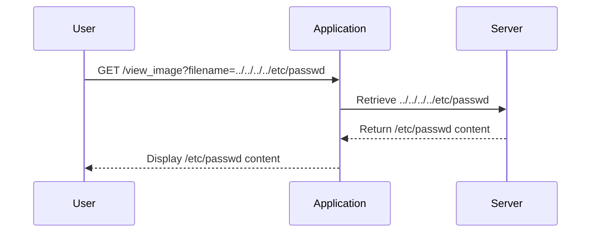
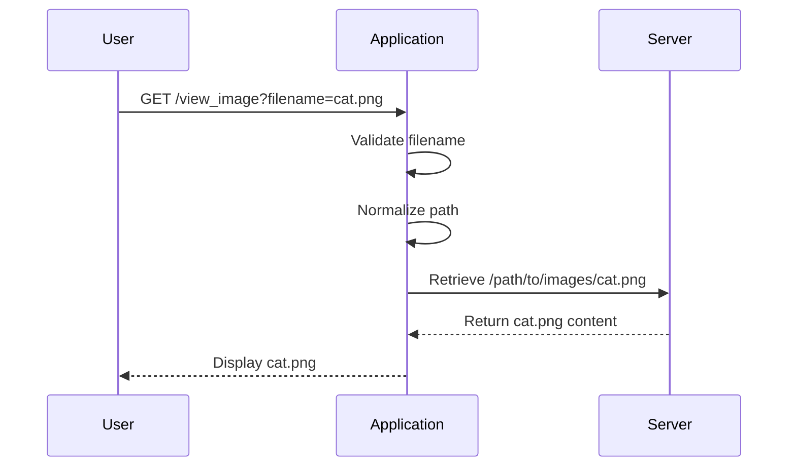

## Directory Traversal Vulnerability

### What is Directory Traversal?

Directory traversal, also known as file path traversal or path traversal, is a type of web application vulnerability that allows an attacker to access restricted files and directories on the server hosting the application. This vulnerability arises when the application does not properly validate input parameters used to reference files on the server. By manipulating these parameters, an attacker can traverse the directory structure of the server and gain unauthorized access to sensitive files such as configuration files, source code, or even system files like `/etc/passwd`.

### Why Does Directory Traversal Matter?

Understanding directory traversal is crucial for both developers and security professionals because it can lead to severe data breaches and compromise the integrity of the entire system. Once an attacker gains access to sensitive files, they can extract confidential information, manipulate the application's behavior, or even escalate their privileges within the system.

### How Does Directory Traversal Work?

To illustrate how directory traversal works, let's consider a simple example involving an application that allows users to view cat images. The application works by making a GET request to the backend server, which processes the request and retrieves the requested file. Here’s a step-by-step breakdown:

1. **User Request**: A user visits the application and requests a specific cat image, say `cat.png`.
2. **GET Request**: The application sends a GET request to the backend server with the filename `cat.png` as a parameter.
3. **Server Processing**: The backend server processes the request, retrieves the file `cat.png`, and returns it to the user.
4. **Display**: The user sees the cat image in their browser.

However, if the filename parameter is user-controllable and not properly validated, an attacker can manipulate it to access other files on the server. For instance, instead of requesting `cat.png`, the attacker might request `../../../../etc/passwd`. This request would cause the server to traverse up several directories and retrieve the `/etc/passwd` file, which contains user account information.

### Example Scenario

Let's delve deeper into the example provided in the lecture transcript:

#### Application Behavior

The application allows users to view cat images by sending a GET request to the server with the filename as a parameter. The server then retrieves the file and displays it to the user.

```http
GET /view_image?filename=cat.png HTTP/1.1
Host: example.com
```

#### Attacker's Manipulation

An attacker can exploit this by manipulating the `filename` parameter to traverse directories and access other files. For example, the attacker might send the following request:

```http
GET /view_image?filename=../../../../etc/passwd HTTP/1.1
Host: example.com
```

#### Server Response

If the server does not validate the `filename` parameter, it will process the request and return the contents of the `/etc/passwd` file:

```http
HTTP/1.1 200 OK
Content-Type: text/plain

root:x:0:0:root:/root:/bin/bash
daemon:x:1:1:daemon:/usr/sbin:/usr/sbin/nologin
bin:x:2:2:bin:/bin:/usr/sbin/nologin
sys:x:3:3:sys:/dev:/usr/sbin/nologin
...
```

### Real-World Examples

#### Recent CVEs and Breaches

Directory traversal vulnerabilities have been exploited in numerous real-world scenarios. One notable example is the CVE-2021-21972, which affected the Apache Struts framework. This vulnerability allowed attackers to bypass security restrictions and access arbitrary files on the server.

Another example is the breach at Equifax in 2017, where a directory traversal vulnerability was exploited to gain access to sensitive customer data. This breach resulted in the exposure of personal information of approximately 147 million individuals.

### How to Prevent / Defend Against Directory Traversal

#### Detection

Detecting directory traversal vulnerabilities requires a combination of static and dynamic analysis techniques:

1. **Static Analysis**: Tools like SonarQube, Fortify, and Veracode can scan the source code for patterns indicative of directory traversal vulnerabilities.
2. **Dynamic Analysis**: Penetration testing tools like Burp Suite, OWASP ZAP, and DirBuster can simulate attacks and identify potential vulnerabilities.

#### Prevention

Preventing directory traversal involves implementing robust input validation and sanitization mechanisms:

1. **Input Validation**: Ensure that the input parameters are strictly validated against a whitelist of allowed characters and filenames.
2. **Path Normalization**: Normalize the input path to remove any unnecessary directory traversal sequences (e.g., `../`).

#### Secure Coding Practices

Here’s an example of how to implement secure coding practices to prevent directory traversal:

**Vulnerable Code**

```python
import os

def view_image(filename):
    file_path = os.path.join("/path/to/images", filename)
    with open(file_path, "r") as file:
        return file.read()
```

**Secure Code**

```python
import os

def view_image(filename):
    # Whitelist allowed characters
    allowed_chars = set("abcdefghijklmnopqrstuvwxyzABCDEFGHIJKLMNOPQRSTUVWXYZ0123456789.-_")
    if set(filename) <= allowed_chars:
        file_path = os.path.join("/path/to/images", filename)
        if os.path.isfile(file_path):
            with open(file_path, "r") as file:
                return file.read()
    else:
        return "Invalid filename"
```

### Configuration Hardening

Hardening the server configuration can further mitigate the risk of directory traversal:

1. **Filesystem Permissions**: Ensure that sensitive files and directories have appropriate permissions and are not world-readable.
2. **Web Server Configuration**: Configure the web server to restrict access to sensitive directories and files.

### Hands-On Practice

For hands-on practice, you can use the following labs:

- **PortSwigger Web Security Academy**: Offers interactive labs specifically designed to teach and test your skills in identifying and exploiting directory traversal vulnerabilities.
- **OWASP Juice Shop**: Provides a vulnerable web application that includes various security flaws, including directory traversal.
- **DVWA (Damn Vulnerable Web Application)**: A deliberately insecure web application for practicing web hacking and security testing.

### Conclusion

Directory traversal is a serious vulnerability that can lead to significant data breaches and system compromises. By understanding the underlying mechanics, recognizing real-world examples, and implementing robust prevention measures, you can significantly reduce the risk of such vulnerabilities in your applications.

### Mermaid Diagrams

#### Directory Traversal Attack Chain



#### File Path Normalization



By thoroughly understanding and implementing these preventive measures, you can ensure that your applications are secure against directory traversal attacks.

---
<!-- nav -->
[[04-Directory Traversal Vulnerabilities|Directory Traversal Vulnerabilities]] | [[Web Security (PortSwigger)/11-Directory Traversal/01-Directory Traversal Complete Guide/00-Overview|Overview]] | [[06-Directory Traversal|Directory Traversal]]
