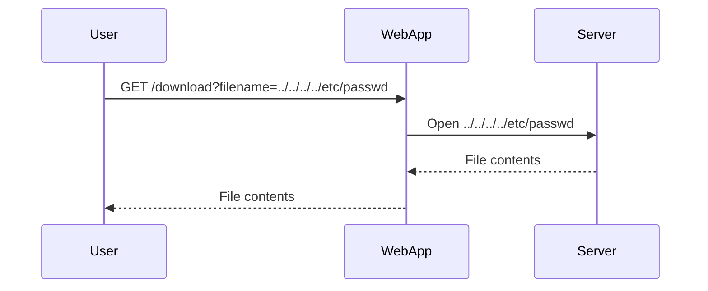
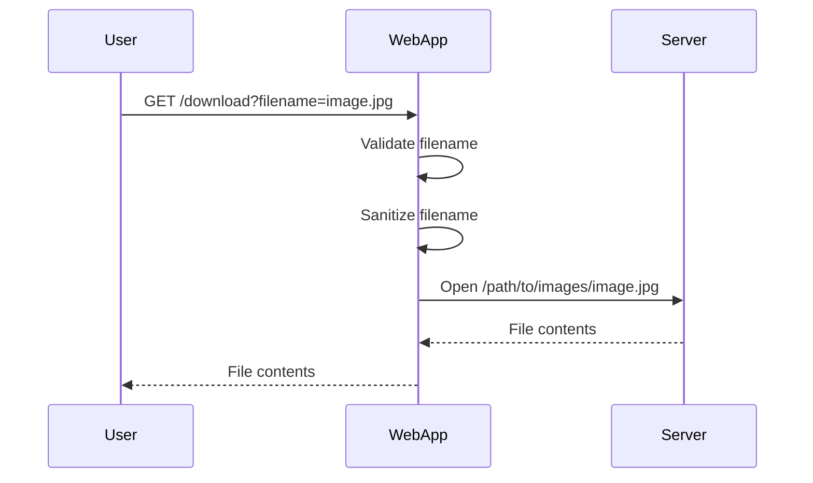

## Directory Traversal Vulnerabilities

### Introduction to Directory Traversal

Directory traversal, also known as path traversal, is a type of web application vulnerability that allows an attacker to access restricted files and directories on a web server. This can lead to unauthorized access to sensitive information such as configuration files, source code, and even hashed passwords. Understanding and mitigating directory traversal vulnerabilities is crucial for maintaining the security of web applications.

### What is Directory Traversal?

Directory traversal occurs when an attacker manipulates input parameters to navigate outside the intended directory structure of a web application. This manipulation typically involves using special characters like `../` (parent directory) or `./` (current directory) to traverse the file system.

#### Why Does Directory Traversal Matter?

Directory traversal matters because it can expose sensitive data stored on the server. If an attacker can access these files, they may gain insights into the application's architecture, configuration, and even sensitive credentials. This can lead to further attacks, such as privilege escalation or data exfiltration.

### How Directory Traversal Works

To understand how directory traversal works, let's break down the process:

1. **Input Manipulation**: An attacker manipulates the input parameter used to specify a file path. This input is often passed through a URL or form field.
   
2. **Traversal Characters**: The attacker uses traversal characters like `../` to move up the directory hierarchy. For example, `../../etc/passwd` would attempt to access the `/etc/passwd` file on a Unix-based system.

3. **File Access**: If the application does not properly validate or sanitize the input, the server will attempt to access the specified file. If the file exists and the application has the necessary permissions, the file contents will be returned to the attacker.

### Example of Directory Traversal

Let's consider a simple example where a web application allows users to download images based on a filename parameter:

```http
GET /download?filename=image.jpg HTTP/1.1
Host: example.com
```

If the application does not properly validate the `filename` parameter, an attacker could manipulate it to access other files on the server:

```http
GET /download?filename=../../../../etc/passwd HTTP/1.1
Host: example.com
```

In this case, the server might return the contents of the `/etc/passwd` file, which contains user account information.

### Real-World Examples and Recent Breaches

Directory traversal vulnerabilities have been exploited in several high-profile breaches and CVEs. Here are a few recent examples:

1. **CVE-2021-21972**: A directory traversal vulnerability was found in the Apache Struts framework, allowing attackers to read arbitrary files on the server. This vulnerability was exploited in various attacks, leading to data breaches.

2. **CVE-2020-14882**: A directory traversal vulnerability in the Jenkins Continuous Integration server allowed attackers to read sensitive files, including configuration files and credentials.

These examples highlight the importance of securing web applications against directory traversal attacks.

### Testing for Directory Traversal

To test for directory traversal vulnerabilities, you can use tools like Burp Suite, which includes features like Repeater to manually manipulate and send HTTP requests.

#### Step-by-Step Testing Process

1. **Identify Input Parameters**: Identify input parameters that are used to specify file paths, such as `filename`, `image`, etc.

2. **Manipulate Input**: Use traversal characters like `../` to manipulate the input parameter. For example, change `filename=image.jpg` to `filename=../../../../etc/passwd`.

3. **Send Request**: Use a tool like Burp Suite Repeater to send the manipulated request to the server.

4. **Analyze Response**: Check the server's response. If the server returns the contents of a file that should not be accessible, the application is likely vulnerable to directory traversal.

### Full HTTP Request and Response Example

Here is a complete example of a directory traversal attack using HTTP requests and responses:

```http
GET /download?filename=../../../../etc/passwd HTTP/1.1
Host: example.com
User-Agent: Mozilla/5.0
Accept: */*
```

Response:

```http
HTTP/1.1 200 OK
Date: Mon, 01 Jan 2024 00:00:00 GMT
Server: Apache/2.4.41 (Ubuntu)
Content-Type: text/plain
Content-Length: 1024

root:x:0:0:root:/root:/bin/bash
daemon:x:1:1:daemon:/usr/sbin:/usr/sbin/nologin
bin:x:2:2:bin:/bin:/usr/sbin/nologin
sys:x:3:3:sys:/dev:/usr/sbin/nologin
...
```

In this example, the server returns the contents of the `/etc/passwd` file, indicating a successful directory traversal attack.

### How to Prevent / Defend Against Directory Traversal

Preventing directory traversal requires a combination of proper input validation, file path sanitization, and least privilege principles.

#### Secure Coding Practices

1. **Validate Input**: Ensure that input parameters are validated to only accept expected values. For example, if the input should be a filename, validate that it matches a specific pattern (e.g., `^[a-zA-Z0-9._-]+$`).

2. **Sanitize Paths**: Sanitize file paths to remove traversal characters. For example, replace `../` with an empty string.

3. **Use Whitelisting**: Use a whitelist of allowed filenames or directories instead of blacklisting known malicious patterns.

#### Configuration Hardening

1. **Least Privilege**: Run the web application with the least privileges possible. Avoid running the application as a root or administrator user.

2. **File Permissions**: Set appropriate file permissions to restrict access to sensitive files. For example, ensure that configuration files and logs are not world-readable.

#### Detection and Monitoring

1. **Web Application Firewalls (WAF)**: Use WAFs to detect and block suspicious requests that may indicate directory traversal attempts.

2. **Logging and Monitoring**: Implement logging and monitoring to detect unusual file access patterns. Monitor for attempts to access sensitive files or directories.

### Secure Code Example

Here is an example of how to securely handle file paths in a web application:

#### Vulnerable Code

```python
import os

def download_file(filename):
    file_path = os.path.join("/path/to/images", filename)
    with open(file_path, "rb") as f:
        return f.read()
```

#### Secure Code

```python
import os
import re

def download_file(filename):
    # Validate filename to only allow alphanumeric characters, dots, and hyphens
    if not re.match(r'^[a-zA-Z0-9._-]+$', filename):
        raise ValueError("Invalid filename")

    # Sanitize filename to remove traversal characters
    sanitized_filename = re.sub(r'\.\./', '', filename)

    # Construct safe file path
    file_path = os.path.join("/path/to/images", sanitized_filename)

    # Check if file exists and is within the allowed directory
    if not os.path.isfile(file_path) or not file_path.startswith("/path/to/images"):
        raise FileNotFoundError("File not found")

    with open(file_path, "rb") as f:
        return f.read()
```

### Mermaid Diagrams

#### Directory Traversal Attack Chain



#### Secure File Path Handling



### Practice Labs

For hands-on practice with directory traversal vulnerabilities, consider the following labs:

- **PortSwigger Web Security Academy**: Offers interactive labs to practice identifying and exploiting directory traversal vulnerabilities.
- **OWASP Juice Shop**: Provides a vulnerable web application with various security issues, including directory traversal.
- **DVWA (Damn Vulnerable Web Application)**: A deliberately insecure web application for practicing web hacking techniques, including directory traversal.

By thoroughly understanding and implementing the practices outlined above, you can significantly reduce the risk of directory traversal vulnerabilities in your web applications.

---
<!-- nav -->
[[Web Security (PortSwigger)/11-Directory Traversal/02-Lab 1 File path traversal simple case/01-Introduction to Directory Traversal|Introduction to Directory Traversal]] | [[Web Security (PortSwigger)/11-Directory Traversal/02-Lab 1 File path traversal simple case/00-Overview|Overview]] | [[Web Security (PortSwigger)/11-Directory Traversal/02-Lab 1 File path traversal simple case/03-Directory Traversal Vulnerability|Directory Traversal Vulnerability]]
