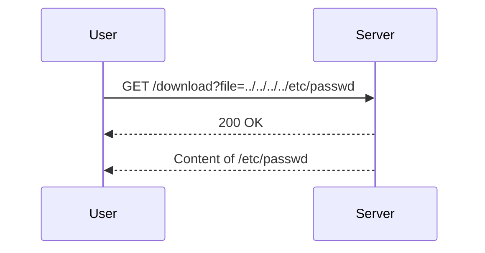

## Directory Traversal Vulnerability

### What is Directory Traversal?

Directory traversal, also known as path traversal, is a web security vulnerability that allows an attacker to access restricted files, directories, and executables on a server. This can be achieved by manipulating the input parameters used by the application to access files. The attacker can navigate through the file system by using special characters like `../` (dot-dot-slash) to move up the directory tree.

### Why Does Directory Traversal Matter?

Directory traversal vulnerabilities can lead to unauthorized access to sensitive information stored on the server. This includes configuration files, database credentials, source code, and other critical data. In extreme cases, an attacker might gain access to the entire file system, leading to a full compromise of the server.

### How Does Directory Traversal Work?

To understand how directory traversal works, let's consider a typical scenario where a web application serves files based on user input. For instance, an application might have a URL structure like:

```
http://example.com/download?file=filename.jpg
```

If the application does not properly validate the `file` parameter, an attacker can manipulate it to traverse directories. For example:

```
http://example.com/download?file=../../../../etc/passwd
```

In this case, the `../` sequences are used to move up the directory hierarchy. The `/etc/passwd` file is a Unix/Linux system file that contains user account information.

### Example Scenario

Let's break down the example provided in the lecture transcript:

1. **Initial Setup**:
    - The application serves a JPEG image located at `/var/www/images/65.jpg`.
    - The application expects a filename parameter to serve the correct file.

2. **Attacker's Goal**:
    - Access the `/etc/passwd` file, which is located outside the `/var/www/images` directory.

3. **Manipulating the Input**:
    - The attacker modifies the URL to include `../` sequences to navigate up the directory tree.
    - The modified URL might look like:
      ```
      http://example.com/download?file=../../../../etc/passwd
      ```

### Detailed Explanation

#### Understanding the File Path

The file path `/var/www/images/65.jpg` can be broken down as follows:
- `/var`: A directory typically used for variable data files.
- `/www`: A subdirectory often used for web server content.
- `/images`: A subdirectory containing image files.
- `65.jpg`: The specific image file.

When the attacker uses `../`, they are moving up one directory level. For example:
- `../` moves up to `/var/www`.
- `../../` moves up to `/var`.

By chaining these sequences, the attacker can navigate to any directory on the server.

### Real-World Examples

#### Recent CVEs and Breaches

1. **CVE-2021-3129**: This vulnerability affected the Apache Struts framework, allowing attackers to execute arbitrary commands on the server. One of the methods involved directory traversal to access sensitive files.

2. **SolarWinds SunBurst Attack (2020)**: Although not primarily a directory traversal attack, the attackers exploited various vulnerabilities, including directory traversal, to gain deeper access to the target systems.

### Complete Code Example

Let's demonstrate a simple directory traversal attack using a Python script that simulates a vulnerable web application.

```python
import os

def serve_file(filename):
    # Simulate the file serving logic
    base_dir = "/var/www/images"
    requested_path = os.path.join(base_dir, filename)
    
    # Check if the requested file exists
    if os.path.exists(requested_path):
        print(f"Serving file: {requested_path}")
    else:
        print("File not found")

# Normal usage
serve_file("65.jpg")

# Attacker's attempt
serve_file("../../etc/passwd")
```

### HTTP Request and Response

Here’s a full HTTP request and response demonstrating the directory traversal attack:

```http
GET /download?file=../../../../etc/passwd HTTP/1.1
Host: example.com
User-Agent: Mozilla/5.0
Accept: */*

HTTP/1.1 200 OK
Date: Mon, 20 Nov 2023 12:00:00 GMT
Server: Apache/2.4.41 (Ubuntu)
Content-Type: text/plain; charset=UTF-8
Content-Length: 1024

root:x:0:0:root:/root:/bin/bash
daemon:x:1:1:daemon:/usr/sbin:/usr/sbin/nologin
...
```

### Mermaid Diagrams

#### Directory Structure

```mermaid
graph TD
    A[Root] --> B[/var]
    B --> C[/www]
    C --> D[/images]
    D --> E[65.jpg]
    B --> F[/etc]
    F --> G[passwd]
```

#### Attack Flow



### Pitfalls and Common Mistakes

1. **Insufficient Input Validation**: Not validating the input parameter against a whitelist of allowed filenames.
2. **Absolute Path Handling**: Allowing absolute paths can lead to easy traversal attacks.
3. **Directory Traversal Characters**: Not sanitizing input to remove or escape characters like `../`.

### How to Prevent / Defend

#### Detection

1. **Logging and Monitoring**: Implement logging and monitoring to detect unusual file access patterns.
2. **Intrusion Detection Systems (IDS)**: Use IDS to identify and alert on suspicious activities.

#### Prevention

1. **Input Validation**: Validate the input parameter against a whitelist of allowed filenames.
2. **Path Canonicalization**: Ensure that the file path is canonicalized to avoid traversal attacks.
3. **Access Control**: Restrict file access permissions to the minimum necessary.

#### Secure Coding Fixes

##### Vulnerable Code

```python
import os

def serve_file(filename):
    base_dir = "/var/www/images"
    requested_path = os.path.join(base_dir, filename)
    
    if os.path.exists(requested_path):
        print(f"Serving file: {requested_path}")
    else:
        print("File not found")
```

##### Fixed Code

```python
import os
import re

def serve_file(filename):
    base_dir = "/var/www/images"
    allowed_pattern = re.compile(r'^[\w.-]+$')
    
    if allowed_pattern.match(filename):
        requested_path = os.path.join(base_dir, filename)
        
        if os.path.exists(requested_path):
            print(f"Serving file: {requested_path}")
        else:
            print("File not found")
    else:
        print("Invalid filename")
```

### Configuration Hardening

1. **Web Server Configuration**: Configure the web server to restrict access to sensitive directories.
2. **Application Security Settings**: Enable security features in the application framework to mitigate directory traversal risks.

### Practice Labs

For hands-on practice with directory traversal vulnerabilities, consider the following labs:

- **PortSwigger Web Security Academy**: Offers interactive labs to learn and test directory traversal attacks.
- **OWASP Juice Shop**: A deliberately insecure web application for practicing web security skills.
- **DVWA (Damn Vulnerable Web Application)**: A PHP/MySQL web application that demonstrates web application vulnerabilities.

By thoroughly understanding and practicing these concepts, you can effectively prevent and defend against directory traversal vulnerabilities in web applications.

---
<!-- nav -->
[[Web Security (PortSwigger)/11-Directory Traversal/02-Lab 1 File path traversal simple case/02-Directory Traversal Vulnerabilities|Directory Traversal Vulnerabilities]] | [[Web Security (PortSwigger)/11-Directory Traversal/02-Lab 1 File path traversal simple case/00-Overview|Overview]] | [[Web Security (PortSwigger)/11-Directory Traversal/02-Lab 1 File path traversal simple case/04-Practice Questions & Answers|Practice Questions & Answers]]
