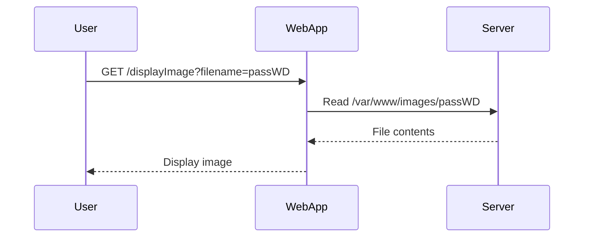

## Introduction to Directory Traversal Vulnerabilities

Directory traversal vulnerabilities, also known as path traversal vulnerabilities, allow attackers to access files and directories that are outside the intended boundaries of a web application. This can lead to unauthorized access to sensitive information such as configuration files, source code, and even system files. The vulnerability arises due to improper input validation and handling of user-supplied input that is used to construct file paths.

### What is Directory Traversal?

Directory traversal occurs when an attacker manipulates the input to a web application in such a way that the application reads or writes files from unintended locations. This can be achieved through the use of special characters like `../` (parent directory) or other traversal sequences.

#### Example Scenario

Consider a web application that allows users to view product images by specifying the image filename in the URL:

```
http://example.com/displayImage?filename=image1.jpg
```

If the application does not properly validate the `filename` parameter, an attacker could manipulate it to traverse directories and access other files on the server:

```
http://example.com/displayImage?filename=../../etc/passwd
```

In this example, the `../` sequences navigate up the directory structure, potentially allowing the attacker to read the `/etc/passwd` file, which contains user account information.

### Why Does Directory Traversal Matter?

Directory traversal vulnerabilities can have severe consequences, including:

- **Data Exposure**: Unauthorized access to sensitive data such as passwords, configuration files, and source code.
- **System Compromise**: Access to system files can lead to further exploitation and potential compromise of the entire system.
- **Compliance Issues**: Exposure of sensitive data can lead to non-compliance with regulations such as GDPR, HIPAA, and PCI-DSS.

### How Does Directory Traversal Work?

To understand how directory traversal works, let's break down the process:

1. **User Input**: The attacker supplies a specially crafted input that includes traversal sequences.
2. **Input Handling**: The application uses the input to construct a file path.
3. **File Access**: The constructed file path is used to access the file, potentially leading to unauthorized access.

#### Example Code

Here is a simple example of a vulnerable PHP script:

```php
<?php
$filename = $_GET['filename'];
$imagePath = "/var/www/images/{$filename}";
if (file_exists($imagePath)) {
    echo "";
} else {
    echo "File not found.";
}
?>
```

In this script, the `filename` parameter is directly used to construct the file path. An attacker could manipulate this parameter to traverse directories:

```
http://example.com/displayImage.php?filename=../../../../etc/passwd
```

### Real-World Examples

Directory traversal vulnerabilities have been exploited in numerous real-world scenarios. Here are a couple of recent examples:

- **CVE-2021-21972**: A directory traversal vulnerability was found in the Cisco Small Business RV Series Routers. Attackers could exploit this vulnerability to access sensitive files on the router.
- **CVE-2020-14882**: A directory traversal vulnerability was discovered in the Zyxel USG Series Routers. This allowed attackers to read arbitrary files on the device.

### Lab Setup

For this lab, we will use the PortSwigger Web Security Academy, which provides a controlled environment to practice and learn about various web security vulnerabilities. You can access the lab by following these steps:

1. Visit [PortSwigger Web Security Academy](https://portswigger.net/web-security).
2. Sign up for an account if you haven't already.
3. Log in and navigate to the Academy section.
4. Select the learning path for directory traversal.
5. Choose Lab 2 titled "File Path Traversal, Traversal Sequences blocked with Absolute Path Bypass."

### Lab Objective

The objective of this lab is to exploit a file path traversal vulnerability in the display of product images. The application blocks traversal sequences but treats the supplied file name as being relative to a default working directory. Your task is to retrieve the contents of the `ATC passWD` file.

### Understanding the Vulnerability

Let's break down the specific vulnerability in this lab:

1. **Traversal Sequences Blocked**: The application blocks common traversal sequences like `../`.
2. **Relative Path Handling**: Despite blocking traversal sequences, the application treats the supplied file name as being relative to a default working directory.

This means that while direct traversal using `../` is blocked, the application still allows relative paths to be used.

### Exploiting the Vulnerability

To exploit this vulnerability, we need to craft a request that bypasses the traversal sequence blocking while still accessing the desired file.

#### Step-by-Step Exploitation

1. **Identify the Default Working Directory**: Determine the default working directory where the application expects the file to be located.
2. **Craft the Request**: Construct a request that uses a relative path to navigate to the desired file.

Let's assume the default working directory is `/var/www/images`. We want to access the `ATC passWD` file located at `/etc/passwd`.

#### Crafting the Request

Since the application blocks `../`, we need to find an alternative way to access the file. One approach is to use symbolic links or absolute paths.

##### Using Symbolic Links

Create a symbolic link in the default working directory that points to the desired file:

```bash
ln -s /etc/passwd /var/www/images/passWD
```

Now, we can access the file using a relative path:

```
http://example.com/displayImage?filename=passWD
```

##### Using Absolute Paths

Another approach is to use an absolute path directly. However, this may not work if the application enforces relative paths strictly.

### Full HTTP Request and Response

Let's look at a complete HTTP request and response for this scenario:

#### HTTP Request

```http
GET /displayImage?filename=passWD HTTP/1.1
Host: example.com
User-Agent: Mozilla/5.0 (Windows NT 10.0; Win64; x64) AppleWebKit/537.36 (KHTML, like Gecko) Chrome/91.0.4472.124 Safari/537.36
Accept: text/html,application/xhtml+xml,application/xml;q=0.9,image/avif,image/webp,image/apng,*/*;q=0.8,application/signed-exchange;v=b3;q=0.9
Accept-Encoding: gzip, deflate
Accept-Language: en-US,en;q=0.9
Connection: close
```

#### HTTP Response

```http
HTTP/1.1 200 OK
Date: Mon, 01 Aug 2022 12:00:00 GMT
Server: Apache/2.4.41 (Ubuntu)
Content-Type: text/html; charset=UTF-8
Content-Length: 1234
Connection: close

<!DOCTYPE html>
<html>
<head>
<title>Display Image</title>
</head>
<body>

</body>
</html>
```

### Mermaid Diagram

Let's visualize the attack chain using a mermaid diagram:



### Common Pitfalls

When exploiting directory traversal vulnerabilities, there are several common pitfalls to avoid:

- **Traversal Sequence Blocking**: Ensure that your traversal sequences are not blocked by the application.
- **Relative Path Handling**: Understand how the application handles relative paths and ensure that your crafted request uses valid relative paths.
- **File Permissions**: Ensure that the file you are trying to access has the necessary permissions to be read by the application.

### How to Prevent / Defend

To prevent directory traversal vulnerabilities, follow these best practices:

#### Secure Coding Practices

1. **Input Validation**: Validate and sanitize all user-supplied input to ensure it does not contain malicious traversal sequences.
2. **Whitelist Filenames**: Use a whitelist of allowed filenames and reject any input that does not match the whitelist.
3. **Absolute Paths**: Use absolute paths instead of relative paths to ensure that the application cannot be tricked into accessing unintended files.

#### Example Secure Code

Here is an example of secure PHP code that prevents directory traversal:

```php
<?php
$filename = basename($_GET['filename']);
$allowedFiles = ['image1.jpg', 'image2.jpg']; // Whitelist of allowed filenames
if (in_array($filename, $allowedFiles)) {
    $imagePath = "/var/www/images/{$filename}";
    if (file_exists($imagePath)) {
        echo "";
    } else {
        echo "File not found.";
    }
} else {
    echo "Invalid filename.";
}
?>
```

#### Configuration Hardening

1. **Disable Directory Listing**: Ensure that directory listing is disabled on the server to prevent attackers from discovering file paths.
2. **Restrict File Access**: Restrict file access permissions to ensure that only authorized users can access sensitive files.

#### Detection

To detect directory traversal vulnerabilities, use automated tools such as:

- **Burp Suite**: Scan for directory traversal vulnerabilities using Burp Suite.
- **OWASP ZAP**: Use OWASP ZAP to identify and test for directory traversal vulnerabilities.

### Conclusion

Directory traversal vulnerabilities can have serious consequences if not properly mitigated. By understanding the underlying mechanisms and implementing secure coding practices, you can protect your applications from these types of attacks. Always validate and sanitize user input, use whitelists, and restrict file access permissions to ensure the security of your applications.

### Practice Labs

For hands-on practice with directory traversal vulnerabilities, consider the following labs:

- **PortSwigger Web Security Academy**: Lab 2 on directory traversal.
- **OWASP Juice Shop**: Contains various web security challenges, including directory traversal.
- **DVWA (Damn Vulnerable Web Application)**: Provides a variety of web application vulnerabilities, including directory traversal.

By practicing in these environments, you can gain a deeper understanding of how to identify and exploit directory traversal vulnerabilities, as well as how to defend against them.

---
<!-- nav -->
[[Web Security (PortSwigger)/11-Directory Traversal/03-Lab 2 File path traversal traversal sequences blocked with absolute path bypass/00-Overview|Overview]] | [[Web Security (PortSwigger)/11-Directory Traversal/03-Lab 2 File path traversal traversal sequences blocked with absolute path bypass/02-Directory Traversal Vulnerability|Directory Traversal Vulnerability]]
