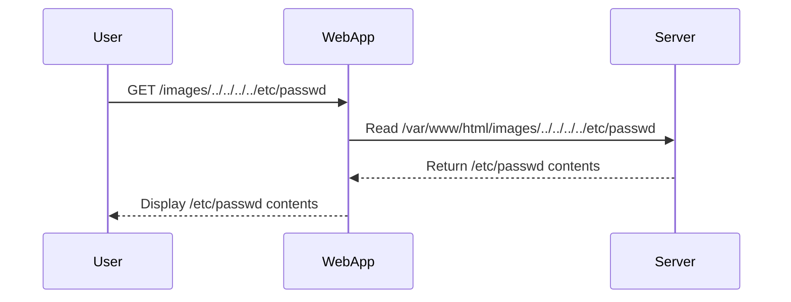
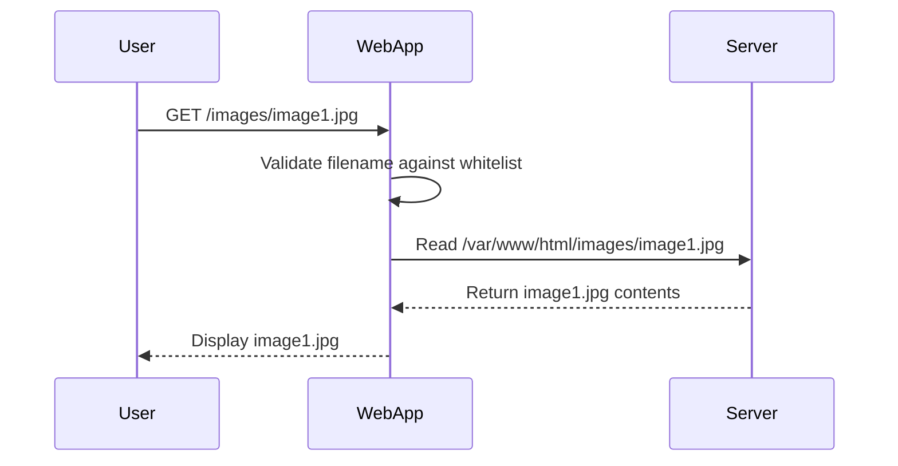

## Introduction to Directory Traversal Vulnerabilities

Directory traversal, also known as path traversal, is a web security vulnerability that allows an attacker to access restricted files, directories, and executables on a web server. This can lead to unauthorized data exposure, privilege escalation, and even remote code execution. The vulnerability arises due to improper input validation and sanitization of user-supplied input used to reference files on the server.

### What is Directory Traversal?

Directory traversal occurs when an application uses user-supplied input to construct a filename or path to access a file on the server. If the input is not properly validated, an attacker can manipulate the input to traverse the directory structure and access arbitrary files on the server.

For example, consider an application that serves images based on a user-provided filename:

```
http://example.com/images/<filename>
```

If the application does not validate the `filename` parameter, an attacker can provide a specially crafted input to access files outside the intended directory:

```
http://example.com/images/../../etc/passwd
```

This would allow the attacker to read the `/etc/passwd` file, which contains sensitive information about the server's users.

### Why Does Directory Traversal Matter?

Directory traversal vulnerabilities can have severe consequences, including:

- **Data Exposure**: Attackers can access sensitive files such as configuration files, database backups, and source code.
- **Privilege Escalation**: Accessing certain files can lead to privilege escalation, allowing attackers to gain administrative access to the server.
- **Remote Code Execution**: In some cases, attackers can execute arbitrary code on the server, leading to complete compromise.

### How Does Directory Traversal Work?

To understand how directory traversal works, let's break down the process:

1. **User Input**: The attacker provides a specially crafted input that includes directory traversal sequences.
2. **File Path Construction**: The application constructs the file path using the user-supplied input.
3. **File Access**: The application attempts to access the constructed file path on the server.

#### Example: Directory Traversal in Action

Consider the following PHP script that serves images based on a user-provided filename:

```php
<?php
$filename = $_GET['file'];
$image_path = "/var/www/html/images/{$filename}";
if (file_exists($image_path)) {
    header("Content-Type: image/jpeg");
    readfile($image_path);
} else {
    echo "File not found.";
}
?>
```

An attacker can exploit this script by providing a malicious filename:

```
http://example.com/image.php?file=../../../../etc/passwd
```

The resulting file path would be:

```
/var/www/html/images/../../../../etc/passwd
```

This would resolve to:

```
/etc/passwd
```

### Real-World Examples of Directory Traversal

Directory traversal vulnerabilities have been exploited in numerous real-world attacks. Here are a few notable examples:

- **CVE-2021-21972**: A directory traversal vulnerability was discovered in the WordPress plugin "WP File Download." An attacker could exploit this vulnerability to access arbitrary files on the server.
- **CVE-2020-14882**: A directory traversal vulnerability was found in the Apache Struts framework. This allowed attackers to access sensitive files and potentially execute arbitrary code.

### Testing for Directory Traversal

Testing for directory traversal vulnerabilities involves sending specially crafted requests to the application and observing the responses. Let's walk through the steps using Burp Suite, a popular web application security testing tool.

#### Setting Up Burp Suite

1. **Start Burp Suite**: Launch Burp Suite and configure your browser to use Burp Suite as a proxy.
2. **Navigate to the Application**: Open the target application in your browser and navigate to the page where file paths are used.

#### Sending Requests to Repeater

1. **Capture the Request**: Use Burp Suite's Proxy tab to capture the request that accesses a file.
2. **Send to Repeater**: Right-click the captured request and select "Send to Repeater."

#### Testing Absolute Paths

1. **Absolute Path Test**: Modify the request to include an absolute path, such as `/etc/passwd`.

```http
GET /images/../../../../etc/passwd HTTP/1.1
Host: example.com
```

2. **Observe the Response**: Send the modified request and observe the response. If the server returns the contents of `/etc/passwd`, the application is vulnerable to directory traversal.

#### Testing Relative Paths

1. **Relative Path Test**: Modify the request to include relative path traversal sequences, such as `../`.

```http
GET /images/../../../etc/passwd HTTP/1.1
Host: example.com
```

2. **Observe the Response**: Send the modified request and observe the response. If the server returns the contents of `/etc/passwd`, the application is vulnerable to directory traversal.

### Encoding Techniques

Sometimes, applications may strip directory traversal sequences or perform URL decoding. To bypass these defenses, attackers can use encoding techniques.

#### URL Encoding

URL encoding replaces special characters with their percent-encoded equivalents. For example, `../` can be encoded as `%2E%2E%2F`.

```http
GET /images/%2E%2E%2F%2E%2E%2Fetc%2Fpasswd HTTP/1.1
Host: example.com
```

#### Double Encoding

Double encoding involves encoding the encoded string again. For example, `%2E%2E%2F` can be double-encoded as `%252E%252E%252F`.

```http
GET /images/%252E%252E%252F%25252E%25252E%25252Fetc%25252Fpasswd HTTP/1.1
Host: example.com
```

### How to Prevent / Defend Against Directory Traversal

Preventing directory traversal vulnerabilities requires a combination of proper input validation, file path sanitization, and secure coding practices.

#### Secure Coding Practices

1. **Input Validation**: Validate user-supplied input to ensure it only contains allowed characters and patterns.
2. **Whitelist Filenames**: Use a whitelist of allowed filenames instead of allowing arbitrary input.
3. **Canonicalize Paths**: Canonicalize file paths to ensure they are within the intended directory.

#### Example: Secure PHP Script

Here is an example of a secure PHP script that prevents directory traversal:

```php
<?php
$allowed_files = ['image1.jpg', 'image2.jpg']; // Whitelist of allowed filenames
$filename = $_GET['file'];

if (in_array($filename, $allowed_files)) {
    $image_path = "/var/www/html/images/{$filename}";
    if (file_exists($image_path)) {
        header("Content-Type: image/jpeg");
        readfile($image_path);
    } else {
        echo "File not found.";
    }
} else {
    echo "Invalid filename.";
}
?>
```

#### Filesystem Hardening

1. **Restrict File Permissions**: Ensure that sensitive files and directories have appropriate permissions to prevent unauthorized access.
2. **Use Chroot Jails**: Restrict the application's filesystem access to a specific directory using chroot jails.

#### Detection and Monitoring

1. **Web Application Firewalls (WAF)**: Use WAFs to detect and block suspicious requests that attempt to exploit directory traversal vulnerabilities.
2. **Logging and Monitoring**: Implement logging and monitoring to detect and respond to potential exploitation attempts.

### Conclusion

Directory traversal vulnerabilities pose significant risks to web applications. By understanding how these vulnerabilities work, testing for them effectively, and implementing robust defenses, developers and security professionals can protect against these threats.

### Practice Labs

For hands-on practice with directory traversal vulnerabilities, consider the following labs:

- **PortSwigger Web Security Academy**: Offers interactive labs that cover various web security topics, including directory traversal.
- **OWASP Juice Shop**: A deliberately insecure web application that includes directory traversal vulnerabilities for educational purposes.
- **DVWA (Damn Vulnerable Web Application)**: A PHP/MySQL web application that intentionally contains numerous security vulnerabilities, including directory traversal.

By engaging with these labs, you can gain practical experience in identifying and mitigating directory traversal vulnerabilities.

### References

- [CVE-2021-21972](https://nvd.nist.gov/vuln/detail/CVE-2021-21972)
- [CVE-2020-14882](https://nvd.nist.gov/vuln/detail/CVE-2020-14882)
- [OWASP Top Ten Project](https://owasp.org/www-project-top-ten/)
- [PortSwigger Web Security Academy](https://portswigger.net/web-security)
- [OWASP Juice Shop](https://owasp.org/www-project-juice-shop/)
- [DVWA (Damn Vulnerable Web Application)](https://github.com/ethicalhack3r/DVWA)

### Mermaid Diagrams

#### Directory Traversal Attack Chain



#### Secure File Path Handling



### Summary

Directory traversal vulnerabilities are a serious threat to web applications. By understanding the mechanisms behind these vulnerabilities, testing for them effectively, and implementing robust defenses, developers and security professionals can protect against these threats. Engaging with hands-on labs and staying up-to-date with the latest security practices will help ensure the security of web applications.

---
<!-- nav -->
[[Web Security (PortSwigger)/11-Directory Traversal/05-Lab 4 File path traversal traversal sequences stripped with superfluous URL decode/00-Overview|Overview]] | [[Web Security (PortSwigger)/11-Directory Traversal/05-Lab 4 File path traversal traversal sequences stripped with superfluous URL decode/02-Introduction to Directory Traversal|Introduction to Directory Traversal]]
