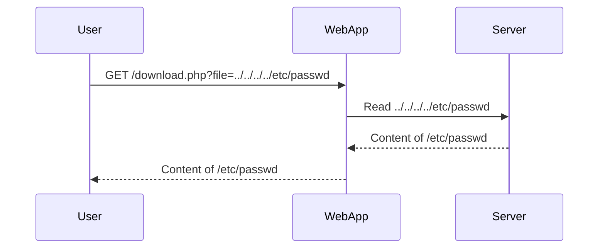
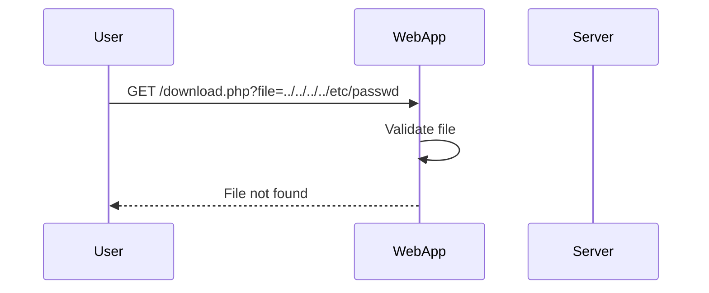

## Directory Traversal Vulnerabilities

### Introduction to Directory Traversal

Directory traversal, also known as path traversal, is a type of web application vulnerability that allows an attacker to access restricted files and directories on a server. This can lead to unauthorized access to sensitive information, such as source code, configuration files, and even system binaries. The vulnerability arises due to improper input validation and sanitization of user-supplied data used in file operations.

### How Directory Traversal Works

In a typical scenario, a web application might allow users to download files from a specific directory. For instance, a URL like `http://example.com/download.php?file=image.jpg` would serve the file `image.jpg` from a predefined directory. However, if the application does not properly validate the `file` parameter, an attacker could manipulate it to traverse the directory structure and access other files.

#### Example Scenario

Consider the following PHP code snippet:

```php
<?php
$file = $_GET['file'];
if (file_exists($file)) {
    readfile($file);
}
?>
```

If an attacker sets the `file` parameter to `../../../../etc/passwd`, the application might attempt to read the `/etc/passwd` file, which contains sensitive information about system users.

### Recent Real-World Examples

#### CVE-2021-21972

One notable example is CVE-2021-21972, a directory traversal vulnerability found in the WordPress plugin "WP File Download." The plugin allowed attackers to download arbitrary files from the server by manipulating the `file` parameter in the URL. This vulnerability could potentially expose sensitive data such as database credentials and configuration files.

#### CVE-2022-22965

Another example is CVE-2022-22965, a directory traversal vulnerability in the Joomla! CMS. The vulnerability allowed attackers to access arbitrary files on the server by manipulating the `tmpl` parameter in the URL. This could lead to the exposure of sensitive data and potential further exploitation.

### Exploitation Techniques

#### Using Path Traversal Sequences

Attackers often use various path traversal sequences to bypass simple input validation mechanisms. Common sequences include:

- `../`
- `%2e%2e%2f` (URL-encoded form of `../`)
- `..%2f` (another URL-encoded form)

These sequences can be combined to create complex traversal paths, such as `../../../../etc/passwd`.

#### Stripping Superfluous URL Decode

Some web applications may strip superfluous URL decoding to prevent certain types of attacks. However, this can sometimes introduce new vulnerabilities. For example, consider the following Python script:

```python
import urllib.parse
import requests

def exploit(url, file_path):
    encoded_file_path = urllib.parse.quote(file_path)
    full_url = f"{url}?file={encoded_file_path}"
    response = requests.get(full_url)
    return response.text

url = "http://example.com/download.php"
file_path = "../../../../etc/passwd"
print(exploit(url, file_path))
```

This script encodes the file path using `urllib.parse.quote` to ensure proper URL encoding. However, if the server strips superfluous URL decoding, the encoded path might still be interpreted as a traversal sequence.

### Detection and Prevention

#### How to Detect Directory Traversal Vulnerabilities

To detect directory traversal vulnerabilities, you can perform the following steps:

1. **Manual Testing**: Manually test the application by supplying different traversal sequences in the URL parameters.
2. **Automated Scanning**: Use automated tools like Burp Suite, OWASP ZAP, or commercial scanners to identify potential vulnerabilities.
3. **Code Review**: Conduct a thorough code review to identify insecure file handling practices.

#### How to Prevent Directory Traversal Vulnerabilities

To prevent directory traversal vulnerabilities, follow these best practices:

1. **Input Validation**: Validate and sanitize user-supplied input to ensure it does not contain traversal sequences.
2. **Whitelist Filenames**: Use a whitelist of allowed filenames instead of allowing arbitrary file paths.
3. **Use Safe Functions**: Use safe functions that restrict file access to a specific directory. For example, in PHP, use `basename()` to remove directory information from the filename.

##### Secure Code Example

Here is an example of secure code in PHP:

```php
<?php
$allowed_files = ['image.jpg', 'document.pdf'];
$file = basename($_GET['file']);
if (in_array($file, $allowed_files)) {
    readfile($file);
} else {
    echo "File not found.";
}
?>
```

In this example, the `basename()` function removes any directory information from the filename, and the `in_array()` function ensures that only allowed files can be accessed.

### Complete Example with Request and Response

#### Vulnerable Code

Consider the following vulnerable code:

```php
<?php
$file = $_GET['file'];
if (file_exists($file)) {
    readfile($file);
}
?>
```

#### Attack Scenario

An attacker might send the following request:

```http
GET /download.php?file=../../../../etc/passwd HTTP/1.1
Host: example.com
```

The server responds with the contents of the `/etc/passwd` file:

```http
HTTP/1.1 200 OK
Content-Type: text/plain

root:x:0:0:root:/root:/bin/bash
daemon:x:1:1:daemon:/usr/sbin:/usr/sbin/nologin
...
```

#### Secure Code

Here is the secure version of the code:

```php
<?php
$allowed_files = ['image.jpg', 'document.pdf'];
$file = basename($_GET['file']);
if (in_array($file, $allowed_files)) {
    readfile($file);
} else {
    echo "File not found.";
}
?>
```

#### Secure Request and Response

An attacker might send the same request:

```http
GET /download.php?file=../../../../etc/passwd HTTP/1.1
Host: example.com
```

The server responds with:

```http
HTTP/1.1 200 OK
Content-Type: text/plain

File not found.
```

### Mermaid Diagrams

#### Directory Traversal Attack Chain



#### Secure Directory Access



### Practice Labs

For hands-on practice with directory traversal vulnerabilities, consider the following labs:

- **PortSwigger Web Security Academy**: Offers interactive labs on directory traversal and other web security topics.
- **OWASP Juice Shop**: A deliberately insecure web application for practicing web security skills.
- **DVWA (Damn Vulnerable Web Application)**: A PHP/MySQL web application that demonstrates web application vulnerabilities.

By thoroughly understanding and implementing the best practices outlined above, you can significantly reduce the risk of directory traversal vulnerabilities in your web applications.

---
<!-- nav -->
[[Web Security (PortSwigger)/11-Directory Traversal/05-Lab 4 File path traversal traversal sequences stripped with superfluous URL decode/02-Introduction to Directory Traversal|Introduction to Directory Traversal]] | [[Web Security (PortSwigger)/11-Directory Traversal/05-Lab 4 File path traversal traversal sequences stripped with superfluous URL decode/00-Overview|Overview]] | [[04-Directory Traversal Vulnerability|Directory Traversal Vulnerability]]
