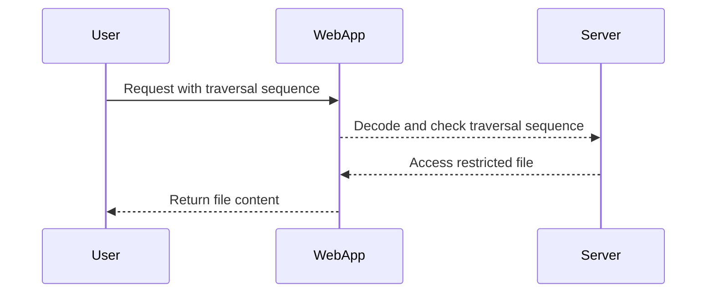
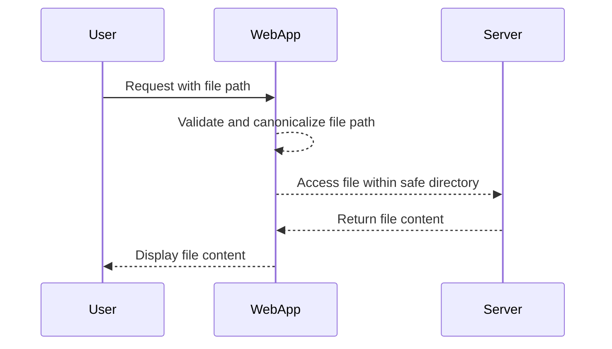

## Directory Traversal Vulnerability

### Introduction

Directory traversal, also known as path traversal, is a type of web application vulnerability that allows an attacker to access restricted files and directories on the server. This can lead to unauthorized access to sensitive information, such as source code, configuration files, and other critical data. The vulnerability arises due to improper input validation and sanitization of user-supplied input used to reference files on the server.

### How Directory Traversal Works

In a typical directory traversal attack, the attacker manipulates the input to include special characters or sequences that allow them to navigate outside the intended directory structure. Commonly used sequences include `../` (parent directory) and `%2e%2e%2f` (URL-encoded form of `../`). By using these sequences, an attacker can traverse up the directory tree and access files that should not be accessible.

#### Example Scenario

Consider a web application that allows users to download files from a specific directory. The URL might look like this:

```
http://example.com/download.php?file=report.pdf
```

If the application does not properly validate the `file` parameter, an attacker could manipulate it to access other files on the server:

```
http://example.com/download.php?file=../../etc/passwd
```

This would attempt to access the `/etc/passwd` file, which contains system user account information.

### Encoding and Decoding Mechanisms

To bypass certain defensive mechanisms, attackers often use encoding techniques to obfuscate the traversal sequences. Common encoding methods include URL encoding, base64 encoding, and hexadecimal encoding.

#### URL Encoding

URL encoding converts special characters into a format that can be safely transmitted over the internet. For example, the `../` sequence can be URL-encoded as `%2e%2e%2f`.

#### Example Attack Using URL Encoding

Let's consider the following scenario where the application decodes the input once before checking for traversal sequences:

```python
import urllib.parse

# Original traversal sequence
traversal_sequence = '../../etc/passwd'

# URL-encode the traversal sequence
encoded_sequence = urllib.parse.quote(traversal_sequence)

print(encoded_sequence)
```

Output:
```
%2E%2E%2F%2E%2E%2Fetc%2Fpasswd
```

By URL-encoding the traversal sequence, the attacker can bypass simple checks that look for unencoded `../` sequences.

### Real-World Examples

#### CVE-2021-21972: Apache Struts Directory Traversal

In 2021, a critical vulnerability (CVE-2021-21972) was discovered in Apache Struts, a popular Java framework. The vulnerability allowed attackers to perform directory traversal attacks by manipulating the `Content-Type` header in multipart/form-data requests. This could lead to unauthorized access to sensitive files on the server.

#### CVE-2020-14882: WordPress REST API Directory Traversal

Another notable example is CVE-2020-14882, which affected the WordPress REST API. The vulnerability allowed attackers to bypass input validation and access arbitrary files on the server through the `/wp-json/wp/v2/media` endpoint.

### Exploitation Techniques

#### Manual Exploitation

To manually exploit a directory traversal vulnerability, an attacker typically follows these steps:

1. **Identify the vulnerable parameter**: Determine which parameter in the URL or form input is susceptible to directory traversal.
2. **Craft the traversal sequence**: Construct the traversal sequence using `../` or its URL-encoded equivalent.
3. **Test the traversal**: Submit the crafted input to the application and observe the response.

#### Scripted Exploitation

Automating the exploitation process can be done using scripting languages like Python. Below is an example of how to script a directory traversal attack:

```python
import requests
from urllib.parse import quote

# Target URL
url = 'http://example.com/download.php'

# Vulnerable parameter
param = 'file'

# Traversal sequence
traversal_sequence = '../../etc/passwd'

# URL-encode the traversal sequence
encoded_sequence = quote(traversal_sequence)

# Craft the full URL
full_url = f"{url}?{param}={encoded_sequence}"

# Send the request
response = requests.get(full_url)

# Print the response
print(response.text)
```

### Detection and Prevention

#### Detection

Detecting directory traversal vulnerabilities involves monitoring for suspicious patterns in web server logs and application behavior. Tools like static analysis scanners and dynamic analysis tools can help identify potential vulnerabilities.

#### Prevention

Preventing directory traversal attacks requires robust input validation and sanitization practices. Here are some best practices:

1. **Input Validation**: Ensure that user-supplied input is validated against a whitelist of allowed characters and patterns.
2. **Canonicalization**: Normalize the input to remove any redundant or malicious sequences before processing.
3. **Access Control**: Implement strict access control mechanisms to restrict file access to authorized users and directories.
4. **Least Privilege Principle**: Run the web application with the least privileges necessary to minimize the impact of a successful attack.

#### Secure Coding Practices

Here is an example of how to securely handle file paths in a Python application:

```python
import os

def safe_file_access(file_path):
    # Define the root directory
    root_dir = '/path/to/safe/directory'
    
    # Canonicalize the file path
    abs_path = os.path.abspath(os.path.join(root_dir, file_path))
    
    # Check if the absolute path starts with the root directory
    if not abs_path.startswith(root_dir):
        raise ValueError("Invalid file path")
    
    # Proceed with file operations
    with open(abs_path, 'r') as file:
        return file.read()

# Example usage
try:
    content = safe_file_access('safe/file.txt')
    print(content)
except ValueError as e:
    print(e)
```

### Mermaid Diagrams

#### Directory Traversal Attack Flow



#### Secure File Access Flow



### Hands-On Labs

For practical experience with directory traversal vulnerabilities, consider the following labs:

- **PortSwigger Web Security Academy**: Offers interactive labs on various web security topics, including directory traversal.
- **OWASP Juice Shop**: A deliberately insecure web application for practicing web security skills.
- **DVWA (Damn Vulnerable Web Application)**: A PHP/MySQL web application that contains numerous security vulnerabilities.

These labs provide a controlled environment to practice identifying and exploiting directory traversal vulnerabilities.

### Conclusion

Directory traversal is a serious web security vulnerability that can lead to unauthorized access to sensitive files and data. Understanding how it works, how to detect and prevent it, and practicing with real-world examples and hands-on labs are crucial steps in mastering web security. By implementing robust input validation and access control measures, developers can significantly reduce the risk of directory traversal attacks.

---
<!-- nav -->
[[03-Directory Traversal Vulnerabilities|Directory Traversal Vulnerabilities]] | [[Web Security (PortSwigger)/11-Directory Traversal/05-Lab 4 File path traversal traversal sequences stripped with superfluous URL decode/00-Overview|Overview]] | [[05-Understanding the Lab|Understanding the Lab]]
