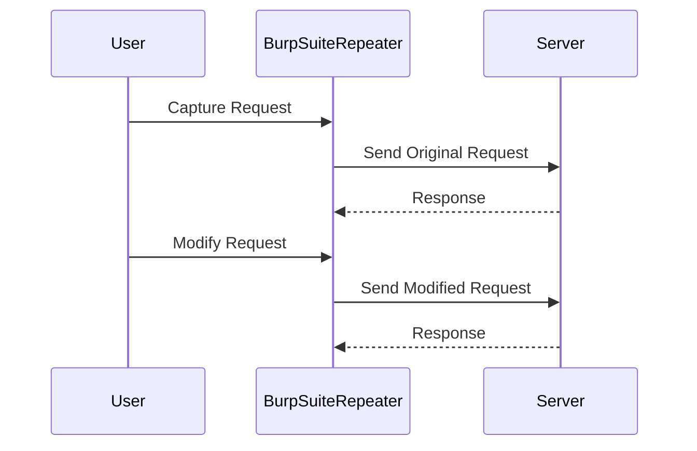

## Directory Traversal Vulnerabilities

### Introduction to Directory Traversal

Directory traversal, also known as path traversal, is a web security vulnerability that allows an attacker to access restricted files, directories, and executables on a web server. This vulnerability occurs due to improper validation of user-supplied input used to reference files. Attackers can manipulate the input to navigate outside the intended directory structure, leading to unauthorized access to sensitive information or even execute arbitrary commands.

### Understanding the Vulnerability

#### What is Directory Traversal?

Directory traversal attacks exploit the way web applications handle file paths. Typically, a web application will take a user-provided file path and attempt to read or serve the corresponding file. If the application does not properly validate the input, an attacker can provide a specially crafted path that navigates outside the intended directory, accessing files that should be protected.

#### Why Does It Matter?

The primary concern with directory traversal is the potential exposure of sensitive data. An attacker can access configuration files, source code, or even system files, which can lead to further exploitation of the system. In some cases, an attacker may be able to execute arbitrary commands on the server, leading to a complete compromise.

#### How Does It Work?

To understand how directory traversal works, consider the following scenario:

- A web application has a feature that allows users to download files from a specific directory, such as `/var/www/images`.
- The application takes a user-provided filename and constructs a path to the file, e.g., `/var/www/images/<filename>`.
- If the application does not validate the input, an attacker can provide a path like `../../../../etc/passwd`, which would navigate up three directories and then access the `/etc/passwd` file.

### Real-World Examples

#### Recent CVEs and Breaches

One notable example of a directory traversal vulnerability is CVE-2019-10100, which affected the Apache Struts framework. This vulnerability allowed attackers to bypass security restrictions and access arbitrary files on the server. Another example is CVE-2020-1938, which affected the Jenkins Continuous Integration server, allowing attackers to read arbitrary files on the server.

### Testing for Directory Traversal

#### Using Burp Suite Repeater

Let's walk through the process of testing for directory traversal using Burp Suite Repeater, a tool commonly used for web application security testing.

1. **Send Request to Repeater**:
    - Capture the request that interacts with the file path in question.
    - Send the captured request to Burp Suite Repeater.

2. **Modify the Request**:
    - In the Repeater tab, modify the file path to test for directory traversal.
    - For example, change the file path from `Image67.jpg` to `../../../../etc/passwd`.

3. **Send Modified Request**:
    - Click "Send" to send the modified request to the server.
    - Observe the response to determine if the server returns the contents of the `/etc/passwd` file.



### Analyzing the Response

When testing for directory traversal, pay close attention to the server's response. A successful directory traversal attack will typically result in a `200 OK` response along with the contents of the requested file.

#### Example HTTP Request and Response

Here is an example of a directory traversal attack using Burp Suite Repeater:

```http
GET /download?file=../../../../etc/passwd HTTP/1.1
Host: vulnerable.example.com
User-Agent: Mozilla/5.0 (Windows NT 10.0; Win64; x64) AppleWebKit/537.36 (KHTML, like Gecko) Chrome/91.0.4472.124 Safari/537.36
Accept: */*
Accept-Encoding: gzip, deflate
Connection: close
```

```http
HTTP/1.1 200 OK
Date: Mon, 01 Feb 2021 12:00:00 GMT
Server: Apache/2.4.41 (Ubuntu)
Content-Type: text/plain
Content-Length: 1234
Connection: close

root:x:0:0:root:/root:/bin/bash
daemon:x:1:1:daemon:/usr/sbin:/usr/sbin/nologin
...
```

### Common Pitfalls

#### Improper Error Handling

One common pitfall is improper error handling. If the server does not return meaningful error messages when an invalid path is provided, it can make it difficult to determine whether the application is vulnerable to directory traversal.

#### Absolute Path Validation

Another common issue is the lack of validation for absolute paths. Applications should ensure that user-provided paths are within a specified directory and do not allow navigation outside of this directory.

### How to Prevent / Defend Against Directory Traversal

#### Secure Coding Practices

To prevent directory traversal vulnerabilities, follow these secure coding practices:

1. **Validate Input**: Ensure that user-provided file paths are validated and sanitized. Only allow paths within a specified directory.
2. **Use Whitelisting**: Instead of blacklisting certain characters or patterns, use whitelisting to only allow valid characters and patterns.
3. **Canonicalize Paths**: Convert all paths to their canonical form to prevent directory traversal via encoded or obfuscated paths.

#### Example Secure Code

Here is an example of secure code that validates and sanitizes file paths:

```python
import os

def get_file_content(filename):
    base_dir = '/var/www/images'
    # Validate the filename
    if not os.path.basename(filename) == filename:
        raise ValueError("Invalid filename")
    
    # Construct the full path
    full_path = os.path.join(base_dir, filename)
    
    # Check if the full path is within the base directory
    if not full_path.startswith(os.path.abspath(base_dir)):
        raise ValueError("Path traversal detected")
    
    # Read the file content
    with open(full_path, 'r') as f:
        return f.read()
```

#### Configuration Hardening

In addition to secure coding practices, harden your server configurations to mitigate directory traversal vulnerabilities:

1. **Disable Directory Listing**: Ensure that directory listing is disabled on your web server to prevent attackers from discovering file paths.
2. **Restrict Access**: Use file permissions and access controls to restrict access to sensitive files and directories.

#### Detection Tools

Use tools like Burp Suite, OWASP ZAP, and Nessus to detect directory traversal vulnerabilities in your web applications.

### Practice Labs

For hands-on practice with directory traversal vulnerabilities, consider the following labs:

- **PortSwigger Web Security Academy**: Offers a comprehensive set of labs covering various web security topics, including directory traversal.
- **OWASP Juice Shop**: A deliberately insecure web application that includes several vulnerabilities, including directory traversal.
- **DVWA (Damn Vulnerable Web Application)**: A PHP/MySQL web application that intentionally contains numerous security vulnerabilities, including directory traversal.

By thoroughly understanding and practicing the concepts covered in this chapter, you will be better equipped to identify, exploit, and defend against directory traversal vulnerabilities in web applications.

---
<!-- nav -->
[[Web Security (PortSwigger)/11-Directory Traversal/06-Lab 5 File path traversal validation of start of path/01-Introduction to Directory Traversal Vulnerabilities|Introduction to Directory Traversal Vulnerabilities]] | [[Web Security (PortSwigger)/11-Directory Traversal/06-Lab 5 File path traversal validation of start of path/00-Overview|Overview]] | [[Web Security (PortSwigger)/11-Directory Traversal/06-Lab 5 File path traversal validation of start of path/03-Directory Traversal Vulnerability|Directory Traversal Vulnerability]]
