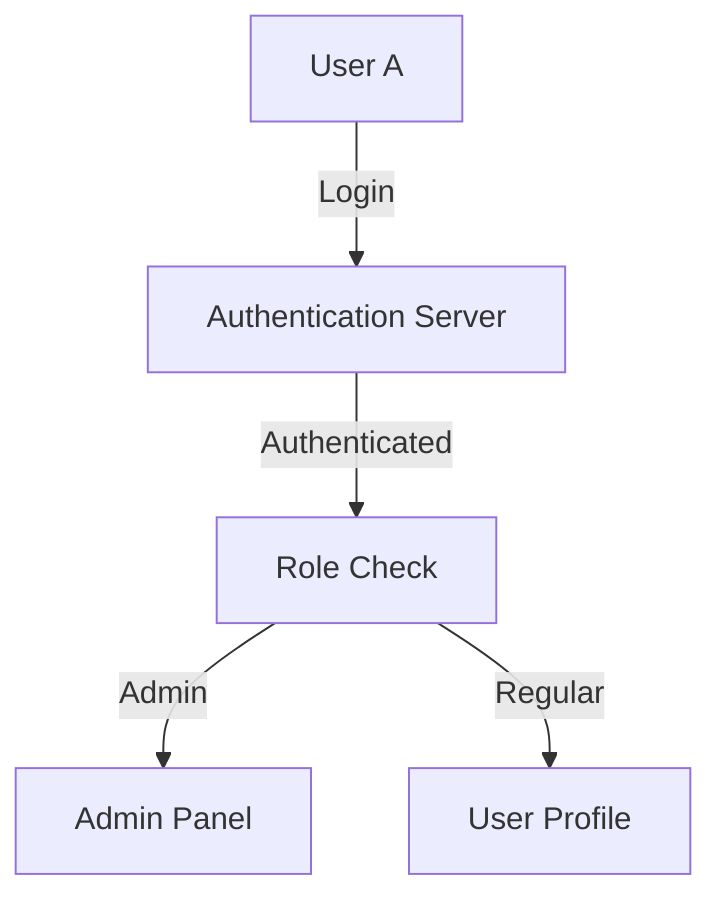
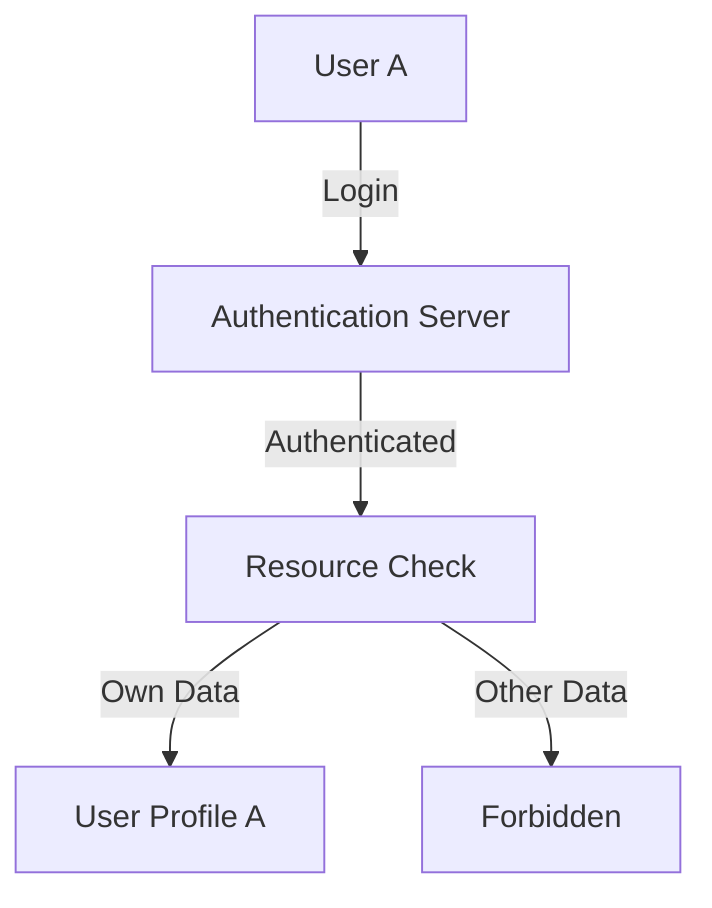

## Access Control Vulnerabilities: A Comprehensive Guide

### Introduction to Access Control

Access control is a fundamental aspect of web security that ensures that users can only access the resources and functionalities that they are authorized to use. This is crucial for maintaining the integrity, confidentiality, and availability of web applications. There are two primary types of access control: vertical and horizontal. Understanding these concepts is essential for building secure web applications.

### Vertical Access Control

Vertical access control restricts access to functions based on the user's role or privilege level within the organization. Typically, this means distinguishing between regular users and administrative users. An administrative user has elevated permissions that allow them to perform critical operations such as managing user accounts, modifying system settings, and accessing sensitive data. Regular users, on the other hand, have limited permissions and should not be able to perform these actions.

#### How Vertical Access Control Works

In vertical access control, the system checks the user's role or privilege level before allowing access to certain functionalities. This is often implemented using role-based access control (RBAC) systems, where each user is assigned a role, and roles are associated with specific permissions.

For example, consider a web application where users can either be regular users or administrators. The administrator role might have permissions to manage user accounts, while regular users can only view their own profile information.



#### Real-World Example: CVE-2021-21972

CVE-2021-21972 is a critical vulnerability found in the Atlassian Jira software. This vulnerability allowed users with lower privileges to escalate their access to administrative levels, effectively bypassing vertical access control. This could lead to unauthorized access to sensitive data and administrative functionalities.

**Detection:**
To detect such vulnerabilities, organizations should regularly audit user roles and permissions. Automated tools like static code analysis and dynamic application security testing (DAST) can help identify potential issues.

**Prevention:**
Implement strict RBAC systems and ensure that all user roles and permissions are properly defined and enforced. Regularly review and update role definitions to ensure they align with organizational policies.

**Secure Coding Fix:**

**Vulnerable Code:**
```python
def check_permission(user_id, action):
    user = get_user(user_id)
    if user.role == 'admin':
        return True
    return False
```

**Fixed Code:**
```python
def check_permission(user_id, action):
    user = get_user(user_id)
    if user.role == 'admin' and action in ['manage_users', 'modify_settings']:
        return True
    elif user.role == 'regular' and action in ['view_profile']:
        return True
    return False
```

### Horizontal Access Control

Horizontal access control restricts users of the same privilege level from accessing each other's resources. This is particularly important in multi-user environments where users share similar roles but should not be able to access each other's data.

#### How Horizontal Access Control Works

In horizontal access control, the system ensures that a user can only access their own resources, even if they have the same privileges as other users. This is often implemented by associating resources with user identifiers and checking these identifiers during access attempts.

For example, consider a web application where users can view and edit their own profile information. The system should prevent a user from accessing another user's profile information.



#### Real-World Example: CVE-2-2021-3427

CVE-2021-3427 is a vulnerability found in the WordPress plugin WP Customer Area. This vulnerability allowed users to access and modify other users' data, effectively bypassing horizontal access control. This could lead to unauthorized access to sensitive user information.

**Detection:**
To detect such vulnerabilities, organizations should regularly audit user access patterns and monitor for unusual activity. Automated tools like intrusion detection systems (IDS) and security information and event management (SIEM) systems can help identify potential issues.

**Prevention:**
Implement strict resource ownership checks and ensure that all user interactions with resources are properly validated. Regularly review and update access control mechanisms to ensure they align with organizational policies.

**Secure Coding Fix:**

**Vulnerable Code:**
```python
def get_user_profile(user_id):
    return UserProfile.objects.get(user_id=user_id)
```

**Fixed Code:**
```python
def get_user_profile(request, user_id):
    current_user = request.user
    if current_user.id == user_id:
        return UserProfile.objects.get(user_id=user_id)
    else:
        raise PermissionDenied("You do not have permission to access this resource.")
```

### Common Pitfalls and Best Practices

#### Common Pitfalls

1. **Insufficient Role Definition:** Not defining roles and permissions clearly can lead to unauthorized access.
2. **Inadequate Validation:** Failing to validate user input and resource ownership can result in horizontal access control vulnerabilities.
3. **Lack of Auditing:** Not auditing user activities can make it difficult to detect and respond to unauthorized access attempts.

#### Best Practices

1. **Define Clear Roles and Permissions:** Ensure that all user roles and permissions are clearly defined and enforced.
2. **Validate User Input and Resource Ownership:** Always validate user input and ensure that users can only access their own resources.
3. **Regularly Audit User Activities:** Regularly audit user activities to detect and respond to unauthorized access attempts.

### Hands-On Labs

For practical experience with access control vulnerabilities, consider the following labs:

- **PortSwigger Web Security Academy:** Offers interactive labs on access control vulnerabilities.
- **OWASP Juice Shop:** Provides a vulnerable web application for practicing security assessments.
- **DVWA (Damn Vulnerable Web Application):** A deliberately insecure web application for practicing penetration testing.

By thoroughly understanding and implementing vertical and horizontal access control, organizations can significantly enhance the security of their web applications and protect against unauthorized access.

---

This comprehensive guide covers the essential aspects of access control vulnerabilities, providing deep insights into vertical and horizontal access control, real-world examples, secure coding practices, and hands-on labs. By following these guidelines, developers and security professionals can build more secure web applications and mitigate access control vulnerabilities effectively.

---
<!-- nav -->
[[Web Security (PortSwigger)/12-Access Control Vulnerabilities/01-Broken Access Control Complete Guide/00-Overview|Overview]] | [[02-Authentication Basics|Authentication Basics]]
