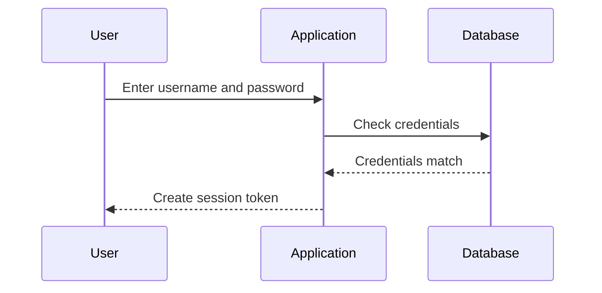

## Authentication Basics

### What is Authentication?

Authentication is the process of verifying a user's identity. In web applications, this typically involves a user providing a username and password, which the application then checks against a stored set of credentials. If the provided credentials match the stored ones, the user is considered authenticated and granted access to the system.

#### Why is Authentication Important?

Authentication is crucial because it ensures that only authorized users can access sensitive resources. Without proper authentication, anyone could potentially gain access to a system and perform unauthorized actions, leading to data breaches, loss of privacy, and other security issues.

#### How Does Authentication Work Under the Hood?

When a user attempts to log in, the following steps occur:

1. **User Input**: The user enters their username and password.
2. **Credential Verification**: The application hashes the entered password and compares it with the hashed password stored in the database.
3. **Session Creation**: If the credentials match, the application creates a session for the user, typically involving the generation of a session token.
4. **Token Management**: This token is then used to maintain the user's authenticated state across subsequent requests.

### Real-World Example: CVE-2021-21972

CVE-2021-21972 is a critical vulnerability found in the WordPress REST API. This vulnerability allowed unauthenticated users to bypass authentication mechanisms and execute arbitrary code. The issue was due to improper validation of user roles, allowing attackers to impersonate administrators.



### Pitfalls of Authentication

One common pitfall is storing passwords in plaintext. This makes it easy for attackers to obtain passwords if they gain access to the database. Another issue is weak password policies, which allow users to choose easily guessable passwords.

#### How to Prevent / Defend

**Detection**: Regularly audit the system for vulnerabilities and ensure that passwords are stored securely using strong hashing algorithms like bcrypt.

**Prevention**: Implement strong password policies and enforce multi-factor authentication (MFA).

**Secure Coding Fix**:
- **Vulnerable Code**:
  ```python
  def authenticate(username, password):
      stored_password = get_password_from_db(username)
      if stored_password == password:
          return True
      return False
  ```
- **Fixed Code**:
  ```python
  import bcrypt

  def authenticate(username, password):
      stored_hashed_password = get_password_from_db(username)
      if bcrypt.checkpw(password.encode('utf-8'), stored_hashed_password):
          return True
      return False
  ```

---
<!-- nav -->
[[01-Access Control Vulnerabilities A Comprehensive Guide|Access Control Vulnerabilities A Comprehensive Guide]] | [[Web Security (PortSwigger)/12-Access Control Vulnerabilities/01-Broken Access Control Complete Guide/00-Overview|Overview]] | [[03-Fundamentals of Access Control|Fundamentals of Access Control]]
