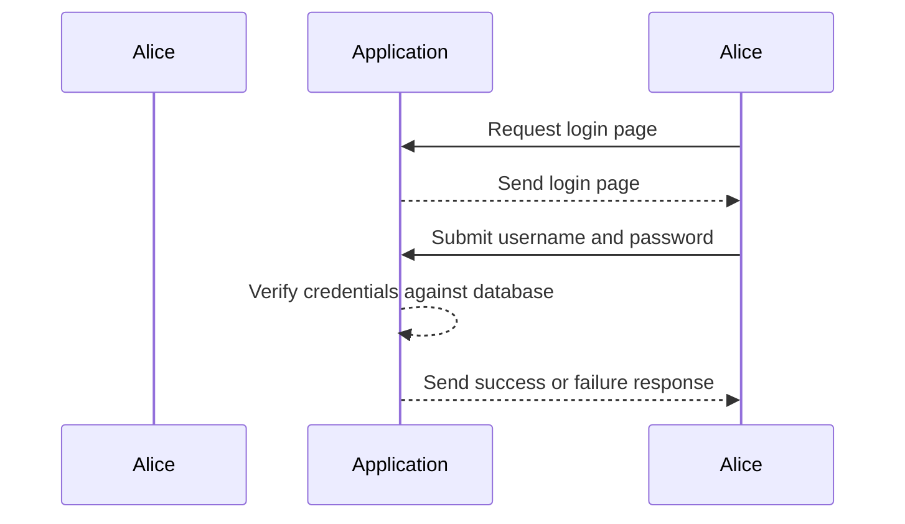
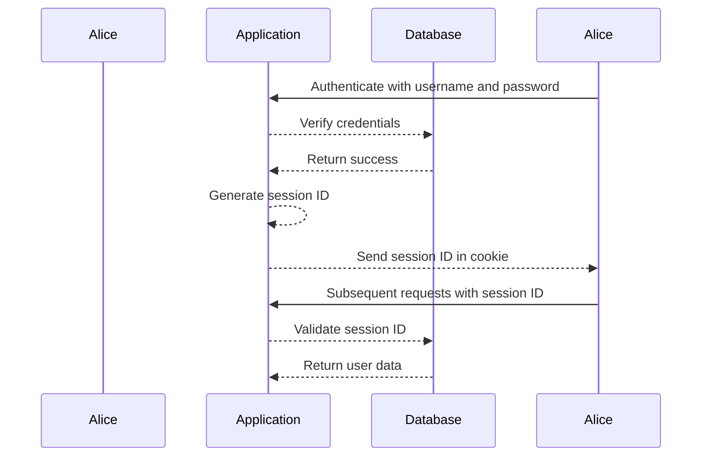
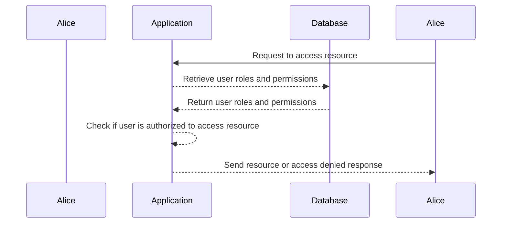

## Fundamentals of Access Control

Before diving into access control vulnerabilities, it is crucial to establish a solid foundation in the core concepts that underpin web security. This chapter will cover three fundamental mechanisms: **authentication**, **session management**, and **access control**. These concepts are often conflated, but they each serve distinct purposes and have unique implementations.

### Authentication

**Authentication** is the process of verifying the identity of a user. It ensures that the person attempting to access a system is indeed who they claim to be. This is critical because without proper authentication, unauthorized individuals could gain access to sensitive resources.

#### What is Authentication?

At its core, authentication involves a challenge-response mechanism. The system presents a challenge to the user, and the user must provide a valid response to prove their identity. Common forms of authentication include:

- **Username and Password**: The user provides a username and a corresponding password.
- **Multi-Factor Authentication (MFA)**: In addition to a password, the user may need to provide a second form of identification, such as a code sent to their phone or a biometric scan.
- **OAuth**: A protocol that allows users to grant third-party applications access to their resources without sharing their credentials.

#### Why is Authentication Important?

Authentication is essential because it prevents unauthorized access to systems and data. Without proper authentication, anyone could potentially access sensitive information, leading to data breaches and other security issues.

#### How Does Authentication Work?

Let's take a closer look at the process of authentication using a simple example. Consider a user named Alice who wants to log into an application.



In this scenario, Alice sends her username and password to the application. The application then checks these credentials against a stored database to determine if they match. If they do, Alice is authenticated and granted access.

#### Recent Real-World Examples

One notable example of a breach due to weak authentication is the **Twitter hack in July 2020**. Hackers gained access to high-profile accounts, including those of Barack Obama and Elon Musk, by exploiting a flaw in Twitter's internal systems. The attackers were able to bypass multi-factor authentication (MFA) and reset passwords, leading to widespread unauthorized access.

#### How to Prevent / Defend Against Weak Authentication

To defend against weak authentication, implement the following measures:

1. **Use Strong Password Policies**: Enforce complex password requirements and encourage users to change their passwords regularly.
2. **Implement Multi-Factor Authentication (MFA)**: Require users to provide additional forms of identification, such as a code sent to their phone or a biometric scan.
3. **Secure Credential Storage**: Store passwords securely using hashing algorithms like bcrypt or Argon2. Never store plaintext passwords.
4. **Monitor Login Attempts**: Implement rate limiting and monitor login attempts to detect and respond to suspicious activity.

#### Vulnerable vs. Secure Code Example

Here is an example of insecure and secure authentication code:

**Insecure Code:**
```python
def authenticate(username, password):
    # Assume `users` is a dictionary of usernames and passwords
    if users.get(username) == password:
        return True
    return False
```

**Secure Code:**
```python
import bcrypt

def hash_password(password):
    salt = bcrypt.gensalt()
    hashed_password = bcrypt.hashpw(password.encode('utf-8'), salt)
    return hashed_password

def authenticate(username, password):
    # Assume `users` is a dictionary of usernames and hashed passwords
    stored_hashed_password = users.get(username)
    if stored_hashed_password and bcrypt.checkpw(password.encode('utf-8'), stored_hashed_password):
        return True
    return False
```

### Session Management

**Session management** is the process of maintaining a user's state across multiple requests. Once a user is authenticated, the system needs to keep track of their session to ensure that they remain logged in until they explicitly log out or their session expires.

#### What is Session Management?

Session management involves creating, maintaining, and destroying sessions. A session typically consists of a unique identifier (session ID) that is associated with a set of user-specific data. This data can include the user's identity, preferences, and other contextual information.

#### Why is Session Management Important?

Session management is crucial because it allows the system to maintain a user's state across multiple requests. Without proper session management, users would need to re-authenticate for each request, leading to a poor user experience and potential security risks.

#### How Does Session Management Work?

Let's consider the process of session management after Alice successfully authenticates.



In this scenario, after Alice is authenticated, the application generates a session ID and sends it to Alice in a cookie. On subsequent requests, Alice includes the session ID in her requests, allowing the application to validate her session and retrieve her user data.

#### Recent Real-World Examples

A notable example of a session management vulnerability is the **CVE-2021-21972** in the Jenkins CI server. This vulnerability allowed attackers to hijack sessions and gain unauthorized access to Jenkins instances. The issue was caused by improper handling of session IDs, leading to predictable and guessable session tokens.

#### How to Prevent / Defend Against Weak Session Management

To defend against weak session management, implement the following measures:

1. **Use Secure Cookies**: Ensure that session cookies are marked as `HttpOnly` and `Secure` to prevent client-side scripts from accessing them and to ensure they are transmitted over HTTPS.
2. **Regenerate Session IDs**: Regenerate session IDs after successful authentication to prevent session fixation attacks.
3. **Set Expiry Times**: Set reasonable expiry times for sessions to ensure that they are not left open indefinitely.
4. **Monitor Session Activity**: Monitor session activity for signs of abuse, such as rapid session creation or unusual patterns of access.

#### Vulnerable vs. Secure Code Example

Here is an example of insecure and secure session management code:

**Insecure Code:**
```python
from flask import Flask, session

app = Flask(__name__)

@app.route('/login', methods=['POST'])
def login():
    username = request.form['username']
    password = request.form['password']
    if authenticate(username, password):
        session['username'] = username
        return "Logged in"
    return "Invalid credentials"

@app.route('/logout')
def logout():
    session.pop('username', None)
    return "Logged out"
```

**Secure Code:**
```python
from flask import Flask, session
from flask_session import Session

app = Flask(__name__)
app.config["SESSION_TYPE"] = "filesystem"
Session(app)

@app.route('/login', methods=['POST'])
def login():
    username = request.form['username']
    password = request.form['password']
    if authenticate(username, password):
        session.regenerate()  # Regenerate session ID
        session['username'] = username
        return "Logged in"
    return "Invalid credentials"

@app.route('/logout')
def logout():
    session.clear()  # Clear all session data
    return "Logged out"
```

### Access Control

**Access control** is the mechanism that determines whether a user is allowed to perform a specific action within a system. It ensures that users can only access the resources and perform the actions that they are authorized to.

#### What is Access Control?

Access control involves defining and enforcing rules that govern what actions a user can perform. These rules can be based on various factors, such as the user's role, the resource being accessed, and the context of the request.

#### Why is Access Control Important?

Access control is essential because it prevents unauthorized access to sensitive resources and ensures that users can only perform actions that they are authorized to. Without proper access control, users could potentially access resources they should not and perform actions that could compromise the system.

#### How Does Access Control Work?

Let's consider the process of access control after Alice is authenticated and her session is established.



In this scenario, Alice requests to access a resource. The application retrieves her roles and permissions from the database and checks if she is authorized to access the requested resource. If she is authorized, the application returns the resource; otherwise, it returns an access denied response.

#### Recent Real-World Examples

A notable example of an access control vulnerability is the **CVE-2021-44228** (Log4Shell) in Apache Log4j. This vulnerability allowed attackers to execute arbitrary code on affected systems, leading to unauthorized access and potential data breaches. The issue was caused by improper validation of user input, allowing attackers to inject malicious code.

#### How to Prevent / Defend Against Weak Access Control

To defend against weak access control, implement the following measures:

1. **Implement Role-Based Access Control (RBAC)**: Define roles and permissions for users and enforce them consistently across the system.
2. **Validate User Input**: Ensure that user input is properly validated to prevent injection attacks and other forms of exploitation.
3. **Audit Access Logs**: Regularly review access logs to detect and respond to unauthorized access attempts.
4. **Use Least Privilege Principle**: Grant users the minimum level of access necessary to perform their tasks.

#### Vulnerable vs. Secure Code Example

Here is an example of insecure and secure access control code:

**Insecure Code:**
```python
@app.route('/resource/<id>')
def view_resource(id):
    user_id = session.get('user_id')
    resource = get_resource_by_id(id)
    if resource.owner_id == user_id:
        return render_template('resource.html', resource=resource)
    return "Access denied"
```

**Secure Code:**
```python
@app.route('/resource/<id>')
def view_resource(id):
    user_id = session.get('user_id')
    resource = get_resource_by_id(id)
    if is_user_authorized(user_id, resource):
        return render_template('resource.html', resource=resource)
    return "Access denied"

def is_user_authorized(user_id, resource):
    # Assume `get_user_roles` and `check_permission` are defined elsewhere
    user_roles = get_user_roles(user_id)
    for role in user_roles:
        if check_permission(role, resource, 'view'):
            return True
    return False
```

### Conclusion

Understanding the fundamentals of authentication, session management, and access control is crucial for building secure web applications. By implementing strong authentication mechanisms, secure session management practices, and robust access control policies, you can significantly reduce the risk of unauthorized access and data breaches.

### Practice Labs

For hands-on practice with these concepts, consider the following labs:

- **PortSwigger Web Security Academy**: Offers comprehensive modules on authentication, session management, and access control.
- **OWASP Juice Shop**: Provides a vulnerable web application for practicing web security techniques.
- **DVWA (Damn Vulnerable Web Application)**: Another vulnerable web application for learning and testing security measures.

By mastering these fundamentals and applying them in real-world scenarios, you can build more secure and resilient web applications.

---
<!-- nav -->
[[02-Authentication Basics|Authentication Basics]] | [[Web Security (PortSwigger)/12-Access Control Vulnerabilities/01-Broken Access Control Complete Guide/00-Overview|Overview]] | [[04-Introduction to Access Control Vulnerabilities|Introduction to Access Control Vulnerabilities]]
