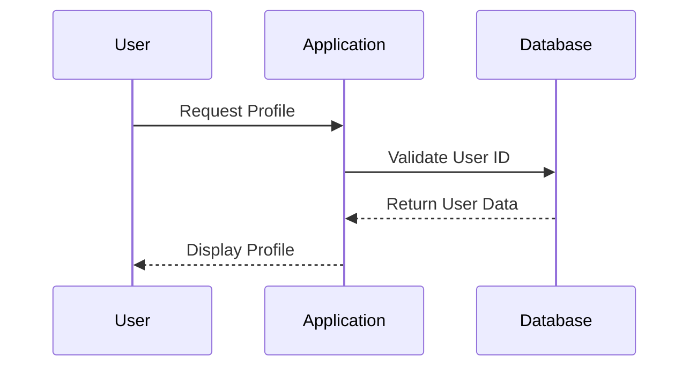

## What is a Broken Access Control Vulnerability?

Access control is a fundamental security mechanism used to ensure that users and systems can only perform actions and access resources that they are authorized to use. A broken access control vulnerability occurs when this mechanism fails, allowing unauthorized access to sensitive data or functionality. This can happen due to various reasons such as misconfigured permissions, insufficient validation, or bypassing authentication mechanisms.

### Why Does Access Control Matter?

Access control is crucial because it helps maintain the confidentiality, integrity, and availability of resources within a system. Without proper access control, sensitive information could be exposed to unauthorized users, leading to data breaches, financial losses, and reputational damage. Additionally, improper access control can allow attackers to perform unauthorized actions, such as modifying critical system configurations or executing malicious code.

### How Does Access Control Work Under the Hood?

Access control typically operates at several layers:

1. **Authentication**: Verifies the identity of a user or system.
2. **Authorization**: Determines what actions a user or system is allowed to perform based on their identity and role.
3. **Resource Management**: Ensures that resources are accessed and modified according to predefined rules.

#### Authentication Mechanisms

Authentication mechanisms include:

- **Username and Password**: The most common method, where users provide credentials to prove their identity.
- **Multi-Factor Authentication (MFA)**: Adds an additional layer of security by requiring more than one form of verification (e.g., password and a code sent via SMS).
- **Biometric Authentication**: Uses unique physical characteristics (e.g., fingerprints, facial recognition) to verify identity.

#### Authorization Mechanisms

Authorization mechanisms include:

- **Role-Based Access Control (RBAC)**: Users are assigned roles, and roles are granted permissions.
- **Attribute-Based Access Control (ABAC)**: Permissions are granted based on attributes of the user, resource, and environment.
- **Discretionary Access Control (DAC)**: Owners of resources decide who can access them.
- **Mandatory Access Control (MAC)**: Access is controlled by a central authority based on security labels.

### Real-World Examples of Broken Access Control

Broken access control vulnerabilities have led to significant breaches. Here are some recent examples:

- **CVE-2021-21972**: A vulnerability in Microsoft Exchange Server allowed attackers to bypass authentication and gain unauthorized access to email accounts.
- **CVE-2020-1472**: Also known as "Zerologon," this vulnerability in Microsoft's Netlogon Remote Protocol allowed attackers to take over domain controllers with administrative privileges.

### Common Pitfalls in Access Control Implementation

Common pitfalls include:

- **Insufficient Input Validation**: Failing to validate input can lead to injection attacks.
- **Hardcoded Credentials**: Using hardcoded credentials in source code can expose sensitive information.
- **Inconsistent Permission Settings**: Inconsistent permission settings across different parts of a system can lead to unexpected behavior.
- **Improper Session Management**: Weak session management can allow session hijacking.

### How to Find Access Control Vulnerabilities

Finding access control vulnerabilities involves both white-box and black-box testing approaches.

#### White-Box Testing

White-box testing involves having access to the application's source code and internal structure. This allows testers to:

- **Review Code for Hardcoded Credentials**: Look for hardcoded passwords or API keys.
- **Check for Inconsistent Permission Settings**: Ensure that permissions are consistently applied across the system.
- **Analyze Authentication and Authorization Logic**: Verify that authentication and authorization mechanisms are correctly implemented.

#### Black-Box Testing

Black-box testing involves testing the application without access to its internal structure. This includes:

- **Testing for Bypassing Authentication**: Attempt to bypass authentication mechanisms by manipulating URLs or using tools like Burp Suite.
- **Testing for Insecure Direct Object References (IDOR)**: Check if direct object references can be manipulated to access unauthorized resources.
- **Testing for Insufficient Input Validation**: Test for SQL injection, cross-site scripting (XSS), and other injection attacks.

### Exploiting Access Control Vulnerabilities

Exploiting access control vulnerabilities often involves manipulating URLs, using tools like Burp Suite, or crafting specific HTTP requests.

#### Example: Exploiting IDOR

Consider an application that allows users to view their profile information. The URL might look like this:

```
http://example.com/profile?id=123
```

If the application does not properly validate the `id` parameter, an attacker could manipulate it to view other users' profiles.

**Vulnerable Code Example:**

```python
@app.route('/profile')
def profile():
    user_id = request.args.get('id')
    user = User.query.get(user_id)
    return render_template('profile.html', user=user)
```

**Exploit Example:**

An attacker could change the `id` parameter to view another user's profile:

```
http://example.com/profile?id=456
```

### How to Prevent / Defend Against Access Control Vulnerabilities

Preventing access control vulnerabilities involves a combination of secure coding practices, proper configuration, and regular security assessments.

#### Secure Coding Practices

- **Validate All Inputs**: Ensure that all inputs are validated to prevent injection attacks.
- **Use Strong Authentication Mechanisms**: Implement multi-factor authentication and biometric authentication where appropriate.
- **Implement RBAC or ABAC**: Use role-based or attribute-based access control to manage permissions effectively.

#### Proper Configuration

- **Configure Permissions Correctly**: Ensure that permissions are set correctly and consistently across the system.
- **Use Least Privilege Principle**: Grant users the minimum level of access necessary to perform their tasks.

#### Regular Security Assessments

- **Conduct Regular Penetration Testing**: Regularly test the application for vulnerabilities using both white-box and black-box methods.
- **Perform Code Reviews**: Regularly review code for security issues, including hardcoded credentials and inconsistent permission settings.

### Full Example: Secure Access Control Implementation

Here is a full example of how to implement secure access control in a web application using Flask:

**Vulnerable Code:**

```python
@app.route('/profile')
def profile():
    user_id = request.args.get('id')
    user = User.query.get(user_id)
    return render_template('profile.html', user=user)
```

**Secure Code:**

```python
from flask import abort

@app.route('/profile')
@login_required
def profile():
    user_id = request.args.get('id')
    if int(user_id) != current_user.id:
        abort(403)
    user = User.query.get(user_id)
    return render_template('profile.html', user=user)
```

### HTTP Details

When dealing with HTTP requests and responses, it is important to understand the full raw HTTP message and each relevant header.

#### Example HTTP Request

```http
GET /profile?id=123 HTTP/1.1
Host: example.com
User-Agent: Mozilla/5.0 (Windows NT 10.0; Win64; x64) AppleWebKit/537.36 (KHTML, like Gecko) Chrome/91.0.4472.124 Safari/537.36
Accept: text/html,application/xhtml+xml,application/xml;q=0.9,image/avif,image/webp,image/apng,*/*;q=0.8,application/signed-exchange;v=b3;q=0.9
Accept-Language: en-US,en;q=0.9
Cookie: session=abc123
```

#### Example HTTP Response

```http
HTTP/1.1 200 OK
Date: Tue, 14 Sep 2021 12:00:00 GMT
Server: Apache/2.4.41 (Ubuntu)
Content-Type: text/html; charset=UTF-8
Content-Length: 1234
Connection: close

<!DOCTYPE html>
<html>
<head>
    <title>User Profile</title>
</head>
<body>
    <h1>User Profile</h1>
    <p>Name: John Doe</p>
    <p>Email: john.doe@example.com</p>
</body>
</html>
```

### Mermaid Diagrams

#### Access Control Flow Diagram



### Practice Labs

For hands-on practice with access control vulnerabilities, consider the following labs:

- **PortSwigger Web Security Academy**: Offers a variety of labs focused on access control vulnerabilities.
- **OWASP Juice Shop**: Provides a vulnerable web application for practicing various security concepts, including access control.
- **DVWA (Damn Vulnerable Web Application)**: Another popular web application for practicing web security vulnerabilities.

By thoroughly understanding and implementing these principles, you can significantly reduce the risk of access control vulnerabilities in your applications.

---
<!-- nav -->
[[04-Introduction to Access Control Vulnerabilities|Introduction to Access Control Vulnerabilities]] | [[Web Security (PortSwigger)/12-Access Control Vulnerabilities/01-Broken Access Control Complete Guide/00-Overview|Overview]] | [[06-Access Control Vulnerabilities|Access Control Vulnerabilities]]
