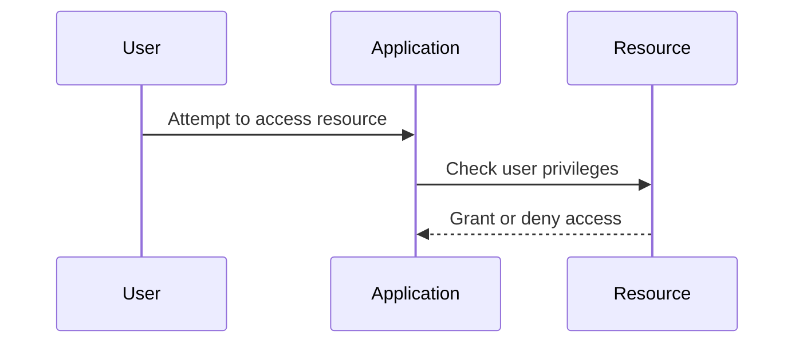

## Access Control Vulnerabilities

### What are Access Control Vulnerabilities?

Access control vulnerabilities occur when an application fails to properly restrict access to resources based on a user's privileges. This can lead to unauthorized access, data breaches, and other security issues.

#### Why are Access Control Vulnerabilities Important?

Access control is crucial for ensuring that users can only access resources they are authorized to use. Without proper access control, attackers can exploit vulnerabilities to gain unauthorized access to sensitive data.

#### How Do Access Control Vulnerabilities Work Under the Hood?

1. **Privilege Assignment**: Users are assigned specific privileges based on their roles.
2. **Resource Access**: When a user attempts to access a resource, the application checks their privileges.
3. **Access Decision**: If the user has the necessary privileges, access is granted; otherwise, it is denied.

### Real-World Example: CVE-2021-21972

CVE-2021-21972, mentioned earlier, is also an example of an access control vulnerability. Attackers were able to bypass authentication and execute arbitrary code due to improper validation of user roles.



### Pitfalls of Access Control

One common pitfall is the lack of proper role-based access control (RBAC). Another issue is the failure to properly validate user input, allowing attackers to manipulate access decisions.

#### How to Prevent / Defend

**Detection**: Regularly audit the system for vulnerabilities and ensure that access controls are properly implemented.

**Prevention**: Implement RBAC and validate user input to prevent manipulation.

**Secure Coding Fix**:
- **Vulnerable Code**:
  ```python
  def access_resource(user_id, resource_id):
      if check_user_role(user_id, 'admin'):
          return get_resource(resource_id)
      return "Access denied"
  ```
- **Fixed Code**:
  ```python
  def access_resource(user_id, resource_id):
      if check_user_role(user_id, 'admin') and validate_resource_id(resource_id):
          return get_resource(resource_id)
      return "Access denied"
  ```

---
<!-- nav -->
[[05-What is a Broken Access Control Vulnerability|What is a Broken Access Control Vulnerability]] | [[Web Security (PortSwigger)/12-Access Control Vulnerabilities/01-Broken Access Control Complete Guide/00-Overview|Overview]] | [[07-Bypassing Access Control Checks by Modifying Parameters|Bypassing Access Control Checks by Modifying Parameters]]
