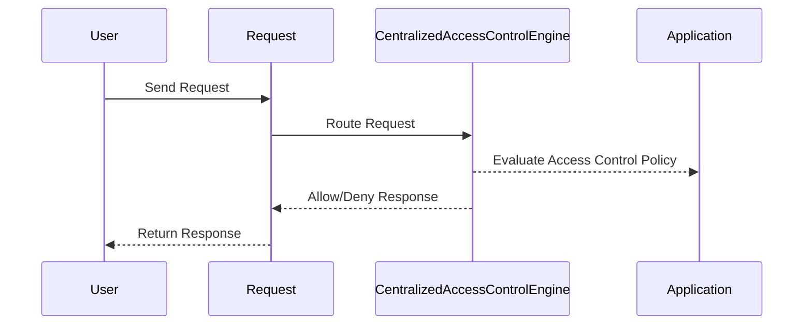

## Centralized Access Control Engine

### What is a Centralized Access Control Engine?

A centralized access control engine is a core component of an application’s security architecture designed to enforce access control policies uniformly across the entire application. Instead of scattering access control logic throughout different parts of the application, a centralized engine consolidates these checks into a single, manageable location. This approach ensures consistency and reduces the likelihood of access control vulnerabilities due to inconsistent or forgotten checks.

### Why Use a Centralized Access Control Engine?

Using a centralized access control engine offers several advantages:

1. **Consistency**: Ensures that all access control decisions are made using the same logic and criteria.
2. **Maintainability**: Simplifies maintenance and updates since changes to access control policies can be made in one place.
3. **Auditability**: Easier to audit and trace access control decisions.
4. **Reduced Risk**: Minimizes the risk of access control vulnerabilities caused by scattered or inconsistent checks.

### How Does a Centralized Access Control Engine Work?

In a typical implementation, all requests to the application are routed through the centralized access control engine. The engine evaluates the request against predefined access control policies and either allows or denies the request based on the outcome of this evaluation.

#### Example: Java Authorization Filters

Java provides a mechanism to implement centralized access control through authorization filters configured in the `web.xml` file. These filters can enforce access control policies for specific directories or locations within the application.

```xml
<filter>
    <filter-name>AuthorizationFilter</filter-name>
    <filter-class>com.example.AuthorizationFilter</filter-class>
</filter>

<filter-mapping>
    <filter-name>AuthorizationFilter</filter-name>
    <url-pattern>/secure/*</url-pattern>
</filter-mapping>
```

In this example, the `AuthorizationFilter` class would contain the logic to evaluate whether a user has the necessary privileges to access resources under the `/secure/` directory.

### Real-World Example: CVE-2021-21972

CVE-2021-21972 is a critical vulnerability in the Jenkins Continuous Integration server. The vulnerability arises from improper access control checks in the Jenkins plugin manager, allowing unauthorized users to upload and execute arbitrary plugins. This issue could have been mitigated with a robust centralized access control engine ensuring that only authorized users can perform sensitive actions.

### How to Prevent / Defend

**Detection**: Regularly audit access control policies and configurations to ensure they are correctly implemented and up-to-date.

**Prevention**: Implement a centralized access control engine and enforce consistent access control policies across the application.

**Secure Coding Fix**:
- **Vulnerable Code**:
  ```java
  public void handleRequest(HttpServletRequest request, HttpServletResponse response) {
      String path = request.getPathInfo();
      if (path.startsWith("/secure")) {
          // Insecure check
          if (request.isUserInRole("admin")) {
              // Handle secure request
          } else {
              response.sendError(HttpServletResponse.SC_FORBIDDEN);
          }
      }
  }
  ```
- **Fixed Code**:
  ```java
  public void handleRequest(HttpServletRequest request, HttpServletResponse response) {
      String path = request.getPathInfo();
      if (path.startsWith("/secure")) {
          // Centralized access control check
          if (authorizationService.isAuthorized(request, path)) {
              // Handle secure request
          } else {
              response.sendError(HttpServletResponse.SC_FORBIDDEN);
          }
      }
  }
  ```

### Mermaid Diagram: Centralized Access Control Flow



---
<!-- nav -->
[[07-Bypassing Access Control Checks by Modifying Parameters|Bypassing Access Control Checks by Modifying Parameters]] | [[Web Security (PortSwigger)/12-Access Control Vulnerabilities/01-Broken Access Control Complete Guide/00-Overview|Overview]] | [[09-Confidentiality, Integrity, and Availability|Confidentiality, Integrity, and Availability]]
