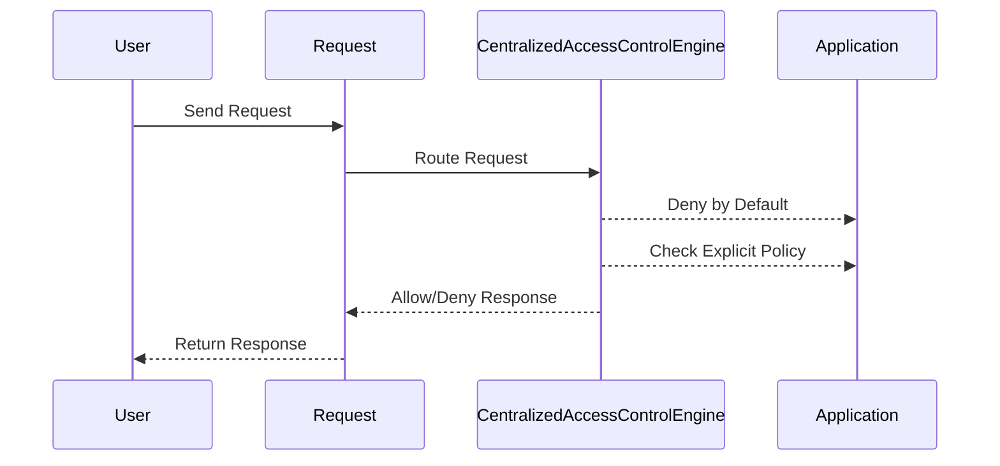

## Denied by Default Design

### What is Denied by Default Design?

Denied by default design is a security principle where access to resources is denied by default unless explicitly granted. This means that any new feature or functionality added to the system will automatically be inaccessible until specific access control rules are defined for it.

### Why Use Denied by Default Design?

The primary advantage of denied by default design is that it minimizes the risk of unintentional exposure of resources. By default denying access, developers must explicitly define who can access what, reducing the likelihood of accidental misconfigurations.

### How Does Denied by Default Design Work?

In a denied by default design, the access control engine assumes that all requests are denied unless there is an explicit policy allowing them. This approach ensures that new features or functionalities are not inadvertently exposed to unauthorized users.

#### Example: Java Filters with Denied by Default

Consider the following configuration in `web.xml`:

```xml
<filter>
    <filter-name>AuthorizationFilter</filter-name>
    <filter-class>com.example.AuthorizationFilter</filter-class>
</filter>

<filter-mapping>
    <filter-name>AuthorizationFilter</filter-name>
    <url-pattern>/*</url-pattern>
</filter-mapping>
```

Here, the `AuthorizationFilter` is applied to all URLs (`/*`). The filter logic should deny access by default and only allow access if the user meets specific criteria.

### Real-World Example: CVE-2021-44228 (Log4Shell)

CVE-2021-44228, commonly known as Log4Shell, is a critical vulnerability in the Apache Log4j library. The vulnerability allows attackers to execute arbitrary code by injecting malicious log messages. While not directly related to access control, the lack of proper input validation and access control contributed to the severity of the vulnerability. A denied by default design could have helped mitigate the risk by ensuring that only trusted inputs were processed.

### How to Prevent / Defend

**Detection**: Regularly review and test access control policies to ensure they are correctly implemented and up-to-date.

**Prevention**: Implement a denied by- default design and enforce strict access control policies.

**Secure Coding Fix**:
- **Vulnerable Code**:
  ```java
  public void handleRequest(HttpServletRequest request, HttpServletResponse response) {
      String path = request.getPathInfo();
      if (path.startsWith("/new-feature")) {
          // Insecure check
          if (request.isUserInRole("user")) {
              // Handle new feature request
          } else {
              response.sendError(HttpServletResponse.SC_FORBIDDEN);
          }
      }
  }
  ```
- **Fixed Code**:
  ```java
  public void handleRequest(HttpServletRequest request, HttpServletResponse response) {
      String path = request.getPathInfo();
      if (path.startsWith("/new-feature")) {
          // Denied by default check
          if (authorizationService.isAuthorized(request, path)) {
              // Handle new feature request
          } else {
              response.sendError(HttpServletResponse.SC_FORBIDDEN);
          }
      }
  }
  ```

### Mermaid Diagram: Denied by Default Flow



---
<!-- nav -->
[[10-Context-Dependent Access Control|Context-Dependent Access Control]] | [[Web Security (PortSwigger)/12-Access Control Vulnerabilities/01-Broken Access Control Complete Guide/00-Overview|Overview]] | [[12-Escalating Privileges via Hidden Parameters|Escalating Privileges via Hidden Parameters]]
