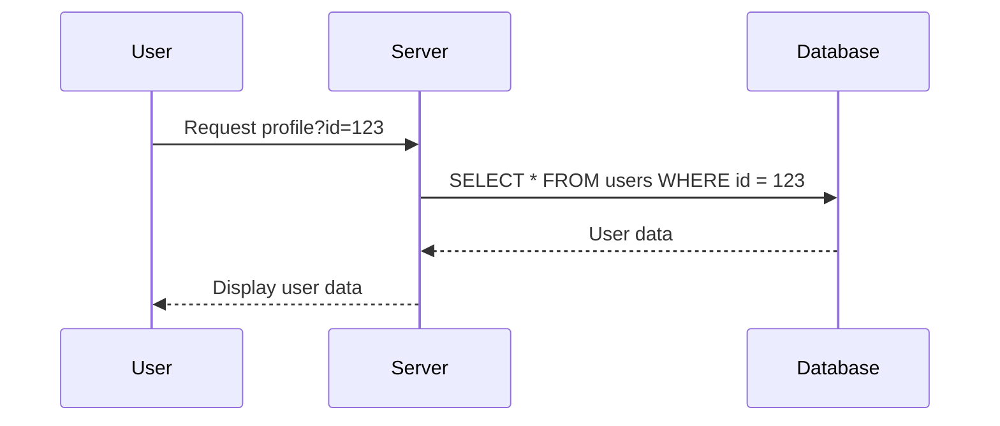
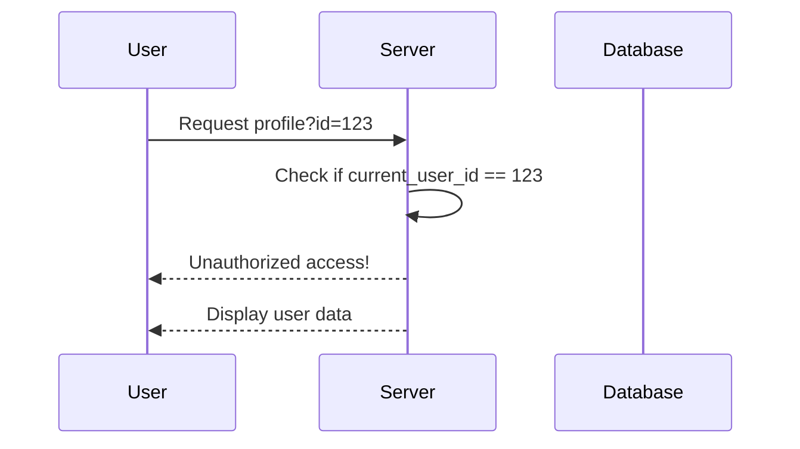

## Horizontal Privilege Escalation

### What is Horizontal Privilege Escalation?

Horizontal privilege escalation is a type of access control vulnerability where an attacker gains unauthorized access to resources belonging to another user within the same privilege level. This means that the attacker and the victim are typically of equal privilege, such as two regular users in a web application. The attacker exploits weaknesses in the application’s access control mechanisms to bypass intended restrictions and access sensitive data or perform actions that should be restricted to the victim.

### Why Does Horizontal Privilege Escalation Matter?

Access control vulnerabilities, including horizontal privilege escalation, are critical because they can lead to significant data breaches and privacy violations. In the context of financial applications, such as online banking, gaining unauthorized access to another user's account can result in financial loss, identity theft, and severe reputational damage to the organization.

### How Does Horizontal Privilege Escalation Work?

To understand how horizontal privilege escalation works, let's consider a simple example involving a banking application. Suppose Alice logs into her banking application using her credentials. After logging in, the application presents her with her personal banking information. The application manages access to users' information through an `ID` parameter that is included in the URL and originates from the client side.

For instance, if Alice's `ID` is `123`, the URL might look like this:

```
https://bank.example.com/profile?id=123
```

When Alice accesses this URL, the server retrieves her banking information based on the provided `ID`. Now, if an attacker, Bob, also has an account on this banking application, he can attempt to gain access to Alice's account by manipulating the `ID` parameter in the URL. By changing his `ID` from `121` to `123`, Bob can access Alice's account:

```
https://bank.example.com/profile?id=123
```

This scenario highlights a fundamental flaw in the application’s access control mechanism: it relies solely on a client-provided `ID` parameter without proper validation or authorization checks.

### Real-World Examples

#### Recent CVEs and Breaches

One notable example of horizontal privilege escalation is the breach at Equifax in 2017 (CVE-2017-5638). The attackers exploited a vulnerability in Apache Struts, which allowed them to execute arbitrary code on the server. This led to unauthorized access to sensitive customer data, including Social Security numbers and birth dates. While this specific case involved vertical privilege escalation, the underlying principle of exploiting weak access controls is similar.

Another example is the Capital One breach in 2019 (CVE-2019-11510). The attacker exploited a misconfigured web application firewall (WAF) to access sensitive customer data. Although this was primarily a vertical privilege escalation, the lack of proper access controls and validation mechanisms contributed to the breach.

### Detailed Example: Banking Application

Let's delve deeper into the banking application example to illustrate the mechanics of horizontal privilege escalation.

#### Vulnerable Code

Consider the following simplified PHP code snippet that handles user profile retrieval based on the `ID` parameter:

```php
<?php
session_start();
require_once('db.php');

if (isset($_GET['id'])) {
    $userId = $_GET['id'];
    $query = "SELECT * FROM users WHERE id = ?";
    $stmt = $pdo->prepare($query);
    $stmt->execute([$userId]);
    $user = $stmt->fetch();

    if ($user) {
        echo "Welcome, " . htmlspecialchars($user['name']) . "!<br>";
        echo "Your balance is: $" . htmlspecialchars($user['balance']);
    } else {
        echo "User not found.";
    }
}
?>
```

In this code, the `id` parameter is directly used to fetch user data from the database. There is no validation to ensure that the current user is authorized to view the requested user's profile.

#### Exploitation

An attacker can exploit this vulnerability by manipulating the `id` parameter in the URL. For example, if the attacker changes the `id` to `123`, they can access Alice's profile:

```
https://bank.example.com/profile?id=123
```

The server will retrieve and display Alice's profile information without any checks to verify the attacker's authorization.

### Brute Force Attack

Since the `id` parameter can be easily manipulated, an attacker can perform a brute force attack to enumerate all user profiles. They can systematically try different `id` values to access various user accounts:

```bash
for i in {1..1000}; do
  curl "https://bank.example.com/profile?id=$i"
done
```

This script sends requests to the server with different `id` values, potentially exposing sensitive information for multiple users.

### Hidden Parameters

While the example above uses a visible `id` parameter in the URL, similar vulnerabilities can exist with hidden parameters in form fields. Consider the following HTML form:

```html
<form action="/profile" method="POST">
  <input type="hidden" name="id" value="121">
  <button type="submit">View Profile</button>
</form>
```

An attacker can modify the `id` value in the form to access other user profiles. This can be done using browser developer tools or automated scripts.

### How to Prevent / Defend

#### Detection

To detect horizontal privilege escalation vulnerabilities, organizations should implement comprehensive logging and monitoring mechanisms. Logs should capture all access attempts to user profiles, including the `id` parameter values. Anomalous patterns, such as repeated access attempts with different `id` values, should trigger alerts.

#### Prevention

Preventing horizontal privilege escalation requires robust access control mechanisms and proper validation of user permissions. Here are some key strategies:

1. **Authorization Checks**: Ensure that the current user is authorized to view the requested user's profile. This can be achieved by comparing the `id` parameter with the authenticated user's `id`.

2. **Parameter Validation**: Validate the `id` parameter to ensure it corresponds to a valid user and that the current user has the necessary permissions to access it.

3. **Use of Tokens**: Instead of relying on client-provided `id` parameters, use secure tokens or session identifiers to manage user sessions and access control.

#### Secure Code Fix

Here is the corrected version of the PHP code snippet with proper authorization checks:

```php
<?php
session_start();
require_once('db.php');

if (isset($_SESSION['user_id'])) {
    $currentUserId = $_SESSION['user_id'];
    if (isset($_GET['id'])) {
        $requestedUserId = $_GET['id'];

        if ($currentUserId == $requestedUserId) {
            $query = "SELECT * FROM users WHERE id = ?";
            $stmt = $pdo->prepare($query);
            $stmt->execute([$requestedUserId]);
            $user = $stmt->fetch();

            if ($user) {
                echo "Welcome, " . htmlspecialchars($user['name']) . "!<br>";
                echo "Your balance is: $" . htmlspecialchars($user['balance']);
            } else {
                echo "User not found.";
            }
        } else {
            echo "Unauthorized access!";
        }
    }
} else {
    echo "Please log in first.";
}
?>
```

In this corrected version, the `id` parameter is compared with the authenticated user's `id` stored in the session. Only if they match is the user allowed to view their own profile.

### Configuration Hardening

#### Secure Coding Practices

1. **Input Validation**: Always validate input parameters to ensure they meet expected criteria.
2. **Least Privilege Principle**: Grant users the minimum privileges necessary to perform their tasks.
3. **Secure Session Management**: Use secure session management techniques, such as regenerating session IDs after login and setting appropriate flags (e.g., `HttpOnly`, `Secure`).

#### Secure Configuration

1. **Web Application Firewall (WAF)**: Implement a WAF to filter out malicious requests and enforce access control policies.
2. **Rate Limiting**: Implement rate limiting to prevent brute force attacks.
3. **Logging and Monitoring**: Enable detailed logging and set up monitoring to detect suspicious activity.

### Mermaid Diagrams

#### Access Control Flow



#### Authorization Check Flow



### Practice Labs

For hands-on practice with horizontal privilege escalation, consider the following well-known labs:

- **PortSwigger Web Security Academy**: Offers a series of labs focused on access control vulnerabilities, including horizontal privilege escalation.
- **OWASP Juice Shop**: A deliberately insecure web application that includes various security challenges, including access control issues.
- **DVWA (Damn Vulnerable Web Application)**: Provides a range of web application vulnerabilities, including horizontal privilege escalation scenarios.

These labs provide a controlled environment to practice identifying and mitigating access control vulnerabilities.

### Conclusion

Horizontal privilege escalation is a serious access control vulnerability that can lead to significant data breaches and privacy violations. By understanding the mechanics of this vulnerability, recognizing real-world examples, and implementing robust prevention and detection mechanisms, organizations can significantly reduce the risk of such attacks. Secure coding practices, proper authorization checks, and comprehensive monitoring are essential components of a strong defense strategy against horizontal privilege escalation.

---
<!-- nav -->
[[15-Hands-On Practice Labs|Hands-On Practice Labs]] | [[Web Security (PortSwigger)/12-Access Control Vulnerabilities/01-Broken Access Control Complete Guide/00-Overview|Overview]] | [[17-Least Privilege Principle|Least Privilege Principle]]
