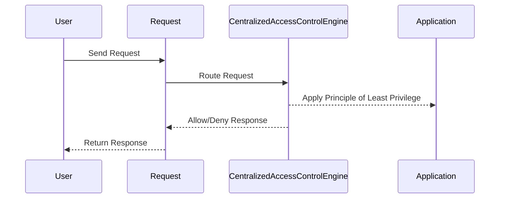

## Principle of Least Privilege

### What is the Principle of Least Privilege?

The principle of least privilege (PoLP) is a security concept that states that a user or process should have the minimum level of access necessary to perform their tasks. This means granting only the permissions required for a specific role or task, and nothing more.

### Why Use the Principle of Least Privilege?

Implementing PoLP helps minimize the potential damage that can occur if a user or process is compromised. By limiting access to only what is necessary, the scope of possible attacks is reduced.

### How Does the Principle of Least Privilege Work?

To implement PoLP, access control policies must be carefully defined and enforced. Each user or process should be granted only the permissions required to perform their specific tasks. This requires a thorough understanding of the roles and responsibilities within the application.

#### Example: Role-Based Access Control (RBAC)

Role-based access control (RBAC) is a common method for implementing PoLP. In RBAC, users are assigned roles, and roles are assigned permissions. This ensures that users only have access to the resources and functions necessary for their roles.

```json
{
  "roles": [
    {
      "name": "Admin",
      "permissions": ["read", "write", "delete"]
    },
    {
      "name": "User",
      "permissions": ["read"]
    }
  ],
  "users": [
    {
      "username": "alice",
      "role": "Admin"
    },
    {
      "username": "bob",
      "role": "User"
    }
  ]
}
```

### Real-World Example: CVE-2021-3427

CVE-2021-3427 is a vulnerability in the Microsoft Exchange Server that allowed attackers to gain remote code execution. The vulnerability was exacerbated by improper access control, where users with lower privileges had access to sensitive functions. Implementing PoLP could have mitigated the risk by ensuring that only users with appropriate privileges could access sensitive functions.

### How to Prevent / Defend

**Detection**: Regularly audit access control policies to ensure they align with the principle of least privilege.

**Prevention**: Implement role-based access control and enforce strict permission management.

**Secure Coding Fix**:
- **Vulnerable Code**:
  ```java
  public void handleRequest(HttpServletRequest request, HttpServletResponse response) {
      String path = request.getPathInfo();
      if (path.startsWith("/sensitive-data")) {
          // Insecure check
          if (request.isUserInRole("user")) {
              // Handle sensitive data request
          } else {
              response.sendError(HttpServletResponse.SC_FORBIDDEN);
          }
      }
  }
  ```
- **Fixed Code**:
  ```java
  public void handleRequest(HttpServletRequest request, HttpServletResponse response) {
      String path = request.getPathInfo();
      if (path.startsWith("/sensitive-data")) {
          // Principle of least privilege check
          if (authorizationService.isAuthorized(request, path)) {
              // Handle sensitive data request
          } else {
              response.sendError(HttpServletResponse.SC_FORBIDDEN);
          }
      }
  }
  ```

### Mermaid Diagram: Principle of Least Privilege Flow



---
<!-- nav -->
[[19-Missing Access Controls on API Methods|Missing Access Controls on API Methods]] | [[Web Security (PortSwigger)/12-Access Control Vulnerabilities/01-Broken Access Control Complete Guide/00-Overview|Overview]] | [[21-Session Management and Access Control|Session Management and Access Control]]
