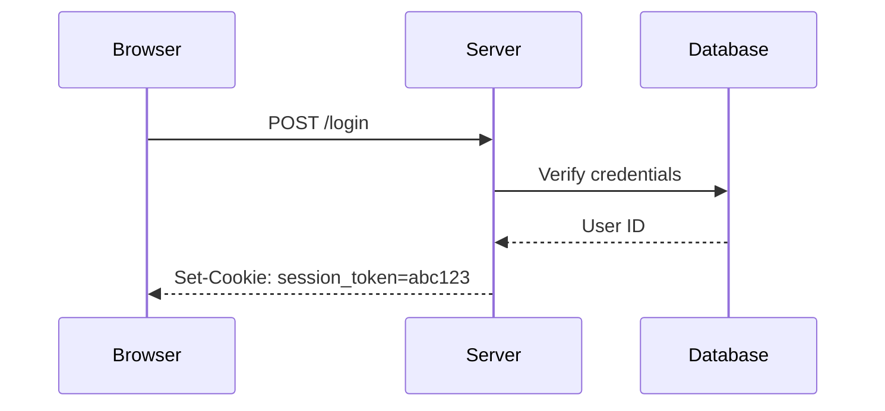
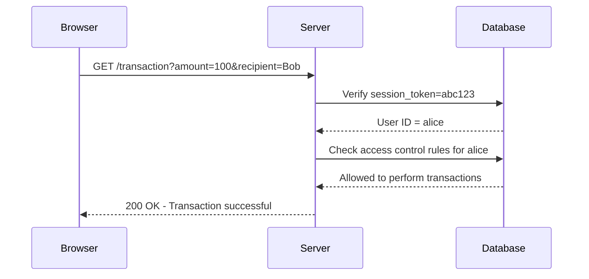

## Session Management and Access Control

### Background Theory

Session management is a critical aspect of web security that ensures users are properly identified and authenticated across multiple requests. In essence, session management allows a server to maintain a stateful connection with a client, even though HTTP is inherently stateless. This is achieved through the use of session tokens, which are unique identifiers that the server generates upon successful authentication of a user. These tokens are typically stored in cookies or URL parameters and are sent with each subsequent request to the server.

#### What is a Session Token?

A session token is a piece of data that uniquely identifies a user's session. It is usually a random string of characters that is difficult to guess. The token is generated by the server and sent to the client, where it is stored in a cookie or URL parameter. Each time the client makes a request to the server, the token is included in the request, allowing the server to identify the user and their session.

#### Why Keep the Token Secret?

Keeping the session token secret is crucial because if an attacker gains access to the token, they can impersonate the user and perform actions on their behalf. This is similar to how an attacker could use a stolen password to log in as the user. Therefore, the session token should be treated with the same level of confidentiality as a password.

### Real-World Examples

Recent breaches have highlighted the importance of proper session management. For instance:

- **CVE-2021-21972**: A vulnerability in the WordPress REST API allowed attackers to bypass authentication and gain unauthorized access to user sessions. This was due to improper validation of session tokens.
- **Equifax Breach (2017)**: One of the factors contributing to this massive breach was the improper handling of session tokens, leading to unauthorized access to sensitive user data.

### Access Control

Access control is the mechanism used to determine whether a user is allowed to perform a specific action within an application. After a user has been authenticated and a session token has been issued, the application must ensure that the user only performs actions they are authorized to perform. This is achieved through access control rules, which are defined based on the user's role and permissions.

#### How Access Control Works

When a user performs an action, such as initiating a banking transaction, the following steps occur:

1. **Token Verification**: The session token is sent with the request to the server.
2. **User Identification**: The server verifies the session token and identifies the user associated with the token.
3. **Access Control Check**: The server checks the access control rules for the identified user to determine if they are allowed to perform the requested action.
4. **Action Execution**: If the user is authorized, the action is executed; otherwise, the request is denied.

### Detailed Example

Let's consider a detailed example of a banking transaction to illustrate the process:

#### User Authentication and Token Generation



In this sequence, the user logs in, and the server verifies the credentials against the database. Upon successful verification, the server generates a session token (`abc123`) and sends it to the browser in a `Set-Cookie` header.

#### Banking Transaction Request



Here, the user initiates a banking transaction. The session token is included in the request, and the server verifies the token to identify the user (`alice`). The server then checks the access control rules for `alice` and determines that she is allowed to perform transactions. The transaction is executed, and a success response is returned to the browser.

### Common Pitfalls

Several common pitfalls can lead to broken access control vulnerabilities:

1. **Insufficient Authorization Checks**: Failing to check if a user is authorized to perform a specific action.
2. **Insecure Direct Object References (IDOR)**: Allowing users to manipulate object identifiers to access unauthorized resources.
3. **Weak Session Management**: Using predictable or easily guessable session tokens.

### How to Prevent / Defend

#### Detection

To detect broken access control vulnerabilities, you can use automated tools and manual testing techniques:

- **Automated Tools**: Tools like Burp Suite, OWASP ZAP, and Acunetix can help identify potential access control issues.
- **Manual Testing**: Conduct thorough testing to ensure that users cannot access unauthorized resources by manipulating object identifiers or session tokens.

#### Prevention

To prevent broken access control vulnerabilities, follow these best practices:

1. **Strong Session Tokens**: Generate strong, unpredictable session tokens using cryptographic functions.
2. **Role-Based Access Control (RBAC)**: Implement RBAC to ensure that users only have access to resources appropriate for their roles.
3. **Least Privilege Principle**: Grant users the minimum privileges necessary to perform their tasks.

#### Secure Coding Fixes

Here is an example of how to implement secure access control in a web application:

**Vulnerable Code**

```python
@app.route('/transaction', methods=['POST'])
def transaction():
    user_id = session['user_id']
    amount = request.form['amount']
    recipient = request.form['recipient']
    execute_transaction(user_id, amount, recipient)
    return "Transaction successful"
```

**Secure Code**

```python
@app.route('/transaction', methods=['POST'])
def transaction():
    user_id = session['user_id']
    if check_access_control(user_id):
        amount = request.form['amount']
        recipient = request.form['recipient']
        execute_transaction(user_id, amount, recipient)
        return "Transaction successful"
    else:
        return "Unauthorized", 403
```

In the secure code, the `check_access_control` function ensures that the user is authorized to perform the transaction before executing it.

### Configuration Hardening

To further harden your application against access control vulnerabilities, configure your web server and application settings appropriately:

- **HTTP Headers**: Use security-related HTTP headers such as `X-Frame-Options`, `Content-Security-Policy`, and `Strict-Transport-Security`.
- **Cookie Settings**: Ensure that session cookies are marked as `HttpOnly` and `Secure`.

#### Example Configuration

**Nginx Configuration**

```nginx
server {
    listen 443 ssl;
    server_name example.com;

    ssl_certificate /etc/nginx/ssl/example.crt;
    ssl_certificate_key /etc/nginx/ssl/example.key;

    location / {
        proxy_pass http://localhost:8000;
        add_header X-Frame-Options DENY;
        add_header Content-Security-Policy "default-src 'self'";
        add_header Strict-Transport-Security "max-age=31536000";
    }

    location /session {
        proxy_set_header Cookie "session_token=abc123; HttpOnly; Secure";
    }
}
```

### Practice Labs

For hands-on practice with access control vulnerabilities, consider the following labs:

- **PortSwigger Web Security Academy**: Offers comprehensive modules on broken access control and other web security topics.
- **OWASP Juice Shop**: A deliberately insecure web application for practicing web security skills.
- **DVWA (Damn Vulnerable Web Application)**: Another popular web application for learning about web security vulnerabilities.

By thoroughly understanding and implementing these concepts, you can significantly enhance the security of your web applications and protect them from access control vulnerabilities.

---
<!-- nav -->
[[20-Principle of Least Privilege|Principle of Least Privilege]] | [[Web Security (PortSwigger)/12-Access Control Vulnerabilities/01-Broken Access Control Complete Guide/00-Overview|Overview]] | [[22-Session Management|Session Management]]
