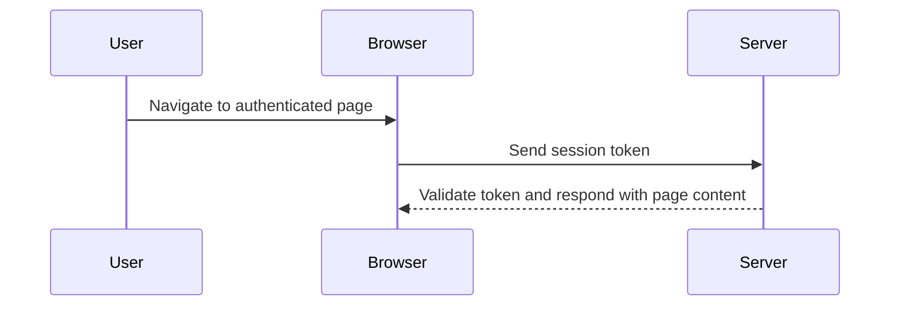

## Session Management

### What is Session Management?

Session management is the process of maintaining a user's state across multiple requests. After a user successfully authenticates, a session is created, and a session token is generated. This token is then used to identify the user in subsequent requests, eliminating the need for repeated authentication.

#### Why is Session Management Important?

Session management is essential for providing a seamless user experience. Without it, users would have to re-enter their credentials every time they navigate to a new page, which would be cumbersome and impractical.

#### How Does Session Management Work Under the Hood?

1. **Session Creation**: Upon successful authentication, the server generates a unique session token.
2. **Token Storage**: This token is stored on the client-side, usually in a cookie.
3. **Token Transmission**: With each subsequent request, the client sends the session token back to the server.
4. **Token Validation**: The server validates the token to ensure the user is still authenticated.

### Real-World Example: CVE-2020-14882

CVE-2020-14882 is a vulnerability in the Apache Struts framework that allows attackers to bypass authentication and gain unauthorized access to the system. This vulnerability was due to improper handling of session tokens, allowing attackers to manipulate them and impersonate legitimate users.



### Pitfalls of Session Management

One common pitfall is the use of predictable session tokens, which can be guessed by attackers. Another issue is the lack of proper expiration mechanisms, allowing sessions to remain active indefinitely.

#### How to Prevent / Defend

**Detection**: Regularly monitor session activity and look for signs of unauthorized access.

**Prevention**: Use strong, unpredictable session tokens and implement proper expiration mechanisms.

**Secure Coding Fix**:
- **Vulnerable Code**:
  ```python
  def create_session(user_id):
      session_token = str(uuid.uuid4())
      store_session_in_db(session_token, user_id)
      return session_token
  ```
- **Fixed Code**:
  ```python
  def create_session(user_id):
      session_token = secrets.token_urlsafe(16)
      store_session_in_db(session_token, user_id, expires_in=3600)
      return session_token
  ```

---
<!-- nav -->
[[21-Session Management and Access Control|Session Management and Access Control]] | [[Web Security (PortSwigger)/12-Access Control Vulnerabilities/01-Broken Access Control Complete Guide/00-Overview|Overview]] | [[23-Understanding Access Control Vulnerabilities|Understanding Access Control Vulnerabilities]]
