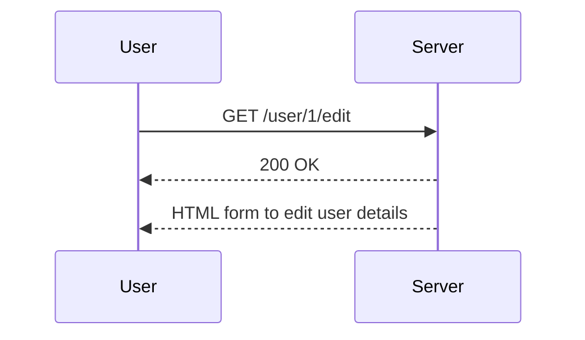
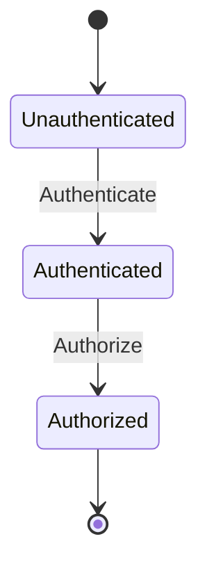

## Understanding Access Control Vulnerabilities

Access control is a fundamental aspect of web security, ensuring that users can only access resources and perform actions that they are authorized to do. In a typical web application, access control mechanisms are used to enforce policies such as authentication, authorization, and role-based access control (RBAC). However, if these mechanisms are not properly implemented, they can lead to significant security vulnerabilities.

### What is Access Control?

Access control refers to the mechanisms that determine whether a user or system process is allowed to access a resource or perform a specific action. This includes:

- **Authentication**: Verifying the identity of a user.
- **Authorization**: Determining what actions a user is permitted to perform based on their identity and roles.
- **Role-Based Access Control (RBAC)**: Assigning permissions based on roles within an organization.

### Why Access Control Matters

Access control is crucial because it helps prevent unauthorized access to sensitive data and functionalities. Without proper access control, an attacker could potentially gain access to administrative functions, modify critical data, or even take over the entire system.

### How Access Control Works Under the Hood

In a typical web application, access control is implemented using a combination of server-side logic and client-side validation. Here’s a high-level overview:

1. **User Authentication**: The user provides credentials (username and password) which are verified against a database.
2. **Session Management**: Upon successful authentication, a session is created, and a session token is issued to the user.
3. **Authorization Checks**: Each request is checked against the user's roles and permissions to determine if they are allowed to perform the requested action.
4. **Role-Based Access Control**: Permissions are assigned based on predefined roles (e.g., admin, user).

### Common Pitfalls in Access Control Implementation

One common pitfall is assuming that users will follow the intended sequence of steps. Developers often implement access control rules at certain endpoints but neglect others, leading to vulnerabilities. For instance, consider a multi-step process where:

1. A user must be authenticated.
2. A user must be an administrator to perform a specific action.

If the developer assumes that the user will follow the intended sequence, they might not implement access control checks at every step. This assumption can be exploited by attackers who bypass the intended sequence.

### Real-World Example: CVE-2021-21972

CVE-2021-21972 is a real-world example of an access control vulnerability in the Apache Struts framework. This vulnerability allowed attackers to execute arbitrary commands on the server by exploiting a flaw in the framework's access control mechanism.

#### Vulnerable Code Example

```java
public class UserController {
    @Action(value = "/user/{id}/edit", method = "GET")
    public String editUser(@PathVariable("id") int id) {
        if (!isAdmin()) {
            return "accessDenied";
        }
        User user = userService.getUserById(id);
        return "editUser";
    }

    private boolean isAdmin() {
        // Check if the current user is an admin
        return currentUser.getRole().equals("admin");
    }
}
```

#### Explanation

In this example, the `editUser` method checks if the current user is an admin before allowing them to edit a user. However, if an attacker can bypass this check by directly accessing the URL, they can potentially edit any user.

### How to Prevent / Defend Against Access Control Vulnerabilities

To prevent access control vulnerabilities, it is essential to implement robust access control mechanisms at every step of the process. Here are some best practices:

1. **Implement Access Control at Every Step**: Ensure that access control checks are performed at every endpoint, not just at the beginning of a process.
2. **Use Role-Based Access Control (RBAC)**: Define roles and permissions clearly and enforce them consistently.
3. **Audit and Test Access Control Mechanisms**: Regularly audit and test access control mechanisms to identify and fix vulnerabilities.

#### Secure Code Example

Here’s how the previous example can be improved to ensure proper access control:

```java
public class UserController {
    @Action(value = "/user/{id}/edit", method = "GET")
    public String editUser(@PathVariable("id") int id) {
        if (!isAuthenticated()) {
            return "loginRequired";
        }
        if (!isAdmin()) {
            return "accessDenied";
        }
        User user = userService.getUserById(id);
        return "editUser";
    }

    private boolean isAuthenticated() {
        // Check if the current user is authenticated
        return currentUser != null;
    }

    private boolean isAdmin() {
        // Check if the current user is an admin
        return currentUser.getRole().equals("admin");
    }
}
```

#### Explanation

In this improved example, both authentication and authorization checks are performed at the beginning of the `editUser` method. This ensures that only authenticated and authorized users can access the functionality.

### Full HTTP Request and Response Example

Let’s look at a full HTTP request and response example to illustrate how access control works in practice.

#### HTTP Request

```http
GET /user/1/edit HTTP/1.1
Host: example.com
Cookie: session=abc123
```

#### HTTP Response

```http
HTTP/1.1 200 OK
Content-Type: text/html; charset=UTF-8

<!DOCTYPE html>
<html>
<head>
    <title>Edit User</title>
</head>
<body>
    <h1>Edit User</h1>
    <!-- Form to edit user details -->
</body>
</html>
```

#### Explanation

In this example, the user sends a GET request to `/user/1/edit`. The server checks if the user is authenticated and authorized to perform this action. If the checks pass, the server returns a 200 OK response along with the HTML form to edit the user details.

### Mermaid Diagrams

#### Sequence Diagram



#### State Machine Diagram



### Hands-On Labs

For hands-on practice with access control vulnerabilities, consider the following labs:

- **PortSwigger Web Security Academy**: Offers interactive labs on broken access control.
- **OWASP Juice Shop**: A deliberately insecure web application for practicing web security skills.
- **DVWA (Damn Vulnerable Web Application)**: Another popular web application for learning about web security vulnerabilities.

By thoroughly understanding and implementing robust access control mechanisms, developers can significantly reduce the risk of security vulnerabilities in their applications.

---
<!-- nav -->
[[22-Session Management|Session Management]] | [[Web Security (PortSwigger)/12-Access Control Vulnerabilities/01-Broken Access Control Complete Guide/00-Overview|Overview]] | [[24-Conclusion|Conclusion]]
