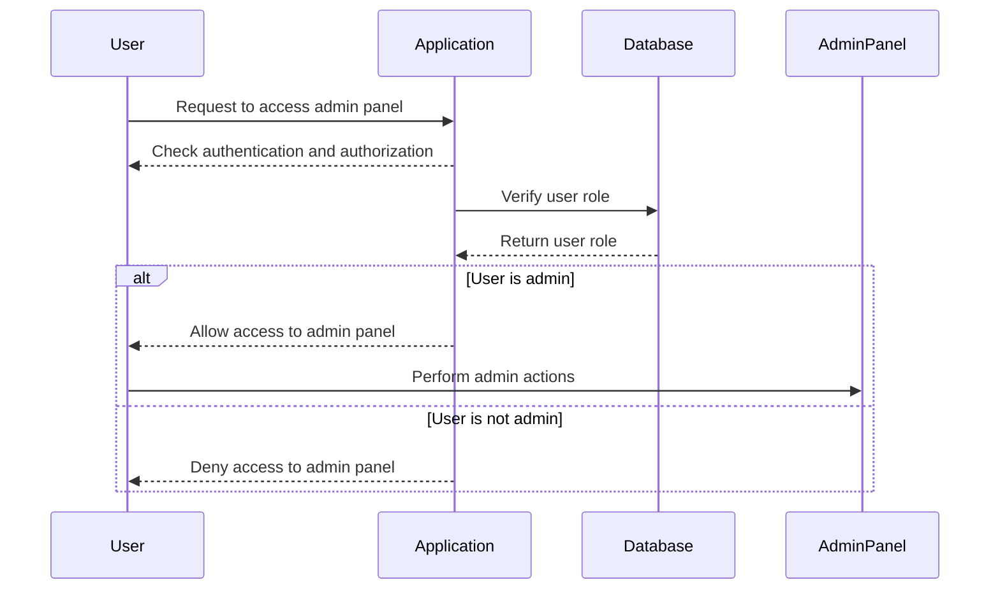

## Introduction to Access Control Vulnerabilities

Access control vulnerabilities are among the most critical issues in web application security. They occur when an application fails to properly restrict access to certain resources or functionalities based on the user's privileges. This can lead to unauthorized users gaining access to sensitive data or performing actions that should be restricted to specific roles, such as administrators.

In this chapter, we will delve deep into the concept of access control vulnerabilities, focusing specifically on the scenario where an admin panel is left unprotected. We will explore the underlying mechanisms, the risks associated with such vulnerabilities, and the steps required to mitigate them. By the end of this chapter, you should have a comprehensive understanding of how to identify, exploit, and defend against these types of vulnerabilities.

### Background Theory

#### What is Access Control?

Access control is a security technique used to regulate who or what can view or use resources in a computing environment. It ensures that only authorized entities can access specific resources or perform certain actions. Access control mechanisms typically involve:

- **Authentication**: Verifying the identity of a user.
- **Authorization**: Determining what actions a user is allowed to perform based on their role or privileges.

#### Why is Access Control Important?

Access control is crucial because it helps prevent unauthorized access to sensitive information and critical functionalities. Without proper access control, an attacker could potentially gain access to administrative functions, leading to severe consequences such as data theft, service disruption, or even complete system compromise.

### Real-World Examples

#### Recent Breaches and CVEs

One notable example of an access control vulnerability leading to a significant breach is the Equifax data breach in 2017. The attackers exploited a vulnerability in Apache Struts, which allowed them to execute arbitrary code on the server. This ultimately led to the exposure of sensitive personal information of millions of customers.

Another example is the CVE-2021-21972, which affected the popular WordPress plugin WPForms. The vulnerability allowed unauthenticated users to upload malicious files, leading to potential remote code execution.

### Understanding Unprotected Admin Functionality

In the context of the Web Security Academy lab, the unprotected admin functionality refers to an admin panel that lacks proper access control measures. This means that any user, regardless of their role, can access and interact with the admin panel.

#### Lab Setup

To understand the lab setup, let's break down the steps involved:

1. **Account Creation**:
    - Visit `Portswigger.net/WebSecurity` and sign up for an account.
    - Log in to your account and navigate to the Web Security Academy.

2. **Accessing the Lab**:
    - Click on "Academy".
    - Select the "Learning Path".
    - Navigate to "Access Control".
    - Choose the first lab titled "Unprotected Admin Functionality".

### Identifying the Vulnerability

The lab states that the admin panel is unprotected, meaning it lacks access control rules. Our goal is to find the admin panel and delete the user "Carlos". To achieve this, we need to understand how access control is typically implemented and how it can be bypassed.

#### Common Access Control Mechanisms

Access control mechanisms often involve:

- **Role-Based Access Control (RBAC)**: Users are assigned roles, and roles are granted permissions.
- **Attribute-Based Access Control (ABAC)**: Access decisions are made based on attributes of the user, resource, and environment.
- **Mandatory Access Control (MAC)**: Access decisions are made based on security labels.

#### How Access Control Can Be Bypassed

Access control can be bypassed through various methods, including:

- **Missing Authentication Checks**: The application fails to verify the user's credentials before granting access.
- **Insecure Direct Object References (IDOR)**: The application exposes direct references to objects without proper authorization checks.
- **Weak Authorization Logic**: The logic used to determine access rights is flawed or incomplete.

### Exploiting the Vulnerability

To exploit the unprotected admin functionality, we need to identify the admin panel and perform the necessary actions. Let's walk through the process step-by-step.

#### Step 1: Identify the Admin Panel

First, we need to locate the admin panel. This can be done through various methods, such as:

- **Manual Exploration**: Navigating through the application and looking for links or buttons that might lead to the admin panel.
- **Automated Scanning**: Using tools like Burp Suite to scan the application for potential admin interfaces.

#### Step 2: Access the Admin Panel

Once we have identified the admin panel, we need to access it. Since the admin panel is unprotected, we should be able to access it without any authentication checks.

#### Step 3: Perform Unauthorized Actions

With access to the admin panel, we can now perform actions that should be restricted to administrators. In this case, our goal is to delete the user "Carlos".

### Example Scenario

Let's consider a hypothetical scenario where the admin panel is accessible via the URL `/admin`. The admin panel allows us to manage users, including deleting them.

#### HTTP Request and Response

Here is an example of the HTTP request and response for accessing the admin panel and deleting the user "Carlos":

```http
GET /admin HTTP/1.1
Host: vulnerable-app.com
Cookie: session=abc123

HTTP/1.1 200 OK
Content-Type: text/html; charset=UTF-8
Set-Cookie: session=abc123; HttpOnly; Secure

<!DOCTYPE html>
<html>
<head>
    <title>Admin Panel</title>
</head>
<body>
    <h1>Admin Panel</h1>
    <ul>
        <li><a href="/admin/users">Manage Users</a></li>
    </ul>
</body>
</html>
```

```http
GET /admin/users HTTP/1.1
Host: vulnerable-app.com
Cookie: session=abc123

HTTP/1.1 200 OK
Content-Type: text/html; charset=UTF-8
Set-Cookie: session=abc123; HttpOnly; Secure

<!DOCTYPE html>
<html>
<head>
    <title>Manage Users</title>
</head>
<body>
    <h1>Manage Users</h1>
    <table>
        <tr>
            <th>User</th>
            <th>Action</th>
        </tr>
        <tr>
            <td>Carlos</td>
            <td><a href="/admin/delete_user?username=Carlos">Delete</a></td>
        </tr>
    </table>
</body>
</html>
```

```http
GET /admin/delete_user?username=Carlos HTTP/1.1
Host: vulnerable-app.com
Cookie: session=abc123

HTTP/1.1 200 OK
Content-Type: text/html; charset=UTF-8
Set-Cookie: session=abc123; HttpOnly; Secure

<!DOCTYPE html>
<html>
<head>
    <title>Delete User</title>
</head>
<body>
    <h1>User Deleted</h1>
    <p>The user Carlos has been successfully deleted.</p>
</body>
</html>
```

### Pitfalls and Common Mistakes

When dealing with access control vulnerabilities, there are several common mistakes to avoid:

- **Relying Solely on Client-Side Controls**: Client-side controls can be easily bypassed. Always implement server-side validation and access control checks.
- **Hardcoding Roles and Permissions**: Hardcoding roles and permissions can make it difficult to manage and update access control rules. Use dynamic and flexible access control mechanisms.
- **Ignoring Least Privilege Principle**: Ensure that users are granted the minimum level of access necessary to perform their tasks.

### How to Prevent / Defend

#### Detection

To detect access control vulnerabilities, you can use various techniques:

- **Static Code Analysis**: Analyze the source code to identify missing or weak access control checks.
- **Dynamic Analysis**: Use tools like Burp Suite to scan the application for potential access control issues.
- **Penetration Testing**: Conduct penetration tests to simulate real-world attacks and identify vulnerabilities.

#### Prevention

To prevent access control vulnerabilities, follow these best practices:

- **Implement Strong Authentication**: Ensure that users are properly authenticated before granting access to any resources.
- **Use Role-Based Access Control (RBAC)**: Assign roles to users and grant permissions based on those roles.
- **Enforce Least Privilege Principle**: Grant users the minimum level of access necessary to perform their tasks.
- **Regularly Review and Update Access Control Rules**: Regularly review and update access control rules to ensure they remain effective and up-to-date.

#### Secure Coding Fixes

Here is an example of how to implement proper access control using RBAC in a web application:

##### Vulnerable Code

```python
@app.route('/admin/delete_user', methods=['GET'])
def delete_user():
    username = request.args.get('username')
    # Delete the user from the database
    db.delete_user(username)
    return f"The user {username} has been successfully deleted."
```

##### Secure Code

```python
@app.route('/admin/delete_user', methods=['GET'])
@login_required
@role_required('admin')
def delete_user():
    username = request.args.get('username')
    # Delete the user from the database
    db.delete_user(username)
    return f"The user {username} has been successfully deleted."
```

In the secure code, we added two decorators: `@login_required` and `@role_required('admin')`. These decorators ensure that only authenticated users with the 'admin' role can access the `delete_user` endpoint.

### Configuration Hardening

To further harden the application, you can implement additional security measures:

- **Enable HTTPS**: Ensure that all communication between the client and server is encrypted using HTTPS.
- **Use Secure Cookies**: Set the `HttpOnly` and `Secure` flags on cookies to prevent them from being accessed by JavaScript and to ensure they are transmitted over HTTPS.
- **Implement Content Security Policy (CSP)**: Use CSP to define a whitelist of trusted sources for content and scripts, reducing the risk of cross-site scripting (XSS) attacks.

### Mermaid Diagrams

#### Access Control Flow



#### Attack Chain

```mermaid
sequenceDiagram
    participant Attacker
    participant Application
    participant Database
    participant AdminPanel

    Attacker->>Application: Access admin panel
    Application-->>Attacker: Check authentication and authorization
    Application->>Database: Verify user role
    Database-->>Application: Return user role
    opt User is admin
        Application-->>Attacker: Allow access to admin panel
        Attacker->>AdminPanel: Perform unauthorized actions
    else User is not admin
        Application-->>Attacker: Deny access to admin panel
    end
```

### Practice Labs

For hands-on practice with access control vulnerabilities, you can use the following labs:

- **PortSwigger Web Security Academy**: Offers a variety of labs related to access control vulnerabilities, including the "Unprotected Admin Functionality" lab.
- **OWASP Juice Shop**: A deliberately insecure web application that includes several access control vulnerabilities.
- **DVWA (Damn Vulnerable Web Application)**: A PHP/MySQL web application that contains numerous security vulnerabilities, including access control issues.

By completing these labs, you can gain practical experience in identifying, exploiting, and defending against access control vulnerabilities.

### Conclusion

Access control vulnerabilities are a serious threat to web application security. By understanding the underlying mechanisms, identifying common mistakes, and implementing robust security measures, you can effectively prevent and defend against these types of vulnerabilities. Through hands-on practice and continuous learning, you can become proficient in securing web applications against access control issues.

---
<!-- nav -->
[[Web Security (PortSwigger)/12-Access Control Vulnerabilities/02-Lab 1 Unprotected admin functionality/00-Overview|Overview]] | [[02-Access Control Vulnerabilities Unprotected Admin Functionality|Access Control Vulnerabilities Unprotected Admin Functionality]]
