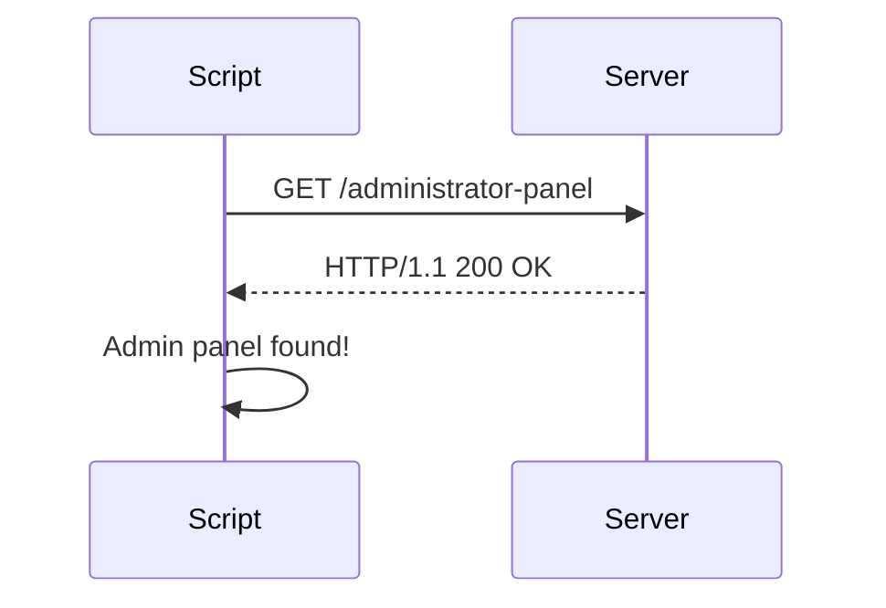

## Access Control Vulnerabilities: Unprotected Admin Functionality

### Introduction to Access Control Vulnerabilities

Access control vulnerabilities occur when an application fails to properly restrict access to sensitive resources or functionalities based on the user's role or permissions. This can lead to unauthorized users gaining access to administrative functions, which can result in data breaches, service disruptions, and other severe consequences. In this section, we will explore a specific type of access control vulnerability: unprotected admin functionality.

### Understanding the Scenario

In the given scenario, we have a script that attempts to find and interact with an admin panel. The script takes two arguments: the script name and the URL of the target website. The goal is to locate the admin panel and perform actions such as deleting a user named "Carlos."

#### Script Overview

Let's break down the script step-by-step:

1. **Argument Parsing**: The script expects two arguments: the script name and the URL of the target website.
2. **URL Variable Creation**: The second argument (the URL) is stored in a variable named `url`.
3. **Finding the Admin Panel**: The script prints a message indicating that it is searching for the admin panel.
4. **Deleting a User**: The script defines a function `delete_user` that takes the `url` as an argument and attempts to delete a user named "Carlos."

Here is the complete script:

```python
import sys
import requests

def delete_user(url):
    admin_panel_url = url + "/administrator-panel"
    response = requests.get(admin_panel_url)
    if response.status_code == 200:
        print("Admin panel found!")
        # Logic to delete user "Carlos"
    else:
        print("Admin panel not found.")

if __name__ == "__main__":
    if len(sys.argv) != 3:
        print("Usage: python script.py <url>")
        sys.exit(1)

    url = sys.argv[1]
    print("Finding admin panel...")
    delete_user(url)
```

### Detailed Explanation of Each Step

#### Argument Parsing

The script uses `sys.argv` to parse command-line arguments. `sys.argv` is a list in Python that contains the command-line arguments passed to the script. The first element (`sys.argv[0]`) is the script name, and subsequent elements are the arguments passed to the script.

```python
if len(sys.argv) != 3:
    print("Usage: python script.py <url>")
    sys.exit(1)
```

This ensures that exactly two arguments are provided: the script name and the URL.

#### URL Variable Creation

The URL provided as the second argument is stored in a variable named `url`.

```python
url = sys.argv[1]
```

#### Finding the Admin Panel

The script prints a message indicating that it is searching for the admin panel.

```python
print("Finding admin panel...")
```

#### Deleting a User

The `delete_user` function constructs the URL for the admin panel by appending `/administrator-panel` to the base URL.

```python
admin_panel_url = url + "/administrator-panel"
```

It then performs a GET request to the constructed URL using the `requests` library.

```python
response = requests.get(admin_panel_url)
```

If the response status code is 200 (indicating a successful request), the script prints a message indicating that the admin panel was found.

```python
if response.status_code == 200:
    print("Admin panel found!")
else:
    print("Admin panel not found.")
```

### Real-World Examples and Recent Breaches

Access control vulnerabilities have led to several high-profile breaches. One notable example is the Capital One breach in 2019, where an attacker exploited a misconfigured server to gain unauthorized access to sensitive customer data. Another example is the Equifax breach in 2017, where attackers exploited a vulnerability in Apache Struts to gain access to personal information of millions of customers.

These breaches highlight the importance of proper access control mechanisms and the potential consequences of their failure.

### HTTP Requests and Responses

Let's examine the HTTP request and response in more detail.

#### Full HTTP Request

```http
GET /administrator-panel HTTP/1.1
Host: www.example.com
User-Agent: python-requests/2.25.1
Accept-Encoding: gzip, deflate
Accept: */*
Connection: keep-alive
```

#### Full HTTP Response

```http
HTTP/1.1 200 OK
Date: Mon, 20 Mar 2023 12:00:00 GMT
Server: Apache/2.4.41 (Ubuntu)
Content-Type: text/html; charset=UTF-8
Content-Length: 1234
Connection: close

<!DOCTYPE html>
<html>
<head>
    <title>Admin Panel</title>
</head>
<body>
    <h1>Welcome to the Admin Panel</h1>
    <!-- Admin panel content -->
</body>
</html>
```

### Mermaid Diagrams

#### Sequence Diagram

A sequence diagram can help visualize the interaction between the script and the server.



### Pitfalls and Common Mistakes

1. **Hardcoding URLs**: Hardcoding URLs in the script can make it inflexible and prone to errors if the URL structure changes.
2. **Ignoring Error Handling**: Failing to handle errors properly can lead to unexpected behavior and security vulnerabilities.
3. **Insufficient Authentication**: Not properly authenticating users before granting access to admin functionalities can expose sensitive operations to unauthorized users.

### How to Prevent / Defend

#### Detection

To detect access control vulnerabilities, organizations should:

1. **Conduct Regular Security Audits**: Regularly review and test access control mechanisms to ensure they are functioning as intended.
2. **Use Web Application Firewalls (WAF)**: WAFs can help detect and mitigate unauthorized access attempts.

#### Prevention

To prevent access control vulnerabilities, organizations should:

1. **Implement Role-Based Access Control (RBAC)**: Ensure that users are granted access based on their roles and responsibilities.
2. **Enforce Strong Authentication Mechanisms**: Use multi-factor authentication (MFA) to add an additional layer of security.
3. **Regularly Update and Patch Systems**: Keep all systems and software up-to-date to protect against known vulnerabilities.

#### Secure Coding Fixes

Here is an example of how to securely implement access control in the script:

**Vulnerable Code**

```python
admin_panel_url = url + "/administrator-panel"
response = requests.get(admin_panel_url)
```

**Secure Code**

```python
from flask import Flask, request, abort

app = Flask(__name__)

@app.route('/administrator-panel', methods=['GET'])
def admin_panel():
    if not request.authorization or not check_credentials(request.authorization.username, request.authorization.password):
        abort(401)
    return "<h1>Welcome to the Admin Panel</h1>"

def check_credentials(username, password):
    # Implement your own credential checking logic here
    return username == "admin" and password == "password"

if __name__ == '__main__':
    app.run()
```

### Hands-On Labs

For hands-on practice with access control vulnerabilities, consider the following labs:

- **PortSwigger Web Security Academy**: Offers interactive labs on various web security topics, including access control.
- **OWASP Juice Shop**: A deliberately insecure web application for practicing web security skills.
- **DVWA (Damn Vulnerable Web Application)**: A PHP/MySQL web application that is riddled with vulnerabilities for educational purposes.

### Conclusion

Access control vulnerabilities can have severe consequences if not properly managed. By understanding the underlying principles, recognizing common pitfalls, and implementing robust security measures, organizations can significantly reduce the risk of unauthorized access to sensitive functionalities.

---
<!-- nav -->
[[Web Security (PortSwigger)/12-Access Control Vulnerabilities/02-Lab 1 Unprotected admin functionality/01-Introduction to Access Control Vulnerabilities|Introduction to Access Control Vulnerabilities]] | [[Web Security (PortSwigger)/12-Access Control Vulnerabilities/02-Lab 1 Unprotected admin functionality/00-Overview|Overview]] | [[Web Security (PortSwigger)/12-Access Control Vulnerabilities/02-Lab 1 Unprotected admin functionality/03-Access Control Vulnerabilities|Access Control Vulnerabilities]]
