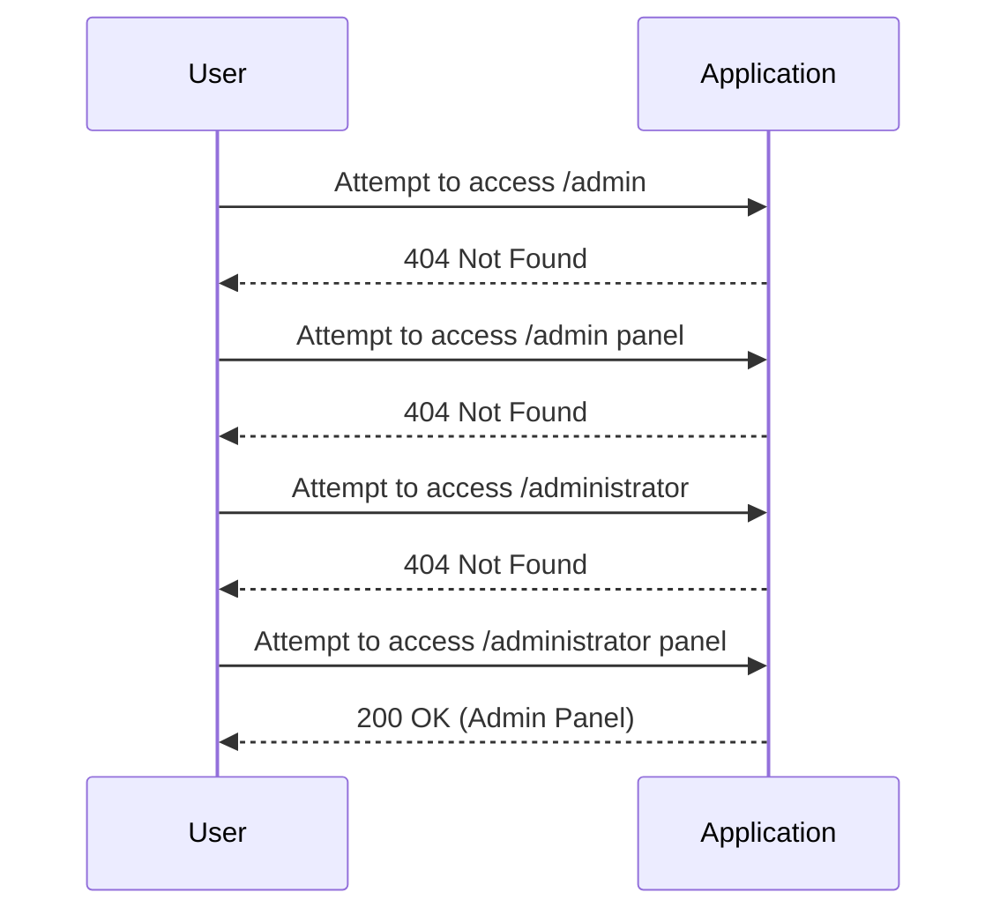

## Access Control Vulnerabilities

### Introduction to Access Control

Access control is a fundamental aspect of web security that ensures that users can only access resources and perform actions that they are authorized to do. In a typical web application, different users have different levels of permissions based on their roles (e.g., guest, user, admin). Access control vulnerabilities occur when these mechanisms are improperly implemented, allowing unauthorized users to gain access to sensitive functionalities or data.

### Understanding the Lab Scenario

In this lab, we will explore an unprotected admin functionality scenario. The goal is to identify and exploit the lack of proper access control rules on the admin panel, leading to unauthorized access and actions.

#### Step-by-Step Walkthrough

1. **Identifying the Admin Panel Endpoint**
    - **Initial Login Page**: The application provides a login page, which is the starting point for our exploration.
    - **Brute Forcing Directory Names**:
        - We attempt to guess the admin panel endpoint by trying common directory names such as `admin`, `admin panel`, `administrator`, and `administrator panel`.
        - After several attempts, we find that `/administrator panel` leads us to the admin panel.



2. **Exploiting the Admin Panel**
    - Once we have accessed the admin panel, we can perform actions that are typically restricted to administrators.
    - In this case, we delete the user `Carlos`.

```http
DELETE /users/Carlos HTTP/1.1
Host: vulnerable-app.com
Authorization: Bearer <access_token>
Content-Type: application/json

HTTP/1.1 200 OK
Content-Type: application/json

{
    "message": "User Carlos deleted successfully."
}
```

### Real-World Examples and Recent Breaches

Access control vulnerabilities have led to significant breaches in recent years. One notable example is the Capital One breach in 2019, where a misconfigured firewall allowed unauthorized access to sensitive customer data. This breach highlights the importance of properly implementing and testing access control mechanisms.

### Background Theory

Access control mechanisms can be broadly categorized into three types:

1. **Discretionary Access Control (DAC)**: Users have control over the objects they own and can decide who else can access those objects.
2. **Mandatory Access Control (MAC)**: Access decisions are based on security labels associated with both subjects and objects.
3. **Role-Based Access Control (RBAC)**: Access is granted based on the roles assigned to users.

### Common Pitfalls and Mistakes

1. **Hardcoding Credentials**: Storing credentials in the codebase can lead to unauthorized access if the code is compromised.
2. **Improper Session Management**: Weak session management can allow attackers to hijack sessions and gain unauthorized access.
3. **Inadequate Input Validation**: Failing to validate input can lead to injection attacks, bypassing access controls.

### How to Prevent / Defend Against Access Control Vulnerabilities

#### Detection

1. **Automated Scanning Tools**: Use tools like Burp Suite, OWASP ZAP, or commercial scanners to identify potential access control issues.
2. **Logging and Monitoring**: Implement logging and monitoring to detect unauthorized access attempts.

#### Prevention

1. **Implement RBAC**: Use role-based access control to ensure that users only have access to the resources and actions appropriate for their roles.
2. **Strong Authentication Mechanisms**: Use multi-factor authentication (MFA) to enhance security.
3. **Proper Input Validation**: Validate all inputs to prevent injection attacks.

#### Secure Coding Fixes

Here is an example of how to implement proper access control in a web application using Python Flask:

```python
from flask import Flask, request, abort
from functools import wraps

app = Flask(__name__)

# Mock user database
users = {
    'admin': {'role': 'admin'},
    'user': {'role': 'user'}
}

def requires_auth(role):
    def decorator(f):
        @wraps(f)
        def decorated_function(*args, **kwargs):
            auth_header = request.headers.get('Authorization')
            if not auth_header:
                abort(401, description="Missing Authorization Header")
            
            username = auth_header.split()[1]
            if username not in users:
                abort(401, description="Invalid Username")
            
            if users[username]['role'] != role:
                abort(403, description="Insufficient Permissions")
            
            return f(*args, **kwargs)
        return decorated_function
    return decorator

@app.route('/admin_panel', methods=['GET'])
@requires_auth('admin')
def admin_panel():
    return "Welcome to the Admin Panel"

if __name__ == '__main__':
    app.run(debug=True)
```

#### Configuration Hardening

1. **Web Server Configuration**: Ensure that web server configurations (e.g., Apache, Nginx) are hardened to prevent unauthorized access.
2. **Database Configuration**: Configure database settings to restrict access to sensitive data.

### Complete Example

Let's walk through a complete example of accessing and exploiting an unprotected admin panel, followed by the secure implementation.

#### Vulnerable Implementation

```http
GET /administrator panel HTTP/1.1
Host: vulnerable-app.com
Authorization: Bearer <access_token>

HTTP/1.1 200 OK
Content-Type: text/html

<!-- Admin Panel Content -->
```

#### Exploitation

```http
DELETE /users/Carlos HTTP/1.1
Host: vulnerable-app.com
Authorization: Bearer <access_token>
Content-Type: application/json

HTTP/1.1 200 OK
Content-Type: application/json

{
    "message": "User Carlos deleted successfully."
}
```

#### Secure Implementation

```python
from flask import Flask, request, abort
from functools import wraps

app = Flask(__name__)

# Mock user database
users = {
    'admin': {'role': 'admin'},
    'user': {'role': 'user'}
}

def requires_auth(role):
    def decorator(f):
        @wraps(f)
        def decorated_function(*args, **kwargs):
            auth_header = request.headers.get('Authorization')
            if not auth_header:
                abort(401, description="Missing Authorization Header")
            
            username = auth_header.split()[1]
            if username not in users:
                abort(101, description="Invalid Username")
            
            if users[username]['role'] != role:
                abort(403, description="Insufficient Permissions")
            
            return f(*args, **kwargs)
        return decorated_function
    return decorator

@app.route('/admin_panel', methods=['GET'])
@requires_auth('admin')
def admin_panel():
    return "Welcome to the Admin Panel"

if __name__ == '__main__':
    app.run(debug=True)
```

### Conclusion

Access control vulnerabilities are a critical aspect of web security that can lead to severe breaches if not properly addressed. By understanding the principles of access control, identifying common pitfalls, and implementing robust security measures, developers can significantly reduce the risk of unauthorized access and exploitation.

### Hands-On Labs

For further practice, consider the following labs:

- **PortSwigger Web Security Academy**: Offers a variety of labs focused on web security, including access control vulnerabilities.
- **OWASP Juice Shop**: A deliberately insecure web application for practicing web security skills.
- **DVWA (Damn Vulnerable Web Application)**: A PHP/MySQL web application that is riddled with vulnerabilities for educational purposes.

By engaging with these labs, you can gain practical experience in identifying and mitigating access control vulnerabilities.

---
<!-- nav -->
[[02-Access Control Vulnerabilities Unprotected Admin Functionality|Access Control Vulnerabilities Unprotected Admin Functionality]] | [[Web Security (PortSwigger)/12-Access Control Vulnerabilities/02-Lab 1 Unprotected admin functionality/00-Overview|Overview]] | [[Web Security (PortSwigger)/12-Access Control Vulnerabilities/02-Lab 1 Unprotected admin functionality/04-Understanding Access Control Vulnerabilities|Understanding Access Control Vulnerabilities]]
