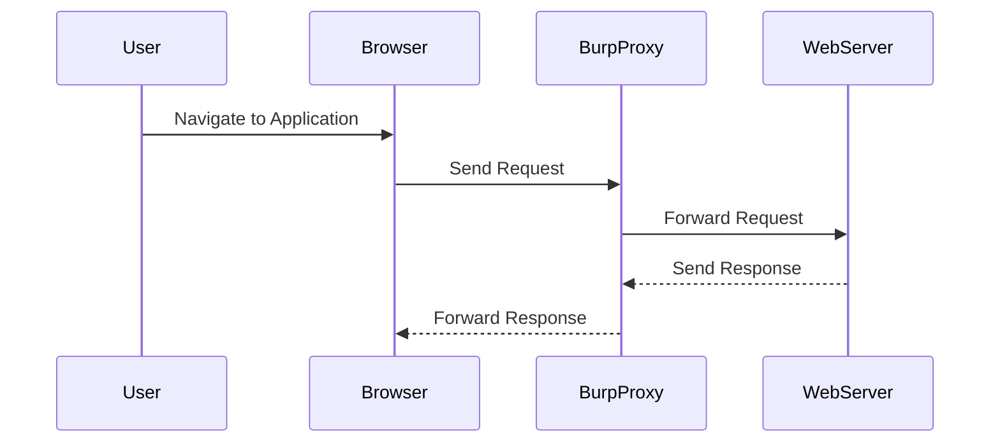

## Introduction to Access Control Vulnerabilities

Access control vulnerabilities are among the most critical issues in web security. They occur when an application fails to properly restrict access to sensitive resources or functionalities based on the identity and privileges of the user. One specific type of access control vulnerability is the unprotected admin functionality with an unpredictable URL. This scenario arises when an administrative interface is accessible via a URL that is not easily guessable but is still disclosed within the application. This makes it possible for attackers to discover and exploit these interfaces, leading to unauthorized access and potential data breaches.

### Background Theory

Access control is a fundamental security mechanism that ensures that users can only access resources and perform actions that they are authorized to do. In web applications, this typically involves:

- **Authentication**: Verifying the identity of the user.
- **Authorization**: Determining what actions the authenticated user is allowed to perform.

When these mechanisms fail, attackers can exploit the vulnerabilities to gain unauthorized access to sensitive areas of the application, such as administrative panels.

### Real-World Examples

Recent real-world examples of access control vulnerabilities include:

- **CVE-2021-21972**: A vulnerability in the WordPress plugin "WPML Multilingual CMS" allowed unauthenticated users to access the admin panel by manipulating certain parameters.
- **CVE-2020-14882**: A vulnerability in the Joomla! Content Management System allowed unauthorized users to access the admin panel through a predictable URL.

These vulnerabilities highlight the importance of proper access control mechanisms and the risks associated with their failure.

### Lab Setup

To understand and practice identifying and exploiting access control vulnerabilities, we will use the Web Security Academy provided by PortSwigger. The lab we will focus on is titled "Unprotected Admin Functionality with Unpredictable URL."

#### Setting Up the Lab

1. **Sign Up**:
    - Visit the URL `https://portswigger.net/web-security`.
    - Click on the "Sign Up" button to create an account.
    - Log in to your account.

2. **Access the Lab**:
    - Navigate to the "Academy" section.
    - Select the "Learning Path" and then choose "Access Control".
    - Finally, select "Lab Number Two" titled "Unprotected Admin Functionality with Unpredictable URL".

### Understanding the Lab

The lab environment consists of an application with an unprotected admin panel. The admin panel is located at an unpredictable URL, but the location is disclosed somewhere within the application. Our goal is to find the admin panel and use it to delete the user named "Carlos".

### Tools and Techniques

To achieve our goal, we will use Burp Suite, a comprehensive toolkit for web application security testing. Burp Suite includes tools like Proxy, Repeater, and Intruder, which will help us identify and exploit the vulnerability.

#### Step-by-Step Process

1. **Start Burp Suite**:
    - Open Burp Suite and configure it to intercept traffic between your browser and the web server.

2. **Intercept Traffic**:
    - Navigate through the application and capture the HTTP requests and responses using Burp Suite's Proxy.

3. **Analyze Responses**:
    - Look for any clues in the responses that might disclose the location of the admin panel. This could be in the form of hidden links, comments, or other metadata.

4. **Exploit the Vulnerability**:
    - Once you have identified the URL of the admin panel, navigate to it and perform the necessary actions to delete the user "Carlos".

### Detailed Example

Let's walk through a detailed example of how to identify and exploit the vulnerability.

#### Initial Setup

1. **Capture Traffic**:
    - Start capturing traffic in Burp Suite's Proxy.
    - Navigate through the application and observe the HTTP requests and responses.



2. **Analyze Responses**:
    - Look for any unusual patterns or hidden links in the responses. For example, a comment in the HTML might reveal the URL of the admin panel.

```html
<!-- Admin panel located at /admin/secret -->
```

3. **Identify the Admin Panel URL**:
    - From the analysis, we determine that the admin panel is located at `/admin/secret`.

4. **Navigate to the Admin Panel**:
    - Use the identified URL to navigate to the admin panel.

```http
GET /admin/secret HTTP/1.1
Host: vulnerable-app.com
Cookie: session=abc123
```

5. **Perform Actions**:
    - Once inside the admin panel, locate the option to delete the user "Carlos".

```http
POST /admin/secret/delete_user HTTP/1.1
Host: vulnerable-app.com
Content-Type: application/x-www-form-urlencoded
Cookie: session=abc123

username=Carlos
```

### Common Pitfalls

When dealing with access control vulnerabilities, several common pitfalls can lead to failed attempts or incomplete exploitation:

- **Overlooking Hidden Clues**: Sometimes the location of the admin panel is disclosed in subtle ways, such as comments or hidden links. Ensure thorough analysis of all responses.
- **Incorrect Authentication**: Make sure to maintain the correct session cookies or authentication tokens to avoid being logged out during the process.
- **Incomplete Exploitation**: Ensure that all necessary steps are followed to fully exploit the vulnerability. Missing even one step can result in failure.

### How to Prevent / Defend

#### Detection

To detect access control vulnerabilities, organizations should implement regular security assessments and penetration testing. Automated tools like Burp Suite can help identify potential issues.

#### Prevention

1. **Proper Authorization**:
    - Ensure that all access to sensitive resources is properly authorized based on user roles and permissions.
    - Use role-based access control (RBAC) to manage user permissions effectively.

2. **Secure Configuration**:
    - Harden the configuration of the application to minimize exposure to vulnerabilities.
    - Use secure coding practices to prevent common web application vulnerabilities.

3. **Regular Audits**:
    - Conduct regular security audits and code reviews to identify and mitigate potential access control issues.

#### Secure Coding Fixes

Here is an example of how to securely configure access control in a web application:

**Vulnerable Code**:
```python
@app.route('/admin/secret')
def admin_panel():
    return render_template('admin.html')
```

**Secure Code**:
```python
from flask import Flask, redirect, url_for
from functools import wraps

app = Flask(__name__)

def admin_required(f):
    @wraps(f)
    def decorated_function(*args, **kwargs):
        if not current_user.is_admin:
            return redirect(url_for('login'))
        return f(*args, **kwargs)
    return decorated_function

@app.route('/admin/secret')
@admin_required
def admin_panel():
    return render_template('admin.html')
```

In the secure code, the `@admin_required` decorator ensures that only users with administrative privileges can access the admin panel.

### Conclusion

Access control vulnerabilities, particularly those involving unprotected admin functionality with unpredictable URLs, pose significant risks to web applications. By understanding the underlying mechanisms and implementing robust security measures, organizations can effectively prevent and mitigate these vulnerabilities.

### Practice Labs

For hands-on practice, consider the following labs:

- **PortSwigger Web Security Academy**: Offers a variety of labs, including the one we covered, to practice identifying and exploiting access control vulnerabilities.
- **OWASP Juice Shop**: Provides a vulnerable web application for practicing various security techniques, including access control.
- **DVWA (Damn Vulnerable Web Application)**: Another popular platform for learning web security through practical exercises.

By engaging with these labs, you can deepen your understanding and proficiency in handling access control vulnerabilities.

---
<!-- nav -->
[[Web Security (PortSwigger)/12-Access Control Vulnerabilities/03-Lab 2 Unprotected admin functionality with unpredictable URL/00-Overview|Overview]] | [[02-Access Control Vulnerabilities Unprotected Admin Functionality with Unpredictable URL|Access Control Vulnerabilities Unprotected Admin Functionality with Unpredictable URL]]
