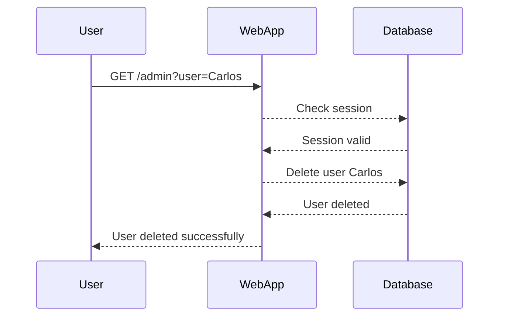
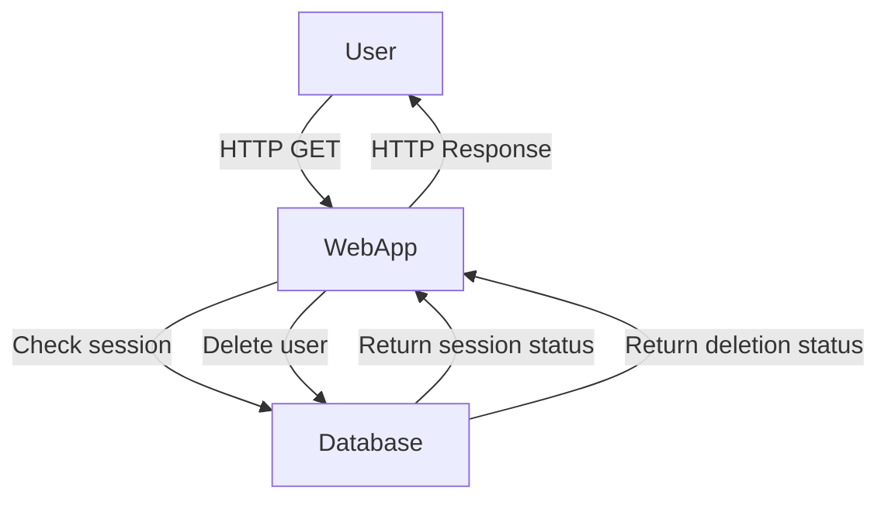

## Understanding Access Control Vulnerabilities

Access control vulnerabilities are among the most critical issues in web security. They occur when an application fails to properly restrict access to sensitive resources or functionalities based on user roles or permissions. This can lead to unauthorized users gaining access to administrative functions, viewing confidential data, or performing actions that should be restricted to specific roles.

### Background Theory

Access control is a fundamental aspect of security that ensures that only authorized entities can access certain resources or perform specific actions. In web applications, this typically involves:

- **Authentication**: Verifying the identity of a user.
- **Authorization**: Determining what actions a user is allowed to perform based on their role or permissions.

When these mechanisms fail, attackers can exploit the vulnerabilities to gain elevated privileges or access sensitive information.

### Real-World Examples

#### Recent CVEs and Breaches

One notable example is the breach at Equifax in 2017, where a vulnerability in their web application allowed attackers to access sensitive personal data of millions of customers. The breach was due to a failure in proper access control, allowing unauthorized access to the database.

Another example is the Capital One breach in 2019, where an attacker exploited a misconfigured web application firewall to gain unauthorized access to customer data. This breach highlighted the importance of proper access control and configuration management.

### Detailed Explanation of the Transcript Chunk

Let's break down the provided transcript chunk and explain each part in detail.

#### Code Breakdown

The transcript mentions a Python script that deletes a user. Here is the complete code for context:

```python
import sys

def delete_user(url):
    # Logic for deleting a user
    pass

if __name__ == "__main__":
    url = sys.argv[1]
    print("Deleting Carlos user")
    delete_user(url)
```

This script takes a URL as an argument and calls the `delete_user` function to delete a user. However, the actual deletion logic is missing.

#### HTTP Request Analysis

The transcript mentions analyzing an HTTP GET request to the admin endpoint. Here is a detailed breakdown of the request and response:

```http
GET /admin HTTP/1.1
Host: example.com
Cookie: session=abc123
```

Response:

```http
HTTP/1.1 200 OK
Content-Type: text/html
Content-Length: 1234

<!DOCTYPE html>
<html>
<head>
    <title>Admin Page</title>
</head>
<body>
    <!-- Admin page content -->
</body>
</html>
```

### Understanding the Session Cookie

The session cookie is crucial for maintaining the user's session state. Without it, the server cannot identify the user, leading to unauthorized access issues.

#### Importance of the Session Cookie

- **Session Identification**: The session cookie uniquely identifies the user's session on the server.
- **State Management**: It helps manage the state across different requests, ensuring that the server knows which user is making the request.

### Analyzing the Request Without the Session Cookie

If the session cookie is removed, the server responds with a 404 Not Found error:

```http
GET /admin HTTP/1.1
Host: example.com
```

Response:

```http
HTTP/1.1 404 Not Found
Content-Type: text/html
Content-Length: 123

<!DOCTYPE html>
<html>
<head>
    <title>Not Found</title>
</head>
<body>
    <h1>404 Not Found</h1>
</body>
</html>
```

### How to Prevent / Defend Against Access Control Vulnerabilities

#### Detection

To detect access control vulnerabilities, you can use automated tools like:

- **Burp Suite**: A comprehensive toolkit for web application security testing.
- **OWASP ZAP**: An open-source web application security scanner.

These tools can help identify unauthorized access attempts and misconfigurations.

#### Prevention

1. **Proper Authentication and Authorization**:
   - Ensure that all users are authenticated before accessing any resources.
   - Implement role-based access control (RBAC) to restrict access based on user roles.

2. **Secure Session Management**:
   - Use secure cookies with the `HttpOnly` and `Secure` flags.
   - Regenerate session IDs after login and logout.

3. **Input Validation and Sanitization**:
   - Validate all input parameters to prevent injection attacks.
   - Sanitize user inputs to ensure they do not contain malicious content.

4. **Least Privilege Principle**:
   - Grant users the minimum level of access necessary to perform their tasks.

### Secure Coding Fixes

Here is an example of a vulnerable and secure version of the `delete_user` function:

#### Vulnerable Version

```python
import requests

def delete_user(url):
    response = requests.get(url)
    if response.status_code == 200:
        print("User deleted successfully")
    else:
        print("Failed to delete user")
```

#### Secure Version

```python
import requests

def delete_user(url, session_cookie):
    headers = {
        'Cookie': f'session={session_cookie}'
    }
    response = requests.get(url, headers=headers)
    if response.status_code == 200:
        print("User deleted successfully")
    elif response.status_code == 401:
        print("Unauthorized access")
    else:
        print("Failed to delete user")
```

### Configuration Hardening

Ensure that your web server and application configurations are hardened against access control vulnerabilities:

- **Web Server Configuration**:
  - Disable directory listing.
  - Restrict access to sensitive files using `.htaccess` or equivalent.

- **Application Configuration**:
  - Enable strict mode in frameworks to enforce security policies.
  - Use security middleware to validate and sanitize inputs.

### Mermaid Diagrams

#### Sequence Diagram for User Deletion



#### Network Topology Diagram



### Practice Labs

For hands-on practice with access control vulnerabilities, consider the following labs:

- **PortSwigger Web Security Academy**: Offers interactive labs on various web security topics, including access control.
- **OWASP Juice Shop**: A deliberately insecure web application for practicing web security skills.
- **DVWA (Damn Vulnerable Web Application)**: A PHP/MySQL web application that contains numerous security vulnerabilities.

By thoroughly understanding and implementing the principles discussed, you can significantly enhance the security of web applications and protect against access control vulnerabilities.

---
<!-- nav -->
[[Web Security (PortSwigger)/12-Access Control Vulnerabilities/03-Lab 2 Unprotected admin functionality with unpredictable URL/03-Access Control Vulnerabilities|Access Control Vulnerabilities]] | [[Web Security (PortSwigger)/12-Access Control Vulnerabilities/03-Lab 2 Unprotected admin functionality with unpredictable URL/00-Overview|Overview]] | [[Web Security (PortSwigger)/12-Access Control Vulnerabilities/03-Lab 2 Unprotected admin functionality with unpredictable URL/05-Practice Questions & Answers|Practice Questions & Answers]]
